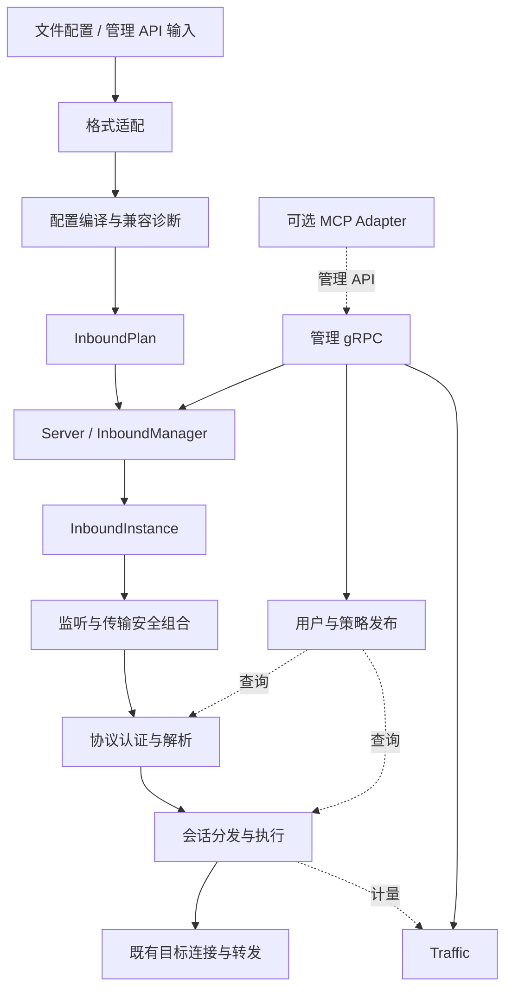
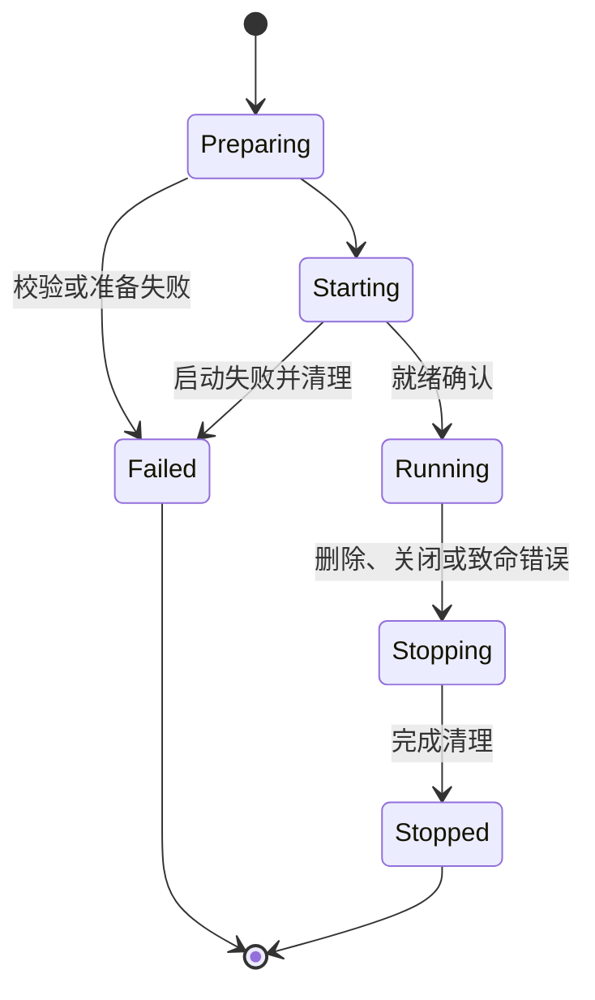

# Chimera Server 架构设计与演进规范

- 文档版本：1.4
- 更新日期：2026-09-21
- 定位：后续架构设计与渐进迁移的首要参考；不是已实现功能清单。
- 实施状态：目标设计已形成，本文不表示代码迁移已经完成。
- 适用范围：Chimera_Server 服务端，当前以 inbound 为主。

## 1. 目标与使用方式

Chimera 的最终目标是完整兼容 xray-core 的服务端行为，使现有客户端无需改变协议配置即可使用 Chimera，并使支持范围内的 Xray 服务端配置保留等价语义。在实现这一目标的同时，改善模块职责、状态所有权、生命周期、资源控制和可维护性。

后续贡献者应先阅读 [AGENTS.md](AGENTS.md)、[需求、架构演进与维护手册](ITERATION_GUIDE.md) 和本文，再检查任务涉及的实际代码与参考实现。手册补充已确认优先级、迁移切片选择、故障排查和交接方法；本文仍是内部设计的首要参考。架构相关改动应说明所属模块、状态所有者、影响的兼容行为和验证方式。本文中的类型与目录名称是设计名称，迁移完成前不得假设它们已经存在。

用户当前明确指令优先；AGENTS 规定贡献流程；本文规定内部设计方向；固定版本的 Xray 源码与互通结果规定外部兼容行为。遇到分歧应明确记录：代码现状不自动推翻目标设计，目标设计也不允许未经验证改变 Xray 行为。例行局部实现不需要反复请求架构确认；重大边界调整应先更新设计理由。

### 1.1 当前范围

- Inbound 协议、传输、安全握手、认证、回落、监听、socket 选项、sniffing。
- 与 inbound 直接相关的用户策略、动态管理、统计和任务生命周期。
- Inbound 正常工作所必需的目标连接、DNS、TCP/UDP 转发及现有路由衔接。
- 用户已明确启动 VLESS Reverse 专项设计；后续实现使用当前 VLESS Reverse 字段与 wire behavior，
  不恢复 legacy `reverse.bridges` / `reverse.portals`。第一阶段优先交付公网 Chimera Portal + 内网
  Xray Bridge 的固定 TCP 端口暴露；完整边界见
  [VLESS Reverse 支持设计与实施计划](VLESS_REVERSE_DESIGN.md)。
- 保护现有 outbound、Chimera 扩展和部署行为。

### 1.2 后置事项与非目标

- 完整 outbound 协议生态和大规模路由功能扩展后置。WireGuard 仍是后期目标；当前仅落地 Linux 服务端 inbound 的 system-TUN 纵向切片，与完整 outbound、userspace IP stack 和跨平台支持分开推进。
- TUN 可以最后做；当前仅保留包级接入与设备资源所有权的扩展空间，不提前引入网络栈、空模块或依赖。未来按固定 Xray 版本核验配置和平台行为，详见手册第 12 节。
- MCP 可做可不做，不是核心交付或发布门槛。若保留，优先独立 Adapter 调用管理 gRPC，复用内部管理服务；现有实现的迁出或删除需纳入具体任务。
- 当前不引入微服务、通用插件平台、分布式控制协议或全局依赖注入容器。
- 不以重构名义改变协议字节、认证规则、默认超时、回落表现或统计口径。
- 不把 Rust、更多 trait、更多 crate 或更短文件视为架构质量的直接证明。
- 不承诺未验证的性能优势；不把参考项目的全部设计视为最优解。

## 2. 参考体系与适用边界

| 参考 | 采用的思路 | 不直接继承的内容 |
| --- | --- | --- |
| xray-core | 配置、线上协议、失败处理和管理 API 的兼容契约 | 具体语言机制和未经分析的内部耦合 |
| clash-rs | 外部配置到内部模型、InboundManager、会话分发的分工 | Clash 配置及默认值 |
| sing-box | inbound 管理与分阶段生命周期 | Go 服务注册机制和整套功能范围 |
| Envoy | listener 就绪/排空、连接与请求作用域、传输和过滤职责 | xDS 全套体系、固定 worker 模型和复杂插件机制 |
| shadowsocks-rust | 协议核心、服务实现与程序入口分离 | 将单一协议抽象直接套用到所有 Xray 组合 |
| Pingora / Leaf | 公共网络能力、协议与传输接口的局部设计 | 用 HTTP 模型统一所有会话，或替换 Xray 行为标准 |

本次设计核对的本地基线：

- `ref/xray-core`：Xray-core `v26.9.9`，提交 `52a412d9e2f5c2a5142b1b4e2ab3771dacb8b120`（pre-release）。
- `ref/clash-rs`：`c6f25ab847a15bf7628d34108eab6a171325dadb`。

后续兼容工作须重新记录实际参考提交和客户端二进制版本。这些基线不是“永远最新”的声明；外部链接可能随分支更新，具体移植前必须固定所用版本。

### 2.1 独立设计原则

参考项目是证据与备选方案，不是 Chimera 内部架构的强制模板。允许并鼓励基于本项目约束提出原创方案；内部结构不必与任何参考项目一一对应。Xray 的外部兼容契约仍然有效。

设计决策从问题出发：先说明状态归属、必须保持的不变量和真实维护成本，再决定模块、接口与并发机制。比较保留现状、借鉴参考和本地简化方案；根据问题规模记录必要的取舍，不为每个小修复增加形式化负担。

优先评估：改变一个行为需要触及多少责任中心、失败后能否恢复一致状态、接口是否暴露过多能力、方案能否独立测试，以及迁移和运行成本。新增抽象应对应真实变化点或不变量；不为了模仿成熟项目或追求原创而增加复杂度。

本设计的独立判断包括：以四种作用域分析状态，同时允许跨连接会话脱离严格父子树；使用实例代次隔离同 tag 重建；数据面获取窄能力而非全局管理状态；先稳定核心库内边界再考虑拆 crate。这些方向应由代码和测试持续检验，不因写入本文而成为不可修订的结论。

## 3. 代码现状与设计动机

以下是初版设计时的结构性动机，不是当前缺口清单，也不是运行故障或性能回归的完整证明。部分问题已在第 12 节记录的迁移中解决；开始新任务时应核对实际代码和手册第 4 节，不能依照此表重新实施已完成工作。

| 当前结构 | 维护风险 | 目标边界 |
| --- | --- | --- |
| `lib.rs` 的 validate 与启动、gRPC 的配置转换分别组织校验 | 默认值和支持范围可能分叉 | 共用配置编译入口 |
| `ServerProxyConfig` 部分分支持有 `SocksUserStore` 共享可变状态 | 配置克隆与运行状态共享的语义不同 | 计划与用户运行状态分离 |
| `RuntimeState` 同时持有配置、任务、路由、策略和事件 | 连接层能依赖过多管理能力 | 管理能力与数据侧查询能力分离 |
| gRPC handler 直接登记、启动、回滚和停止 inbound | 生命周期规则绑定在 API 实现中 | InboundManager 统一编排 |
| `beginning` 同时负责监听、sniffing、分发与转发 | 修改一个流程需要理解多个层次 | 按职责渐进提取 |
| handler 的 `Completed` outcome 只表示当前连接已同步处理完成 | outcome 不再隐含 detached/spawned task 的所有权转移 | 后台任务必须在返回前登记到 connection/session owner |
| 协议与安全/传输层共用递归枚举 | 多处递归匹配容易重复规则 | 明确组合计划及能力边界 |

代码入口： [lib.rs](chimera_server_lib/src/lib.rs)、[runtime.rs](chimera_server_lib/src/runtime.rs)、[配置类型](chimera_server_lib/src/config/server_config/types.rs)、[gRPC Handler](chimera_server_lib/src/grpc/handler.rs)、[连接处理结果](chimera_server_lib/src/handler/tcp/tcp_handler.rs)。

现有 handler、TCP/UDP 消息流区分、路由快照和真实客户端测试是迁移基础。本文不要求推翻这些实现。协议覆盖应查阅并核验 [兼容矩阵](examples/xray-compatible/README.md)，不在此维护易过时的“未实现协议”列表。

## 4. 总体结构与依赖方向



图表示职责调用关系，不规定所有网络包都经过相同线性链路。QUIC、XHTTP、REALITY/Vision 的组合必须单独表达。

### 4.1 模块契约

| 逻辑模块 | 输入与输出 | 拥有的内容 | 禁止承担的职责 |
| --- | --- | --- | --- |
| config | 外部配置 → 已验证计划或诊断 | 字段规则、默认值、组合校验 | listener、连接任务、动态授权状态 |
| server | 启动计划 → ServerHandle | 组件装配、整体就绪、进程级关闭 | 协议帧解析 |
| inbound | 计划与管理命令 → 实例/操作结果 | 实例注册、启停、资源准备协调 | protobuf 解码、业务路由匹配 |
| transport | 网络接入 → 流/消息与传输上下文 | listener、传输状态、安全握手资源 | 代理协议业务目标决策 |
| protocol | 流/消息与凭据查询 → 会话请求/回落结果 | 认证和协议编解码 | 全局服务增删 |
| session | 会话请求 → 转发与完成结果 | 会话任务、超时、取消、半关闭 | JSON/protobuf 格式 |
| identity / policy | 管理更新 → 可查询版本 | 用户、授权规则、策略发布 | socket 启停 |
| control | API 请求 ↔ 内部命令与响应 | API 适配与错误映射 | 独立实现启动事务 |
| traffic | 计量记录 → 聚合/查询 | 统计状态 | 决定认证和连接结束 |
| outbound | 目标请求 → 既有连接能力 | 已有出站实现 | 本轮扩展新协议体系 |

配置编译可依赖纯协议选项校验；运行模块不反向依赖外部配置格式。控制面可调用管理能力，但协议/会话层不依赖 gRPC/MCP。跨模块公共类型只提取稳定的小型值对象，不建立容纳所有状态的 `common` 大模块。

## 5. 配置、计划与运行实体

### 5.1 三阶段模型

| 对象（设计名） | 作用 | 不变量 |
| --- | --- | --- |
| XrayInboundConfig | 表达原始输入，包括别名与省略值 | 不把未指定值过早变成默认值 |
| InboundPlan | 表达编译完成的监听、传输、协议和初始用户设置 | 不持有活跃 socket、任务或可变授权集合 |
| InboundInstance | 表达实际运行的 inbound | 资源、动态状态和清理责任明确 |

计划不等于可公开打印的数据：它仍可能包含凭据，必须采用安全摘要或脱敏 Debug。不要持久保存无必要的原始配置副本。

### 5.2 单一语义入口

文件和 gRPC 各自解码，再汇入共用的内部描述及编译逻辑。两种格式不必具有相同字段，但相同含义必须得到相同默认值与组合检查。API 侧需保留 protobuf presence 等输入语义，不能无条件绕经 JSON 导致信息丢失。

检查分三个阶段：

1. 配置编译：字段、默认值、feature 支持及协议组合。
2. 资源准备：证书、密钥、必要文件和平台能力；昂贵或阻塞工作离开转发路径。
3. 启动：实际绑定端点、启动任务、确认就绪。

`--check` 的检查深度应在迁移时记录并用测试固定；它不等同于端口可绑定。共享编译过程不应启动后台任务或安装日志订阅器。

### 5.3 兼容诊断

- 区分已支持、部分支持、仅格式保留、服务端不适用和未支持。
- 已识别但未执行的行为不能无声成为“支持”；安全关键选项未实现时应拒绝。
- 未知字段的处理对照 Xray，不通过全局严格模式随意改变接受范围。
- 诊断包含安全的字段路径和错误类别，不回显配置原文、私钥、密码或认证帧。
- 偏离 Xray 的安全强化应声明影响，尤其关注认证失败响应和回落行为。

## 6. 四个生命周期作用域

| 作用域 | 典型所有者 | 资源与状态 | 结束条件 |
| --- | --- | --- | --- |
| 服务器 | ServerHandle | 组件管理器、控制服务、根取消信号 | 组件完成关闭或达到明确清理期限 |
| Inbound 实例 | InboundManager / InboundInstance | 监听、用户存储、实例任务组 | 停止接入并完成规定的清理 |
| 物理连接 | ConnectionHandle | TCP/QUIC 连接、握手状态、传输子任务 | 传输关闭且所属任务收尾 |
| 逻辑会话 | SessionHandle 或会话注册表 | 目标连接、消息通道、策略引用、计量 | 协议规定的关闭、超时或取消 |

这些作用域不是严格的四层树：HTTP/2 和 QUIC 一条连接可承载多会话；XHTTP 会话可能关联多条 HTTP 请求；XUDP 的跨连接重关联可能要求会话状态由 inbound 级注册表持有。明确谁拥有持久会话、谁仅持有引用，禁止在连接退出时误删可重关联状态。

### 6.1 Inbound 状态机与实例身份



- tag 是外部寻址属性，不是唯一内部身份。内部实例 ID/代次应能区分同 tag 的删除重建；无 tag 和重复 tag 的合法性遵循 Xray。
- 管理器统一维护实例及状态，避免配置表与任务表由不同调用者分别更新。
- 同一目标的变更须串行化或做版本检查；不持有全局阻塞锁执行异步启动。
- 旧实例任务回调只能影响自己的代次，不能删除新实例。
- 对外 API 何时返回成功、是否暴露准备状态，按 Xray 合同确定；内部就绪状态不自动新增外部 API。

### 6.2 关闭与任务所有权

任务生成必须有 owner；任务移交要带登记与完成通知。Drop 不能完成异步排空，丢弃 JoinHandle 也不是取消。设计应提供显式关闭流程，并处理调用方取消管理操作时的资源清理。

区分停止接受新连接、结束逻辑会话、关闭底层传输。是否排空既有连接及其期限按协议/API 兼容行为确定，不能默认所有删除都立即 abort，也不能默认永远保留旧连接。清理超时后仍应记录未完成项并处理资源，不把取消信号已发送当作关闭成功。

## 7. 传输、安全与协议边界

监听端点与代理协议分开建模；计划明确合法的安全/传输组合，构建阶段选取实现。避免每个管理操作都重复递归匹配整个协议枚举。

但不强制固定的“TCP → TLS → HTTP → 协议”顺序：QUIC 自带安全握手；REALITY 具有回落职责；Vision 依赖安全状态与底层转发能力。传输上下文通过明确能力提供 SNI、ALPN、来源地址及必要状态，不把完整 RuntimeState 交给协议。

原始 TCP 转发等优化仅在能力与安全前提满足时启用。快速路径必须保持计量、取消、半关闭及协议边界；缺少能力时使用已验证的常规路径。

协议返回结果应表达 TCP、固定目标 UDP、多目标 UDP、会话型 UDP、回落或可跟踪的协议自主管理任务。保留现有不同消息流抽象，不用单一字节流隐藏消息边界，也不建立覆盖所有协议细节的巨大 trait。

## 8. 身份、策略、分发与统计

- 初始用户属于计划；可变用户与授权状态属于运行存储。存储可共享实现，但协议特定凭据和认证流程保留在对应模块。
- 认证身份由协议产生，再用于策略、目标选择与统计；不能依靠统计上下文充当认证的唯一事实来源。
- 数据面仅持有查询/执行能力，管理面持有发布/变更能力。优先使用具体窄接口，确有替换或测试需求时再引入 trait。
- 路由与关联数据应作为一致版本发布；现有 RoutingPublication 可逐步复用。
- 每项用户/策略变更注明影响新握手、新请求、新消息还是既有会话。不可统一假定整条连接只读取一次，也不可按字节获取全局锁。
- 流量在定义明确的位置计量，传输层和会话层避免重复计数；失败、回落、取消和快速路径同样验证 Xray 对应口径。
- 继续复用 traffic、tracing 和管理 gRPC，不另设观测体系；MCP 为可选适配能力。

## 9. 关键流程

### 9.1 初始启动

解码与编译 → 准备必需资源 → 创建组件与 inbound 实例 → 绑定并等待就绪 → 按既有部署契约暴露服务就绪。

阶段失败由 server 统一执行已创建资源的反向清理；清理责任不能依赖 CLI 进程恰好退出。部分启动是否允许必须明确，默认不能把关键 inbound 失败报告为整体健康。

### 9.2 动态增加与删除 inbound

控制适配 → 共用配置编译 → 管理器预留实例身份 → 准备与启动 → 发布运行状态 → 映射 API 结果。失败撤销预留并清理资源；相同 tag 的并发变更不能绕过一致性规则。

删除按实例身份进入停止流程，API 状态和返回时机保持兼容。不得直接由 gRPC 分别删除配置、abort listener、修改统计来拼凑操作。

### 9.3 连接与会话

接入 → 传输/安全处理 → 协议认证与目标解析 → sniffing/策略/分发 → 目标连接 → 会话转发 → 计量及资源收尾。

该流程表达逻辑责任，不改变协议规定的成功响应时机、认证顺序和回落原始字节重放。握手、目标连接、空闲以及单向关闭分别拥有超时语义。

### 9.4 动态用户更新

输入适配 → 协议用户校验 → 发布更新版本 → 按指定边界读取新版本。失败不发布半成品；跨字段更新应原子可见。既有连接是否继续有效按参考行为测试。

## 10. 资源与错误模型

资源预算按适当作用域分配，重点覆盖未认证握手、连接、UDP 会话、XHTTP 待配对数据、队列和缓存。限额同时定义释放条件、过载行为和配置默认值。新增限额不得隐式破坏合法客户端流量。

控制更新和慢速统计消费者不阻塞转发。明确背压或丢弃策略：允许丢弃的观测事件不能被误用于认证、流量结算或生命周期事实。重放缓存也不能因普通缓存淘汰策略失去安全保证。

内部错误至少在责任上区分配置、资源准备、协议、连接和生命周期失败；沿用已有错误类型渐进演化，不要求一次重写全部错误枚举。控制面映射 Status，CLI 映射退出与诊断；内部模块不直接决定外部 API 错误格式。

## 11. 目录演进与工程边界

第一阶段保留现有四个 workspace crate：主应用、核心库、CLI 工具、专用 TCP REALITY 服务。先在核心库内部建立边界，稳定后再依据独立依赖、复用或编译需求决定是否拆 crate。

| 当前位置 | 目标职责归属（不是立即移动指令） |
| --- | --- |
| lib.rs 的装配与启动 | server |
| config 与各入口重复转换 | config 的适配、编译、计划 |
| beginning 的 listener 创建 | inbound / transport |
| beginning 的 sniffing、分发、转发 | session |
| handler 的代理协议 | protocol |
| handler 的 WS、gRPC、TLS 等包装 | transport 及安全子模块 |
| RuntimeState 的实例与任务表 | inbound 管理组件 |
| 配置内动态用户状态 | identity / inbound 实例 |
| gRPC 的启停事务 | inbound 管理组件 |
| gRPC/MCP 的格式适配 | control |

专用服务入口和公共 library API 是需要保护的使用方，不因为主 CLI 通过就视为迁移完成。优先提取职责和收窄可见性，再移动文件；不做大规模纯重命名。

迁移状态（2026-09-13）：`session` 目录已开始承接会话域职责。第一步将 `beginning::stream_session` 中的 sniffing 解析、目标覆盖与 route-plan 纯逻辑，以及前缀读取/回放 helper 收敛到 `session::sniff`；随后将 setup outcome 规范化、routing identity 投影与核心 `process_stream_with_context` 分发收敛到 `session::dispatcher`。普通 TCP、gRPC transport 与 XHTTP 现已直接调用 `session::dispatcher`；handler setup 与 routed outbound connector 的薄 adapter 也已收进 dispatcher，原 `beginning::stream_session` 过渡模块已删除。TCP/UDP relay helper 仍暂由 `beginning` 窄接口提供，因此 `beginning` 尚未完成迁移，listener、connection/session task owner、响应时机与 relay 行为均未改变。

### 11.1 功能隔离：模块、Cargo feature 与运行时配置

目标是让能力可隔离、可验证，并帮助缩小线上故障范围。模块和类型负责职责与依赖；Cargo feature 负责构建时裁剪可选能力；运行时配置负责选择已编译能力的启用方式。不能通过增加 feature 数量代替职责拆分，也不要求每个模块对应一个 feature。

| 能力类别 | 划分建议 | 约束 |
| --- | --- | --- |
| 入站协议 | 按独立协议提供可选 feature | 启用时包含必需认证与协议校验 |
| 可选传输 | WS、HTTPUpgrade、gRPC transport、XHTTP 等按需要隔离 | 声明组合要求，不暗示所有协议均能使用 |
| 安全能力 | TLS、REALITY 等显式表达依赖 | 未编译时拒绝相关配置，不降级为明文 |
| 控制面 | Xray gRPC API、MCP 可独立裁剪 | 区分管理 API 与 gRPC 传输，数据面不依赖管理服务 |
| 可选优化 | 编译选择配合必要的运行时路径选择 | 常规路径须保持等价协议、安全和计量语义 |
| 诊断能力 | 昂贵跟踪与实验探针单独控制 | 不自动进入普通生产构建，不泄露凭据 |
| 核心保障 | 生命周期、取消、必要校验与错误处理保持必需 | 不能作为关闭后“更快”或“更容易排障”的选项 |

上表是目标分类，不是现有 feature 清单。当前 manifest 已包含协议/传输 feature、`full`、`minimal-vless`、`minimal-vless-tls` 等组合；XHTTP、MCP 是否独立裁剪等事项仍需审计。先验证既有边界是否真实有效，再决定新增或调整 feature；本文件不授权立即重命名或修改默认构建。

### 11.2 依赖与能力记录

- Feature 以增加能力为原则，避免表示“关闭某行为”的负向 feature，以及隐含优先级的互斥组合。确需选择不同实现时，优先在合法构建中通过明确配置选择。
- 默认依赖及其他使用方可能使依赖 feature 被合并启用。最小构建必须明确 package、target 和 feature 集合，检查最终依赖图，不能根据 `--no-default-features` 或组合名称推断隔离成功。
- 应用 crate 向库转发 feature 时保持语义一致；共享辅助实现不应因为某个协议关闭而意外消失，也不应为复用辅助函数而启用无关服务器。
- 对影响行为的已识别能力，区分“未编译”“已编译但未启用”和“不支持该组合”。配置应给出明确诊断，不能通过条件编译移除字段后静默忽略用户意图。
- 保留现有发布构建和默认值；变更默认 feature 是部署兼容变更，需要单独说明。

为涉及的能力在对应 Cargo.toml 注释、配置说明或兼容矩阵记录：责任模块、所属 package、编译 feature、必需/共享依赖、运行时入口、平台限制、未编译时行为、验证命令和已验证版本。不要求在多处重复维护同一清单；通过链接关联构建能力与协议兼容矩阵。

### 11.3 构建与行为验证矩阵

不穷举所有 feature 排列，但每项公开支持的构建组合应有可追溯验证。覆盖至少包含：

| 构建范围 | 验证目的 |
| --- | --- |
| 指定 package 的最小支持组合 | 发现对默认/full 隐含依赖，验证该组合实际可用 |
| 常用生产组合 | 验证真实部署配置和所需控制面能力 |
| 默认与 full 组合 | 防止对现有发行方式的回归 |
| all-features | 检查全部已声明特性的共存，不等同生产推荐构建 |
| 本次影响的重要交互组合 | 协议 × 传输 × 安全，以及控制面或优化路径交互 |
| 禁用相关能力的组合 | 已识别配置明确失败，无静默安全降级 |

有意义的验证包含编译、针对性行为测试与必要互通，不只检查 feature 名称存在。测试依赖与 feature 合并可能掩盖生产二进制缺少依赖的问题，需同时检查实际部署目标。降低 feature 后问题消失，只能证明与构建差异相关，不能直接认定某模块有 bug。

以下命令对应当前应用 manifest，仅展示如何查看和检查最小 VLESS 构建，不表示本次文档更新已执行或认证这些组合：

```sh
cargo tree -p chimera_server_app --no-default-features --features minimal-vless -e features
cargo check -p chimera_server_app --no-default-features --features minimal-vless
cargo check -p chimera_server_app --no-default-features --features minimal-vless-tls
```

针对部署补充相同 target 与实际构建参数；追踪某依赖是谁启用时可进一步使用反向依赖查询。确认相关测试真正执行，不能把零测试、被忽略测试或全特性下通过当成最小组合验证。

### 11.4 线上问题的两级缩减流程

1. 保存原始证据：源码提交、二进制标识、工具链、lockfile 状态、package/target、启用 feature、构建参数、安全配置摘要、客户端版本与请求、负载和故障现象。不要记录凭据原文。
2. 在复现或灰度环境优先使用同一二进制，减少无关 inbound、停用不影响复现的可选服务，或切换已有的等语义常规转发路径。每次只改变一个维度，并确认请求仍经过原故障路径。
3. 必要时制作最小 feature 构建：保留故障协议、传输、安全能力及其依赖，检查实际启用图；保持其余构建和运行条件可比。
4. 恢复被移除能力并重复观察，检查是否为功能交互或时序变化；对并发性问题重复运行，记录频率与负载。减少并发后不复现不等于问题修复。
5. 定位后增加对应组合的回归验证，并在原始部署组合复验。保留可回退版本，生产切换遵循现有部署授权与流程。

禁止以关闭认证、重放保护、必要校验或资源安全保障的方式取得“通过”结果。该排障流程不是任意停用生产服务的授权。使用现有日志与构建记录，不为此默认增加遥测服务或公开诊断 API。

## 12. 渐进迁移路线与验收

本文建立路线，不自动授权执行所有阶段。后续任务按当前用户范围选择一个切片；迁移与新增协议分别验收。具体选择流程与调整后的迁移阶段见 [维护手册第 15–16 节](ITERATION_GUIDE.md#15-每轮迭代如何选择任务)。优先实际责任、必要契约和 owner，不以文件行数或目录移动作为必经门槛；下方历史完成状态不因新手册建立而重置。

| 阶段 | 交付 | 最小验收 |
| --- | --- | --- |
| M0 | 固定现有行为与入口测试、记录依赖边界 | 基线和未验证范围可追溯 |
| M1 | 一个现有 inbound 的共用编译与计划边界 | 文件/检查/API 等价输入规则一致，准备不启动任务 |
| M2 | 管理器接管该 inbound 的初始启动和动态增删 | 绑定失败回滚、重复操作、取消、同 tag 重建 |
| M3 | 配置计划与动态用户状态分离 | 克隆隔离、原子更新、认证及删除用户语义 |
| M4 | 连接/会话任务归属明确 | EOF、半关闭、超时、重关联、取消和计量收尾 |
| M5 | 提取传输/协议组合边界 | 所涉及的 TLS/REALITY/传输组合互通不变 |
| M6 | 收窄 RuntimeState 与依赖，扩展到其余 inbound | 无控制面格式进入数据面，公共调用方保持可用 |

实施状态（2026-09-11）：M2/M3/M4/M5/M6 已按本文当前验收边界完成。`InboundManager` 已把运行时 inbound 发布记录收敛为实例级 `InboundInstance`：同一 generation 内由一个对象共同持有配置、生命周期、协议运行时用户存储与 listener task handles，不再维护可与配置漂移的独立 task 注册表；并已接管 gRPC Add/Remove/Alter 的启动、停止和失败回滚事务；同 tag 操作通过有界 hash-lock 分片串行化，运行实例使用 generation 区分同 tag 重建，旧 generation 的 task 注册或停止不能影响新实例。Add 仅在 listener 启动成功后发布配置与 task，Remove 在摘除实例后 abort/await task，非原地 Alter 重启失败时按既有行为尝试恢复旧实例。固定 Xray baseline 的 untagged inbound 语义现也已显式落地：空 tag 不参与非空 tag 唯一性约束，多个空 tag inbound 可按 generation 独立启动并共存；批量启动在 bind 前显式拒绝重复的非空 tag，避免 generation 化启动误放宽命名唯一性；动态 AddInbound 接受空 tag，而 RemoveInbound 仍不能用空 tag 寻址，与 Xray `untaggedHandlers`/`RemoveHandler("")` 行为一致。HandlerService 的 lifecycle failure gRPC code 也已用同一双端 harness 实测对齐固定 Xray baseline：重复非空 tag 的 AddInbound、缺失 tag 的 RemoveInbound、缺失 tag 的有效 AlterInbound 均返回 `Unknown`；Chimera 保留自己的简洁错误文本，不复制 Xray 内部 error wrapping 链。M2 的成功时机与既有连接处理也已完成 closure：动态 Add 只有在 bind/listen 成功并取得 `BoundInboundTasks` 后才返回成功，Remove 会同步停止并 await owning listener task、确认端口已释放后返回；真实 Xray/Chimera 双端 SOCKS5 测试进一步锁定 Remove 后新连接被拒绝而既有 TCP tunnel 继续传输。固定 Xray baseline 在动态 Add 的 bind 失败时会先把 handler 留在 manager map，导致失败 tag 仍可列出且释放端口后同 tag 重试仍失败；Chimera 按本文 M2 的事务/rollback 约束有意不复刻该失败残留，失败实例不发布且端口恢复后可重试。这是明确记录的 lifecycle safety deviation，而不是未验证差异。对只有一个 VLESS UserManager 的 inbound，初始用户仍来自配置计划，但可变用户集合现由实例级运行时存储持有；管理查询把该快照投影回配置视图，VLESS/TLS/REALITY/Vision 数据面在新握手时读取最新用户快照。direct TLS/REALITY 到 VLESS 的 handler 拓扑现不再由初始用户是否包含 `xtls-rprx-vision` 决定：两者始终构造 mixed-capable VLESS security handler，在每个新请求上读取 runtime user snapshot 并按该用户的 flow 选择普通 VLESS 或 Vision，因此 AddUser/RemoveUser 包括首次加入或删除最后一个 Vision 用户都无需重启 listener，与固定 Xray baseline 的单 handler validator 更新语义一致；XHTTP/WebSocket/gRPC/HTTPUpgrade 等不支持 Vision 的 transport 不会因动态用户变化切换 transport handler。单一 VMess UserManager 也已使用实例级运行时存储；VMess handler 与管理器共享预编译的 AuthID 认证材料，AddUser/RemoveUser 在控制面更新时重新编译并原子发布，新握手无需重建 listener，邮箱匹配和相同 UUID 的最后写入认证优先级按固定 Xray 基线处理。单一 Trojan UserManager 现同样使用实例级运行时存储，并分离 email 管理索引与 password-hash 认证索引；动态 AddUser/RemoveUser 不重启 listener，保留原始 password/email 文本，非空 email 按大小写不敏感语义唯一，空 email 用户可认证但不进入 GetUsers/GetCount，同 password 后写覆盖认证索引以及删除后不恢复旧 credential 的行为均按固定 Xray 基线锁定。单一 Hysteria2 UserManager 也已分离为实例级 validator store；QUIC/H3 listener 保持不变，新认证直接读取共享运行时授权索引，动态 AddUser/RemoveUser 无需重启 listener。raw auth 与 UUID masked-ID 二级索引按固定 Xray 基线维护，UUID 字节 6..7 仅携带 VLESS route、碰撞时后写覆盖，删除碰撞用户不会恢复旧 masked-ID 映射；transport-level auth 仅在真实 validator 为空时作为 fallback，删除最后一个动态用户后重新生效；管理面的 email 删除保持大小写敏感、只删除一个匹配用户且 missing 为 no-op。单一 Shadowsocks UserManager 现也使用实例级运行时 store，TCP 新握手与 UDP 新数据包都读取共享的预编译用户状态，动态 AddUser/RemoveUser 无需重启 listener，同时既有连接、已认证 UDP 请求以及 replay/salt/session 状态不会因用户表更新被重建。legacy Shadowsocks AddUser 按 Xray 直接 append，并从新增 account 自身的 `cipherType` 解析 AEAD method，因此同端口可动态加入不同 AEAD cipher；RemoveUser/GetUser 的 email 匹配大小写不敏感。Shadowsocks 2022 EIH identity 保持不可变配置，只动态更新用户 key；非空 email 仅完全相同时拒绝重复，空 email 可重复，删除与单用户查询仍大小写不敏感，GetUsers 保留 user level。Chimera 扩展允许一个 wrapper 中出现多个嵌套 user-manager target；这没有对应的单一 Xray inbound `proxy.UserManager` 语义，当前仍保留 restart fallback 以避免合并不同认证作用域，不作为 Xray-compatible M3 的阻塞项。固定 baseline 中当前 inbound 目标实现 UserManager 的 VLESS、VMess、Trojan、Hysteria2、Shadowsocks/2022 均已完成实例级动态状态分离、配置视图投影和新握手/新数据包生效；WireGuard UserManager 不在当前 inbound compatibility matrix 范围。初始 data-plane 启动现也由 `InboundManager` 事务化接管：`lib.rs` 只触发整批配置启动，后续任一 inbound 绑定失败会 generation-aware 地停止本批此前已启动的 listener，批次 future 被取消时同样通过启动 guard 清理已发布 task。非原地 Alter 在旧 task 摘除后由 generation-aware recovery guard 覆盖管理 future 取消，且 `start_servers` 对已产出的启动中 listener task 使用临时所有者，在取消或中途失败时主动 abort，避免半启动实例阻塞恢复。实例级生命周期状态的第一层也已落地：已登记配置显式记录 `Prepared/Starting/Running/Stopping/Recovering`，配置批量启动、task 发布/停止以及非原地 Alter/取消恢复按 generation 更新该状态，并用回归测试锁定失败回滚和恢复后的状态不变量。动态 Add 的未发布阶段现使用 generation-aware `Starting` reservation，绑定失败或管理 future 取消会清除 reservation，成功时再一次性发布 `Running` 配置与 task；Remove 摘除公开配置后保留 `Stopping` tombstone，并由 cleanup guard 持有已 abort 的 `JoinHandle`，即使管理 future 被取消也会后台 await 完成后才释放 tombstone，因此同 tag 不会在旧 listener 清理完成前被重新占用。兼容保留的 `RuntimeState::register_inbound_tasks` 现在也只能把 task 附着到已存在实例，不存在 tag 时会主动 abort handles，不能再形成只有 task 没有配置的幽灵状态。当前各 `start_servers` 路径均在返回前完成 socket bind/listen；manager 专用启动路径现进一步返回不可公开构造的 `BoundInboundTasks`，只有所有要求的 bind/listen 步骤成功后才能取得该就绪令牌并发布 `Running`，令牌在 publication 前被丢弃会主动 abort 已绑定 listener，避免 ready-but-unpublished 实例脱离生命周期所有者。公开 `start_servers` 仍保留原 `Vec<JoinHandle>` 兼容签名。该边界已把“绑定完成”编码为 manager 的 readiness capability，但还没有协议/传输层更细的 accept-loop health 或首个服务请求就绪信号。M5 已完成传输/协议组合边界闭环：配置编译现在按 Xray 的 effective network 语义只选择一个 transport，未选中的 `wsSettings` 等 transport settings 不再叠加执行；WebSocket、gRPC、HTTPUpgrade 与 XHTTP 在省略对应 settings 时使用固定 Xray 26.2.6 验证过的默认配置，`raw`/`tcp` 与 `xhttp`/`splithttp` 别名保持等价。运行时新增单一 listener transport plan，一次把兼容保留的递归 `ServerProxyConfig` wrapper 分类为普通 stream、gRPC 或 XHTTP，并携带唯一 TLS/REALITY security 与 leaf protocol；`beginning` 不再分别用 `is_grpc_server_protocol`/`is_xhttp_server_protocol` 重复递归探测，gRPC/XHTTP transport 也不再各自重新解析 wrapper。TCP protocol factory 已与 WebSocket/HTTPUpgrade/TLS/REALITY transport wrapper factory 分离，协议 leaf 构造不再承担 transport/security 组合知识。固定 Xray client 已重新实测 VLESS raw TCP、WebSocket、WebSocket+TLS、gRPC、HTTPUpgrade，以及 XHTTP none/TLS/REALITY/HTTP3 均保持互通；workspace all-feature Clippy、locked 全测试与 minimal VLESS 构建同时通过。M4 已完成本阶段的连接/会话任务归属闭环：普通 TCP listener、gRPC transport、XHTTP TCP(H1/H2)、XHTTP HTTP/3、Hysteria2 QUIC 以及 Chimera TUIC QUIC accept 后的顶层连接处理不再由 listener-local detached task/`JoinSet` 隐式持有，而由 `RuntimeState` 中 server-level `ConnectionTaskOwner` 通过 `TaskTracker` 跟踪其完整生命周期；任务 owner 只负责生命周期归属与后续 server drain 能力，不统一决定 listener 删除时是否取消既有连接，各传输仍按固定基线或既有协议语义执行自己的关闭策略。gRPC transport 的 plain/TLS/REALITY 顶层连接均进入同一 owner，connection-scope 的 stream/upload 子任务仍由既有 guard 管理；XHTTP TCP listener 停止时也不再通过 listener Drop 广播 shutdown，因此既有 keep-alive 连接可继续处理请求，而新连接已停止接受，与固定基线 `splithttp.Listener.Close()` 只关闭底层 TCP listener、不调用 `http.Server.Close()` 的行为一致。Hysteria2 仍保留 Xray 对应的 QUIC transport-close 语义：删除 listener 会关闭底层 endpoint/transport，server-level owner 只负责记录连接任务生命周期，不额外把它改造成 TCP 式 drain；其已认证 H3 connection 内的 0x401 TCP stream handler 现由 connection-local `JoinSet` 持有，正常 connection 收尾会 abort/drain 残留 stream task，connection future 被 sibling UDP/H3 failure 或 server shutdown 取消时也会通过 `JoinSet` Drop 终止子任务，不再形成 detached stream。TUIC 的顶层 QUIC connection task 也进入同一 owner；其 connection 内部的 bidirectional/unidirectional stream、UDP remote relay 与 session cleanup 子任务现进一步由 connection-local `TaskTracker` 和 server-level owner 双重跟踪，正常 connection 收尾会统一 cancel/await，父 connection 被强制取消时 connection owner 的 Drop 也会触发子任务 cancellation，避免子任务依赖 `quinn::Connection`/UDP socket 克隆脱离父生命周期；固定 Xray baseline 不提供 TUIC，因此该迁移仅用于 Chimera 内部生命周期一致性，不构成 Xray compatibility 声明。REALITY probe/auth fallback 也已从 detached relay 改为显式 connection continuation：SNI 不匹配、客户端不支持 TLS 1.3、目标站 TLS 握手不完整或 REALITY 认证失败时，fallback 判定仍处于原握手 deadline 内，但一旦决定转发，双向 relay 会由原 server-owned connection future 持有直到 EOF/错误收尾，不再 `spawn` 后让父 future 提前返回；因此既保留 Xray probe fallback 可持续转发的外部语义，也让 whole-server drain/cancel 能准确覆盖该连接。XHTTP 的 stream-one upload pump、stream-one/stream-down logical handler 以及未配对 split session 的 TTL cleanup 现也进入 server-level connection/session owner，不再在 HTTP handler 返回后成为 detached task；TCP listener 删除仍不触发 XHTTP shutdown token，因此既有 keep-alive/logical session 可按固定 Xray TCP listener-close 语义自然结束，而 whole-server drain/cancel 能覆盖这些跨请求任务。若 server 已关闭新任务登记，新建 split session 会立即从 store 摘除并关闭 upload queue，避免留下无 owner 的幽灵 session。XHTTP HTTP/3 顶层 QUIC connection task 仍监听该 XHTTP listener 的 shutdown token；listener 停止会终止这些 H3 连接任务、connection-owned request tasks 以及上述 logical/session tasks，保持固定 Xray `http3.Server.Close()` 的 server-close 语义，而不是套用 TCP keep-alive drain。XUDP frame reader task 则继续由 `XudpMessageStream` 本身持有 `JoinHandle`：显式 message-stream shutdown 会 abort/await，Drop 也会 abort，因此它属于物理 XUDP stream owner，不迁入跨连接 GlobalID registry。MultiDirectional UDP 中按目标创建的普通 direct/Trojan UDP 子会话现由当前物理连接持有 connection-scoped `TaskTracker`：父 relay 的正常 EOF 与错误退出都会先释放 session senders，再关闭并等待子任务完成后返回；GlobalID XUDP 明确保留 inbound/global registry 所有权，不因当前连接退出而被纳入该 tracker，以维持跨连接重附着语义。SessionBased local direct/Trojan worker 现通过显式 cancellation 进入统一 cleanup 并 await task；GlobalID worker 的 replacement、显式 termination 与 detached TTL expiry 都在 per-GlobalID gate 下先从 registry/map 摘除，再释放 global mutex 后 abort/await，TTL timer 本身由 global registry 的 `TaskTracker` 持有；Dokodemo logical UDP tasks 与 Shadowsocks per-packet tasks 也已进入 server-level owner，同时保留 listener 停止后既有处理自然结束的语义。Shadowsocks TCP 的 legacy AEAD 与 2022 AEAD codec worker 现由返回给 relay 的 `TaskBackedStream` 显式持有：plaintext write-half shutdown 会等待 encrypt worker 完成 encrypted write-half shutdown，但不会中断独立 decrypt/read half，从而保留 Xray request/response 双向并行与半关闭语义；整个 wrapper Drop 时同时 abort decrypt/encrypt worker，因此父 connection 被取消或提前结束时不会留下仍阻塞在客户端 socket 上的 codec task。server shutdown 的第一层统一 drain/cancel 策略现已落地：SIGINT/SIGTERM 会先关闭 server-level connection owner 的新任务登记，停止控制面/观测面与全部 inbound listener，再给既有 server-owned connection/session task 10 秒自然 drain 窗口，超时后通过共享 cancellation token 取消并等待残留任务；GlobalID XUDP 仍保持 global registry 所有权，不被错误归入物理连接 tracker，但在整个 server 退出时会单独清空 worker/registry 并取消 expiry maintenance task。server runtime 的第二层 shutdown 状态现也已落地：生命周期显式记录 `Starting/Running/Draining/Stopped/Failed`，只有所有要求的服务完成启动后才发布 `Running`；收到退出信号或服务异常后在停止 listener 前先进入 `Draining`，正常信号清理完成进入 `Stopped`，异常服务/信号监听失败清理完成进入 `Failed`。既有 `GetSysStats` readiness probe 只在 `Running` 返回成功，在 startup/drain/terminal 状态返回 `Unavailable`，避免控制面端口已绑定但数据面尚未 ready，或 shutdown 已开始后仍被外部视为 ready。Chimera 根配置扩展 `shutdown.gracePeriodSeconds` 可覆盖 server-owned connection/session 的自然 drain 窗口，缺省保持 10 秒，`0` 表示不等待自然 drain、直接取消残留任务；该扩展不改变 Xray 协议/传输配置语义。per-inbound lifecycle 的下一层 health 也已接入：运行实例增加 `Draining/Failed` 状态，server-wide shutdown 在 abort/await listener 前先把正常运行实例标成 `Draining`；`Running` generation 下任何 listener `JoinHandle` 非预期结束都会被 generation-aware health watcher 检出并标成 `Failed`，正常 remove/alter/shutdown 因会先离开 `Running` 而不会误报。server 顶层同时等待该故障信号，命中后记录具体 tag/generation、把整体 readiness 拉低并按失败路径统一 shutdown；`GetSysStats` 在整体 runtime 仍短暂处于 `Running` 的竞态窗口也会直接检查 per-inbound health，并以 `Unavailable` 返回具体故障 tag/generation。当前 watcher 使用低成本周期检查现有 manager-owned listener handles，不改变各协议 listener 的 Xray 关闭语义。TCP accept-loop health 的第一层也已接入普通 TCP、gRPC transport 与 XHTTP TCP：`ConnectionAborted/ConnectionReset/Interrupted` 等单连接级错误不污染 listener health，`WouldBlock` 只做短退避；其余可重试错误使用 25ms 起步、500ms 封顶的指数退避，只有连续至少 8 次、持续至少 5 秒且期间没有一次成功 accept 才结束 listener task，并复用 generation-aware watcher 将 inbound 标为 `Failed`。明确不可恢复的 listening-socket 状态会立即结束 task。该策略保留固定 Xray 对 accept 错误持续重试及资源压力时退避的韧性方向，同时避免永久错误 busy-loop。QUIC endpoint health 也已按 Quinn 0.11.9 的真实 failure surface 接入：UDP socket I/O 错误会终止 Quinn 内部 `EndpointDriver`，随后 `Endpoint::accept()` 返回 `None`；XHTTP HTTP/3、Hysteria2 与 TUIC listener 现统一把这种自然结束显式转为 listener failure，再复用 generation-aware watcher 将 inbound 标为 `Failed`。正常 remove/shutdown 仍通过 abort owning listener task，不调用 `Endpoint::close()`，因此不会把主动停止误报为 endpoint fault；并用可控失败 `AsyncUdpSocket` 回归锁定 driver-loss → readiness failure 链路。Quinn 不公开 send-only/degraded 健康状态，因此当前不增加虚构 heartbeat；首个请求级 readiness 与更底层 UDP/QUIC degraded 证据仍待后续切片，这些属于 readiness/health 的后续工作，不阻塞 M4。按本阶段验收边界，EOF/半关闭、策略超时、XUDP GlobalID 重关联、listener/connection/session/task owner、whole-server drain/cancel 与既有 traffic 计量收尾均已有显式实现和回归覆盖；当前 M2/M3/M4 均标记为完成。M6 的 RuntimeState/依赖收窄也已闭环：server lifecycle 与 routing mutation 串行化继续只由 `RuntimeState` 持有；数据面新增独立的 `DataPlaneRuntime`/私有 `DataPlaneState` capability，只共享转发所需的 inbound 运行时用户存储、当前 routing publication、policy、user-domain enforcement、balancer snapshot、routing event/observation 与 connection task owner，不再通过包装整个 `RuntimeState` 间接持有 lifecycle 或 routing-update lock。普通 TCP、UDP、QUIC/TUIC/Hysteria2、gRPC transport、XHTTP request/session 及协议 handler/outbound 路径在 listener/装配边界后均只接收该 capability；gRPC request 与 XHTTP `AppState`/`SessionStore` 不再携带完整 runtime。数据面模块审计未发现 Xray gRPC/MCP 控制请求类型进入 forwarding；`outbound.rs` 保留的 protobuf TypedMessage 解码属于 outbound 配置/传输参数，不是控制面格式。公开 `start_servers` 及各既有 server 启动入口仍保留兼容签名，由装配层负责降权。运行时回归锁定已持有的 data-plane capability 会继续观察到 policy 动态发布；workspace all-feature Clippy、1367 个 library tests、`minimal-vless`/`minimal-vless-tls` 构建均通过，并以固定 Xray 26.2.6 客户端重新实测 VLESS raw TCP、gRPC 与 XHTTP none 代表路径保持互通。因此 M6 按“无控制面格式进入数据面、公共调用方保持可用”的当前验收标准标记完成。

每轮按单一职责、可独立验证、可回滚和易审阅原则选择边界；以本轮开始时的工作区为基线，
不把他人的历史未提交改动计入本轮成果。若一个切片混合多个责任中心、无法用聚焦检查证明，
或失败回滚边界不清楚，则继续拆分；不能以删除测试或省略生命周期处理换取表面上的小改动。

协议兼容验收使用版本固定的真实客户端，必要时同案对照 Xray 服务端。覆盖正向请求和相关异常行为，记录准确命令；`#[ignore]` 测试必须显式执行才算验证。性能变更另做等语义基准。编译、Clippy、单元测试通过不等于全协议兼容。

执行 [AGENTS.md](AGENTS.md) 规定的格式、lint、测试和发布门禁。不能以架构迁移跳过“单一主要协议目标、发布后部署验证”的节奏。

## 13. 决策记录与待验证事项

### 13.1 WireGuard inbound first slice (2026-09-21)

当前实现选择 WireGuard 服务端 inbound 作为第一切片：配置编译和 key/peer/AllowedIPs 校验进入 `wireguard` Cargo feature，Linux runtime 使用 userspace `boringtun` 协议状态加系统 L3 TUN 设备，UDP listener 与 TUN 生命周期由同一个 inbound task 持有。2026-09-21 已用无特权 loopback UDP + 内存 `PacketDevice` harness 验证握手、解密包写入 TUN、服务端回复加密和 task abort；真实 system TUN 权限/路由创建与版本化 Xray 客户端互操作仍未验证。`noKernelTun`、userspace IP stack、Xray routing/outbound 注入、IPv6-only TUN 和非 Linux 后端尚未完成，不能据此宣称完整 WireGuard/Xray 兼容。下一步应验证真实 system TUN 启动/停止与 TCP/UDP 转发，再决定是否引入 userspace IP stack。

### 13.2 VLESS Reverse capability boundary (2026-09-21)

用户已将当前 Xray VLESS Reverse 提升为明确专项。目标只接受 VLESS inbound user 和简化 VLESS
outbound 内的当前 `reverse` 字段；根级 `reverse.bridges` / `reverse.portals` 按 Xray 当前行为明确
拒绝。构建隔离采用 additive `vless-reverse = ["vless"]`：library/app 的 `full` 包含它，现有
`minimal-vless` 与 `minimal-vless-tls` 保持基础 VLESS，不被 Xray Mux、Reverse registry、连接池和
后台任务依赖扩张。2026-09-22 的 Batch A 已在首个真实配置消费者切片中加入该 feature：当前字段
会被类型化识别并 fail closed，而不是形成无运行时消费者的占位开关。Batch B 随后对齐 VLESS account
`reverse = 7` 与 command `0x04` 的无地址 header，并固定普通/Reverse 用户的命令授权边界。Batch C
补齐独立的 Xray Reverse Mux frame/control wire codec，包括 source/local metadata、ACTIVE/DRAIN control、
transfer type 和重复 session ID 的 fail-closed 校验。Batch D 在此基础上加入 standalone Mux TCP session
core：session manager、bounded client worker、least-loaded picker、`udp://reverse:0` control lifecycle、
Xray END 全关闭语义与物理连接关闭传播均已有定向测试。Batch E 已把该 core 接入 DataPlane-owned
Portal registry/routing：`reverse.tag` 发布为动态 `vless-reverse` outbound capability，`0x04` 物理流注册
worker，DokodemoDoor 固定 TCP route 可选择 ACTIVE worker 并携带 source/local metadata。

运行时边界选择由数据面 owner 持有 Reverse registry 和 Bridge monitor；VLESS handler 只完成认证、
command `0x04` 编解码与显式 Reverse outcome，不直接维护全局 outbound 表或 detached task。公网侧
`reverse.tag` 作为动态 outbound 能力，内网侧 tag 作为逻辑 inbound identity 进入现有 routing；TCP、
UDP/XUDP、源地址、sniffing、断线恢复和关闭都必须经过现有 policy/traffic/lifecycle 边界。完整字段、
模块、批次和互操作验收见 [VLESS Reverse 支持设计与实施计划](VLESS_REVERSE_DESIGN.md)。当前已完成
Batch A–F 的 TCP 角色已经接通：配置/account/`0x04`/Reverse Mux wire/Portal registry/routing 与
受监督 Chimera Bridge monitor 均已落地。固定 Xray-core `v26.9.9` 双向互操作已验证 Xray Bridge ->
Chimera Portal 以及 Chimera Bridge -> Xray Portal 的 RAW VLESS/TCP 与 VLESS/TCP+TLS loopback echo；
Bridge 还覆盖首次拨号失败后的 2 秒周期重试和 Portal 重启后的自动重连。当前声明仍限 TCP RAW/TLS；
UDP/XUDP、sniffing、动态管理和更广 transport/security 矩阵尚未实现。

交付顺序进一步收缩为 Portal-first。第一阶段复用现有 DokodemoDoor 固定 TCP 目标和
`inboundTag -> outboundTag` routing：公网 Chimera 暴露普通 TCP 端口，内网固定版本 Xray 主动建立
VLESS Reverse Bridge，外部访问者不需要 Xray 客户端。该阶段仍必须实现 Xray-compatible command
`0x04`、Mux TCP frame、Reverse 控制 session、worker picker 与生命周期，不能使用私有 tunnel wire。
Batch F 已补齐 Chimera Bridge 的 TCP RAW/TLS 主动角色；UDP/XUDP、sniffing、动态映射和更广 transport
矩阵仍后置。尚未实现的当前字段或组合必须明确报错，不能静默接受。此顺序不改变最终双角色兼容目标，
也不让 Reverse 绕过 routing 或 TUN。

已选定的方向：单核心库内渐进分层；共用配置语义入口；计划与运行实体分离；管理器拥有生命周期；数据面仅接收必要能力；复用既有观测面。

实施前需按切片验证，而非臆定：

- 用户与策略更新对既有连接/会话的生效边界。
- 各入口已有的 `--check`、资源加载和 readiness 约定。
- 共享锁是否形成实际瓶颈；采用分片或无锁发布前先测量。

重大调整在本文追加决策：问题、证据、备选方案、选择理由、兼容影响、迁移与验证方式。完成阶段时更新实施状态和代码映射；普通局部修复不要求重写整份设计。

2026-09-16 身份策略边界决策：`TrafficContext.identity` 继续表示 Xray routing 使用的用户字段（通常是 email），不再复用它承载协议认证凭据。新增的 `policy_identities` 由认证层填充 UUID 或密码，并在 TCP、VLESS/VMess UDP、Trojan UDP、Hysteria2 TCP/UDP 的 outbound 选择前交给 `userDomainAccess`；没有别名的旧调用仍按原 identity 判断。选择该边界是为了同时保留 Xray `routing.user` 语义和 Chimera 扩展的协议身份匹配能力，避免把 UUID/密码泄漏到路由用户字段。验证：`cargo check -p chimera_server_lib --all-features --lib`、`cargo test -p chimera_server_lib --lib user_domain::tests::policy_matches_any_authenticated_protocol_identity -- --exact`、VLESS/VMess 定向握手测试、Xray 26.2.6 VLESS/VMess/Trojan/Hysteria2 TCP 与 XUDP 允许拒绝测试、VLESS TCP unknown-target 审计测试、Xray 26.2.6 VLESS TCP 原生 `routing.rules` `user + domain` 测试及 `cargo check -p chimera_server_lib --no-default-features --lib`。

2026-09-16 未知目标域名决策：`userDomainAccess` 只在目标域名可用且可规范化时执行用户域名 allow/reject；IP-only、缺失域名或无法规范化的目标始终放行，并在启用策略时记录不包含认证凭据的结构化审计日志。旧 `unknownTargetAction` 字段继续接受以兼容已有 Chimera 发布物，但其 `reject` 值不再改变该语义，策略加载时会明确告警。该规则不覆盖 Xray 原生 `routing.rules` 对 IP/端口等其他条件的独立匹配。验证：`cargo test -p chimera_server_lib --lib user_domain::tests::unknown_targets_are_always_allowed_and_recorded -- --exact`，以及 Xray 26.2.6 VLESS TCP 直接 IP 放行并捕获 `user_domain_access_unknown_target` 审计事件的真实客户端测试。

2026-09-16 resolver 所有权决策：DNS 配置在应用启动边界编译为 `RuntimeState` 持有的共享 resolver，主要 routing、`TestRoute` 和数据面从该实例解析，避免“配置已解析但数据面仍使用另一个系统 resolver”。当前实现 Xray `dns.hosts` 的自定义域名规则到 IP 映射：默认/`full:`、`domain:`、`keyword:`、`regexp:` 和 `dotless:`，多个命中规则合并结果；并沿用现有缓存、地址排序和超时包装。`proxiedDomain` 已按 Xray 的域名替换语义实现有界递归，替换后未命中静态 hosts 时对最终别名继续执行底层 resolver；plain UDP `servers` 已支持单个 IP、`IP:port`、字符串数组和基础对象的 `address`、`port`、`domains`、单服务器 `queryStrategy`、`timeoutMs`、`expectedIPs`/`expectIPs`/`unexpectedIPs`、`skipFallback`/`finalQuery`，并实际执行 A/AAAA 查询、nameserver 超时和响应地址筛选；全局 `queryStrategy` 的 `UseIP`、`UseIPv4`、`UseIPv6`、`UseSystem` 已接入系统和 plain UDP resolver，DNS 顶层 `disableFallback`/`disableFallbackIfMatch` 已接入 nameserver 选择，单服务器策略可覆盖全局值，匹配的 nameserver 按 Xray `domains` 规则优先选择，筛选后为空会继续尝试下一个 nameserver；响应码 host 值已实现，其他 fallback 字段、URL、DoH/DoT 等字段仍显式报错。为保持切片可审查，REALITY fallback 和 observatory 的独立 resolver 暂未纳入该配置切片，XUDP session 的目标解析已改由 session routing 使用共享 resolver，兼容矩阵仍保留 Partial。验证：hosts/`proxiedDomain`/response-code host/plain UDP nameserver 规则定向测试、基础对象、`domains` 选择、单服务器策略、nameserver timeout、IP 筛选和 fallback 控制定向测试、`cargo test -p chimera_server_lib --lib`（1464 passed）、`cargo check --workspace --all-targets --all-features`、`cargo check -p chimera_server_lib --no-default-features --lib`。

2026-09-16 XUDP 目标保留决策：XUDP frame reader 不得在策略判断前把 `NetLocation::Hostname` 转换成 `SocketAddr`。本地旧路径在 `handler/xudp/message_stream.rs::run_reader` 解析目标后只向 `SessionMessage` 传递 IP，`beginning/udp.rs::run_session_based_udp` 因而无法把 XUDP 域名交给 `userDomainAccess`，形成可复现的域名策略绕过。现在 `SessionMessage::Data.target` 保留完整 `NetLocation`，session UDP 使用 `select_direct_outbound_for_location` 先执行用户域名检查和原生 routing，再按 Freedom/Trojan 的实际需要使用共享 resolver；Blackhole 拒绝路径不触发目标 DNS。该内部消息类型变化不改变 XUDP wire format，符合 Xray routing 必须看到原始目标的外部语义。验证：`cargo test -p chimera_server_lib --lib beginning::udp::tests::session_udp_checks_xudp_domain_before_resolving_it -- --exact`、`cargo test -p chimera_server_lib --lib`，以及 Xray 26.2.6 的 VLESS/VMess/Trojan/Hysteria2 TCP 和 VLESS XUDP 用户域名允许/拒绝测试均通过；VLESS TCP 直接 IP unknown-target 审计测试也通过，其他协议身份及更多传输组合尚未验证。

2026-09-16 动态域名策略发布决策：`UserDomainAccessService` 的 `ApplyPolicy`、`RollbackPolicy` 和 `GetPolicyStatus` 继续直接操作 `RuntimeState` 共享的策略存储；完整策略先完成解析、校验和版本检查，再以一次 active publication 替换数据面可见状态，统计和 unknown-target 审计去重状态随新激活版本重置。这样控制面不会把半套规则暴露给新会话，同时不要求重建 listener。验证：服务层测试、Linux 实际 TCP gRPC 进程的三项 RPC 测试、下发策略后 `TestRoute` 返回 `user-domain-access`，真实 SOCKS TCP 新建域名请求在更新前允许、更新后拒绝，以及真实 Xray XUDP 新建域名请求在远程更新后拒绝。该决策仍不宣称既有连接、GlobalID 重附着、跨节点一致性或高并发控制面压测的完整兼容。
2026-09-16 动态 XUDP 策略验证：共享 `DataPlaneRuntime` 在 session-based XUDP relay 已经处理第一条域名会话后仍能读取新发布的 `UserDomainAccessStore` active publication；第二条新 session 会在 DNS/UDP worker 创建前被拒绝。该测试锁定“新建 session 读取最新策略”的边界，不改变 XUDP wire format，也不把策略快照复制到连接级状态。验证：本地运行时测试和 Xray 26.2.6 客户端经 TCP gRPC `ApplyPolicy` 更新后的真实 XUDP 测试均通过。GlobalID 重附着、既有 session 生命周期和跨节点/高并发控制面语义仍未宣称完成。
2026-09-16 并发策略发布验证：`UserDomainAccessStore::apply` 在 active publication 的版本检查和替换上使用同一写锁；两个任务并发提交同一版本时恰好一个成功，另一个返回 `FailedPrecondition`，不会产生两个 active revision。验证：`user_domain::tests::concurrent_same_version_activation_has_one_winner` 通过。该证据只覆盖本地存储的原子版本闸门，不宣称跨节点一致性、真实 gRPC 高并发吞吐或所有不同版本到达顺序下的性能。
2026-09-16 真实远程 XUDP 动态策略验证：Xray 26.2.6 客户端先通过 XUDP 完成允许域名请求，再经 TCP gRPC `UserDomainAccessService/ApplyPolicy` 发布拒绝策略；Chimera 正在运行的 XUDP 数据面对随后新建的拒绝域名 session 不返回成功回显。该路径复用现有共享 `RuntimeState`，不重建 listener，也不改变 XUDP wire format。验证：`xray_client_proxy_e2e::xray_client_remote_policy_update_reaches_new_xudp_session` 在 Linux 通过。该证据不覆盖既有 session、GlobalID 重附着、跨节点一致性、并发 gRPC 压测或其他协议/传输组合。
2026-09-16 DNS 失败统计决策：resolver 返回错误或空地址时，`TestRoute` 和共享 outbound routing 路径返回明确 DNS 错误，并通过 `UserDomainAccessStore` 的 `dns_failures` 统计记录；该结果不进入 `rejected`，避免把基础设施故障伪装成用户域名授权拒绝。`GetPolicyStatus.stats.dnsFailures` 作为 protobuf 新字段暴露，旧客户端可安全忽略。验证：`grpc::routing::tests::routing_test_route_records_dns_failure_separately_from_rejection` 和 `outbound::tests::tcp_domain_dns_failure_is_recorded_separately_from_policy_rejection` 通过。真实上游故障和统计查询压测仍未覆盖。
2026-09-16 审计查询决策：unknown-target 的结构化审计事件由 `UserDomainAccessStore` 在有界 `VecDeque` 中保留，控制面新增 `UserDomainAccessService/GetAuditEvents` 只读接口，默认 100 条、最多 1000 条，事件字段限制长度并仅返回 routing user 的 SHA-256 摘要。激活新策略或回滚时清空旧激活事件，查询按最新优先返回；审计队列不参与授权决策，满载时丢弃最旧事件。验证：`user_domain::tests::audit_events_keep_safe_context_and_return_newest_first`、服务层测试及 Linux 实际 TCP gRPC `user_domain_access_service_applies_reports_and_rolls_back_policy` 通过。该接口是 Chimera 运维扩展，不是 Xray 原生 RPC。
2026-09-16 domainStrategy 原始目标边界决策：`RoutingInput` 增加内部 `target_ips_are_resolved` 标记，区分入站/route-only sniffing 保留的原始目标 IP 与 resolver 返回的候选 IP。Xray 的 `AsIs` 不应因为存在 route-only 域名就丢弃原始 IP；`IpIfNonMatch` 首轮使用原始路由上下文，域名未命中后再解析并进行第二轮 IP 匹配；`IpOnDemand` 在存在域名时不能仅依据原始 IP 非空就跳过按需解析。真实 outbound 路径在 DNS 替换 target IP 后设置该标记；`TestRoute` 对调用方显式提供的 IP 标记为已解析候选，以保持其既有命令接口语义。该标记不进入 Xray wire format，也不改变实际 Freedom 连接仍使用原始 IP 的 route-only 行为。选择该边界是为了匹配 `ref/xray-core/app/router/router.go` 的首轮/二轮匹配和 `features/routing/dns/context.go` 的解析上下文，同时不把原始目标误当成 DNS 结果。验证：`routing_state` 79 个测试、`cargo test -p chimera_server_lib --lib` 1446 个测试、AsIs/IpIfNonMatch/IpOnDemand route-only outbound 定向测试和 Xray 26.2.6 VLESS TCP route-only HTTP `Host` allow/reject 测试均通过；其他协议/传输的该特殊组合仍未验证。

2026-09-16 plain UDP nameserver timeout 决策：基础 Xray nameserver 对象支持 `timeoutMs`，并在配置编译时保留其是否省略；运行时对当前 nameserver 的整次 A/AAAA 查询使用该值，省略或显式 `0` 采用 Xray 的 4000ms 默认值。该超时只限制当前 nameserver 的等待，不改变既有 server 顺序、`skipFallback`、`finalQuery` 或全局 fallback 语义；超时仍作为当前 server 的失败结果交给后续允许的 fallback server。负数和非整数显式拒绝，避免把配置错误变成无限等待或静默默认。验证：配置有效/无效值测试及静默 UDP fixture 的 per-server timeout 测试通过；共享 resolver 和 Xray DNS 基线的其他 nameserver 传输仍未在本切片实现。

2026-09-16 dns.hosts 响应码决策：`dns.hosts` 的值支持 Xray 的 `#<rcode>` 形式，并在配置编译时校验为非负 `u16`；`#0` 映射为空响应，其他值以保留 rcode 的 DNS 错误返回。命中静态响应码时，`HostsResolver` 立即结束 hosts 查询，不访问上游 nameserver，避免把 Xray 明确配置的 DNS 结果错误地变成普通 fallback。该能力属于 resolver，不改变用户域名策略的“未知目标放行并审计”语义。验证：配置有效/无效响应码测试、大小写/尾部点命中测试和无上游调用回归测试通过；Xray geosite/ext hosts 规则与 nameserver 加密传输仍未在本切片实现。

2026-09-16 DNS clientIp 决策：顶层 `dns.clientIp` 作为 plain UDP nameserver 的共享 ECS 来源，nameserver 对象的 `clientIp` 在对应 server 上覆盖顶层值；运行时在每个 A/AAAA 查询中生成与 Xray `genEDNS0Options` 等价的 OPT/ECS 记录，IPv4 使用 source prefix `/24`，IPv6 使用 `/96`，scope 为 0。配置解析、地址校验、运行时优先级和实际 UDP query bytes 均由共享 resolver 覆盖；DoH/DoT 等其他 nameserver 传输不因该字段提前宣称支持。选择在 resolver 内手工编码是为了保持现有 plain UDP 实现的依赖边界，同时保留 Xray 的外部 DNS 查询语义。验证：`config::def::tests::compiles_xray_dns_client_ip_and_rejects_invalid_values`、`resolver::tests::dns_query_adds_xray_edns_client_subnet`、`resolver::tests::udp_dns_resolver_sends_xray_client_ip_with_server_override` 通过；真实外部 DNS 的 ECS 回显行为仍待环境允许时验证。
2026-09-16 DNS disableCache 决策：顶层 `dns.disableCache` 由配置编译边界传入共享 `NativeResolver`；启用时只保留 resolver 的超时、地址排序和 hosts/上游逻辑，绕过 `CachedResolver` 的结果缓存与请求合并，省略或显式 `false` 保持原有缓存行为。nameserver 对象级 `disableCache` 暂不接受，避免在尚未具备 per-server cache ownership 时产生静默 no-op。选择在最外层共享 resolver 控制缓存，是因为当前 routing、`TestRoute` 和数据面共享同一个 resolver；该切片不改变 DNS wire 或 fallback 顺序。验证：`config::def::tests::accepts_xray_top_level_dns_disable_cache` 与 `resolver::tests::disabling_xray_dns_cache_queries_upstream_each_time` 通过。
2026-09-16 DNS 并行查询决策：顶层 `dns.enableParallelQuery` 由配置编译边界传入共享 `NativeResolver`，默认 `false` 保持原有顺序查询。启用后，当前 nameserver 选择结果按相邻且配置策略等价的 server 分组；所有分组的查询同时启动，但只有当前优先组全部失败后才接受后续组的成功结果，组内则返回先完成的成功结果。该边界对齐 Xray `parallelQuery` 的 policy-group 选择，同时限制实现范围为当前直连 UDP/TCP nameserver，不提前扩展 DoH/DoT 或 dispatcher。验证：`config::def::tests::accepts_xray_enable_parallel_query`、`resolver::tests::udp_dns_resolver_parallel_query_returns_fast_same_policy_server` 和 `resolver::tests::udp_dns_resolver_parallel_query_preserves_policy_group_priority` 通过。

2026-09-16 用户域名策略协议诊断决策：`InboundRoutingMetadata` 新增实际入站协议字段，并与
sniffing 得到的 payload 协议分离；统一 outbound 策略检查点优先使用实际入站协议识别本轮
VLESS、XHTTP、Hysteria2、Socks5、Trojan 目标范围。VMess、TUIC、HTTP、Shadowsocks 等
非本轮目标协议不会被误报为已验证支持；命中时按 `inbound_tag + protocol` 有界去重并输出
`user_domain_access_unsupported_protocol` warning。该诊断只提示范围，不改变已有策略结果，
也不记录 UUID、密码或其他认证材料；Shadowsocks 后续扩展保持暂停。选择 warning 而不是阻断
是为了保留已有部署行为，同时避免把未完成的协议组合静默包装成兼容能力。验证：
`cargo test -p chimera_server_lib --lib user_domain::tests::unsupported_protocol_diagnostic_is_explicit_and_deduplicated -- --exact`、
`cargo test -p chimera_server_lib --lib user_domain::tests -- --nocapture`。

2026-09-16 Hysteria2 UDP 域名策略顺序决策：Hysteria2 UDP 新 session 的首次目标和完整分片
后的目标变更，必须在 `resolve_single_address` 前通过 `userDomainAccess`；拒绝时不创建
session、不触发目标 DNS。转发前保留第二次统一 outbound 检查，以覆盖策略动态更新和
session 内目标变化；该检查复用 Hysteria2 的认证 password policy identity，并把入站协议
固定标为 `hysteria2`。选择局部前置检查是为了修复拒绝路径的 DNS/资源副作用，同时不重构
现有分片和 session 生命周期。验证：
`cargo test -p chimera_server_lib --lib handler::hysteria2::connection::tests::hysteria2_udp_domain_policy_rejects_target_before_resolution -- --exact --nocapture`、
`cargo test -p chimera_server_lib --lib handler::hysteria2::connection::tests`；真实 Xray
26.2.6/Linux 的 `xray_client_hysteria2_domain_access_policy_allows_and_rejects_target`
同时覆盖 Hysteria2 TCP/UDP allow/reject，结果为 `1 passed; 0 failed`。随后完整
`cargo test -p chimera_server_lib --lib` 通过 1477 个测试。

2026-09-16 Socks5 UDP 用户域名策略验证决策：Socks5 的 UDP ASSOCIATE 继续复用统一的
`select_direct_outbound_for_location`，认证后的用户名保持为 routing user；服务端必须显式
启用 `settings.udp`，否则按现有 Xray 兼容语义拒绝 UDP ASSOCIATE。没有新增独立的 UDP
matcher 或放宽认证边界。验证：Xray 26.2.6/Linux 的
`xray_client_socks5_username_domain_access_policy_allows_and_rejects_target` 覆盖同一用户
的 TCP/UDP allow/reject，结果为 `1 passed; 0 failed`；此前完整库测试为 1477 个通过。

2026-09-16 Trojan UDP 用户域名策略验证决策：Trojan 的 `CMD_UDP_ASSOCIATE` 继续进入
targeted UDP relay，并在创建目标 session 前复用统一的 `select_direct_outbound_for_location`；
认证 password identity 通过既有 `TrafficContext.policy_identities` 参与用户策略匹配。
没有新增独立 UDP matcher。验证：Xray 26.2.6/Linux 的
`xray_client_trojan_domain_access_policy_allows_and_rejects_target` 覆盖同一用户的
TCP/UDP allow/reject，结果为 `1 passed; 0 failed`。

2026-09-20 XHTTP 用户域名策略与上行方法语义决策：XHTTP 的 TLS/H2、TLS/HTTP/3
（`stream-one`、`packet-up`、`stream-up`）和 REALITY/TCP 层继续包裹既有 VLESS 认证与
XHTTP session，不复制或改变用户域名策略；VLESS UUID 仍是策略身份来源。域名允许、拒绝、
直接 IP 放行及审计事件已由 Xray 26.9.9/Linux 真实客户端组合测试覆盖。`uplinkHTTPMethod`
保留 Xray 的配置/管理语义，但它是客户端生成上行请求时使用的字段；服务端根据实际 HTTP
方法和序号分类请求，因此 Chimera 不把它作为服务端强制覆盖项。该语义与固定参考中的
`splithttp/dialer.go`、`hub.go` 一致。验证：
`xray_client_xhttp_tls_domain_access_policy_allows_and_rejects_target`、
`xray_client_xhttp_http3_domain_access_policy_allows_and_rejects_target`、
`xray_client_xhttp_reality_domain_access_policy_allows_and_rejects_target`、
`xhttp_security_http3_packet_up` 和 `xhttp_security_http3_stream_up` 均通过。

2026-09-16 数据面启动入口收窄决策：`beginning` 的 TCP、UDP、gRPC transport、XHTTP、QUIC
和 mKCP listener/会话启动函数现在只接收 `DataPlaneRuntime`；`RuntimeState` 仅在 server、
inbound manager 和 control 管理边界保留。`start_bound_servers` 与 `start_tcp_server` 继续
保留原有 facade，在进入具体 listener 前完成一次 capability 投影。这样避免传输层通过
`RuntimeState` 间接获得配置、生命周期或控制面操作，同时复用同一个共享 resolver、策略、
用户运行时存储和连接任务 owner。该切片不改变 listener bind、协议握手、路由、计量或关闭
语义。验证：`git diff --check`、`cargo check --workspace --all-targets --all-features`、
`cargo test -p chimera_server_lib --lib`（1477 passed）；最小 feature 和真实客户端对 QUIC/
mKCP 的互通仍待后续受影响组合单独验证。

2026-09-16 observatory 能力边界决策：后台 routing observatory 现在接收 `DataPlaneRuntime`，
通过窄接口读取 outbound 快照、查询观测结果并发布主动探测结果；探测目标连接复用数据面
共享 resolver，不再在 observatory 内创建独立的 `NativeResolver`。控制面仍可通过
`RuntimeState` 构造服务，但不再把完整管理 facade 传入后台探测任务。这样保证配置 DNS、
`TestRoute`、普通转发和 observatory 的解析来源一致，同时保留观测结果进入 routing
publication 的现有语义。验证：`cargo fmt --all -- --check`、
`cargo test -p chimera_server_lib --lib routing_observer::tests`（27 passed）；QUIC/mKCP
和外部真实 observatory 部署组合仍需单独验证。

2026-09-16 第一阶段配置计划与启动事务决策：新增 `ValidatedServerPlan` 作为应用装配边界，
统一消费文件配置的 inbound/outbound、DNS、路由、用户域名策略、API/MCP、observatory 和
关闭参数。`validate` 只解析并编译该计划，不再创建 `RuntimeState`；`prepare_server_runtime`
和正式 startup 复用相同的编译结果，准备阶段不绑定 listener、不启动 task。正式启动把 MCP、
inbound、observatory 和 gRPC 纳入同一个 startup transaction，任一后续阶段失败都会调用
统一 shutdown 清理已创建资源；MCP 的更新循环与 HTTP 服务共用一个可取消 owner。API 的
protobuf 输入仍保留其 presence 语义，由既有 adapter 转成 `ServerConfig` 后进入共用的
`InboundPlan` 结构校验；更深的 protobuf 字段编译仍由 adapter 保持，避免强制序列化成 JSON。
未编译的 API feature 现在返回显式配置错误。选择该切片是为了先固定“配置语义一次编译、资源准备无副作用、
启动失败可回收”三个可观察不变量，而不是移动目录制造形式进度。验证：
`cargo test -p chimera_server_lib --lib`（1480 passed）、
`cargo check -p chimera_server_app`、`cargo test -p chimera_server_lib --lib tests::prepare_server_runtime_does_not_bind_inbound_listeners -- --exact`；
真实 Xray 客户端互通组合未因本切片改变，QUIC/mKCP 等已标记未验证范围保持不变。

2026-09-17 第三阶段 TCP transport 归位决策：将 TCP listener、accept health、socket policy、
原始目标地址读取、TCP connection task 启动和 PROXY header helper 从 `beginning/mod.rs`
迁移到 `transport/tcp.rs`。`beginning` 暂时保留 `start_servers`、`start_bound_servers`、
`start_tcp_server` 以及 gRPC/XHTTP 所需的窄 facade，避免调用方和生命周期发布规则同时变化；
本切片不迁移 UDP、relay 或协议行为。验证：`cargo check -p chimera_server_lib`、
`cargo test -p chimera_server_lib --lib beginning::tests`（18 passed）、
`cargo test -p chimera_server_lib --lib`（1480 passed）、`git diff --check`；
日志、listener bind、connection/session owner 和既有兼容入口保持不变。

## 14. 参考资料

- [Xray inbound 管理源码（本地）](ref/xray-core/app/proxyman/inbound/inbound.go)：外部管理行为的核对入口。
- [clash-rs 配置入口（本地）](ref/clash-rs/clash-lib/src/lib.rs)、[InboundManager（本地）](ref/clash-rs/clash-lib/src/app/inbound/manager.rs)：内部模型与管理分工。
- [sing-box Inbound Manager](https://raw.githubusercontent.com/SagerNet/sing-box/testing/adapter/inbound/manager.go)、[Lifecycle](https://raw.githubusercontent.com/SagerNet/sing-box/testing/adapter/lifecycle.go)：组件管理和分阶段生命周期。
- [Envoy: Life of a Request](https://www.envoyproxy.io/docs/envoy/latest/intro/life_of_a_request.html)：listener 状态、连接和请求作用域。
- [shadowsocks-rust](https://github.com/shadowsocks/shadowsocks-rust)：协议库、服务库和可执行入口划分。
- [Pingora](https://github.com/cloudflare/pingora)：基础网络能力与代理逻辑的职责边界。
- [Leaf 协议接口](https://raw.githubusercontent.com/eycorsican/leaf/master/leaf/src/proxy/mod.rs)：流、消息与 handler 抽象的补充参考。

这些资料提供设计依据，不构成对其全部实现的质量背书，也不替代 Xray 兼容测试。
