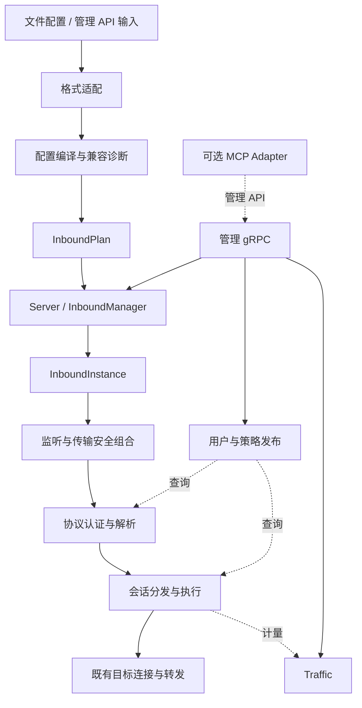
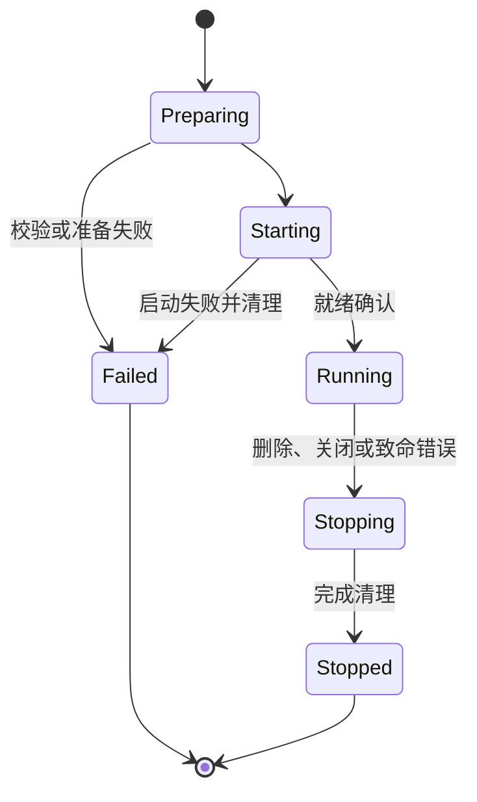

# Chimera Server 架构设计与演进规范

- 文档版本：1.4
- 更新日期：2026-10-05
- 定位：后续架构设计与渐进迁移的首要参考；不是已实现功能清单。
- 实施状态：目标设计已形成，本文不表示代码迁移已经完成。
- 适用范围：Chimera_Server 服务端，当前以 inbound 为主。

## 1. 目标与使用方式

Chimera 的最终目标是完整兼容 xray-core 的服务端行为，使现有客户端无需改变协议配置即可使用 Chimera，并使支持范围内的 Xray 服务端配置保留等价语义。在实现这一目标的同时，改善模块职责、状态所有权、生命周期、资源控制和可维护性。

后续贡献者应先阅读 [AGENTS.md](AGENTS.md)、[需求、架构演进与维护手册](ITERATION_GUIDE.md) 和本文，再检查任务涉及的实际代码与参考实现。手册补充已确认优先级、迁移切片选择、故障排查和交接方法；本文仍是内部设计的首要参考。架构相关改动应说明所属模块、状态所有者、影响的兼容行为和验证方式。本文中的类型与目录名称是设计名称，迁移完成前不得假设它们已经存在。

用户当前明确指令优先；AGENTS 规定贡献流程；本文规定内部设计方向；固定版本的 Xray 源码与互通结果规定外部兼容行为。遇到分歧应明确记录：代码现状不自动推翻目标设计，目标设计也不允许未经验证改变 Xray 行为。例行局部实现不需要反复请求架构确认；重大边界调整应先更新设计理由。

### 1.1 当前范围

- Inbound 协议、传输、安全握手、认证、回落、监听、socket 选项、sniffing。
- 与 inbound 直接相关的用户策略、动态管理、统计和任务生命周期。
- Inbound 正常工作所必需的目标连接、DNS、TCP/UDP 转发及现有路由衔接。
- 用户已明确启动 VLESS Reverse 专项设计；后续实现使用当前 VLESS Reverse 字段与 wire behavior，
  不恢复 legacy `reverse.bridges` / `reverse.portals`。第一阶段优先交付公网 Chimera Portal + 内网
  Xray Bridge 的固定 TCP 端口暴露；完整边界见
  [VLESS Reverse 支持设计与实施计划](VLESS_REVERSE_DESIGN.md)。
- 用户于 2026-10-03 启动 Reverse 站点到站点网关专项：以现有 VLESS Reverse 为站点隧道，在 Server 中逐步加入 Linux TUN 网关和 Overlay 目标映射；TUN 网络栈优先复用 Chimera_Client `clash-netstack/`（Cargo package `watfaq-netstack`）。该专项与完整 Xray TUN inbound 兼容分开声明。当前 Linux TUN 数据面已由隔离 namespace 验证 IPv4/IPv6 单站点 veth LAN 路径、重复 LAN 双站点选择、两 Edge site policy 对 TCP/UDP 的真实目标拒绝、4 KiB UDP 和 SIGTERM 清理；可选 `tunGateway.ipv6Address` 由 Server 绑定；Chimera-only `tunGateway.mtu` 默认 1500、允许 1280–9000，并同时设置设备和 netstack；Gateway 本机可选择使用 `routes`、`routeFrom` 与 `routeInputInterface` 做源/入接口限定路由，上游 LAN 路由仍由部署方设置。站点路径支持 Chimera-only VLESS Reverse `HALF_CLOSE` option，使 TCP 单向 FIN 后仍能传回对向数据；无该扩展位的 Xray 标准 `END` 仍整流关闭，Xray 对端不会获得该扩展语义。Server vendored 了 netstack 异步 shutdown/join 与敏感日志脱敏修复，并在 service owner 退出包循环后 await TCP packet engine。物理 LAN/生产路由、生产负载、更广分片异常、Xray TUN 互通和更大 UDP 的 Mux 分片仍未验收。
  设计与当前实施状态见 [站点到站点网关设计](SITE_TO_SITE_DESIGN.md)。
- 2026-10-05 VLESS Reverse TCP/REALITY 已在固定 Xray 26.9.9 下双向验证：Xray Bridge → Chimera Portal 与 Chimera Bridge → Xray Portal。Bridge client 同时提供 X25519MLKEM768 与 X25519 fallback，并处理所选 hybrid ServerHello；Xray v26.9.9 锁定的 XTLS/REALITY `v0.0.0-20260908062103-8cdf7bf9c7f0` 服务端在 admission 阶段要求 hybrid share。该能力仅由 `vless-reverse-reality` 显式编译启用，验证覆盖错误 shortId 拒绝、TCP echo 与 Portal 重启后的 Bridge reconnect；其他安全/传输组合仍须逐项认证，站点网关及完整 Xray TUN 目标仍为 Partial。
- 2026-10-03 网关安全传输切片：普通静态 VLESS outbound 现可在 `vless` + `tls` features 下使用 RAW/TCP + TLS，并拒绝未编译 TLS feature 的相同配置。固定 Xray 26.9.9 namespace 路径使用 SAN 信任根验证 Office Gateway→Hub Portal 与 Xray Edge Bridge→Hub Portal 两条 TLS 链路，承载双栈 TCP/UDP 与 4 KiB UDP，并验证 TLS Hub 重启后 Xray Reverse worker 重新挂接、Office TCP/UDP 恢复；随后在 Hub/Gateway 持续运行时单独重启 TLS Edge，验证 Portal 新 worker 挂接及 Office TCP/UDP 恢复；Rust TLS 负向测试确认错误信任根与错误 SNI 均拒绝握手；隔离 namespace 的完整 TUN 路径还验证错误 SNI 时双栈 TCP/UDP 不抵达 Edge LAN、恢复正确 SNI 后双栈转发恢复。更广的普通 VLESS outbound 传输/security 组合未实现，站点网关整体仍为 Partial。
- 保护现有 outbound、Chimera 扩展和部署行为。

### 1.2 后置事项与非目标

- 完整 outbound 协议生态和大规模路由功能扩展后置。WireGuard 仍是后期目标；当前仅落地 Linux 服务端 inbound 的 system-TUN 纵向切片，与完整 outbound、userspace IP stack 和跨平台支持分开推进。
- WireGuard 和广泛的 Xray outbound 扩展仍是独立目标，先后次序未定。新启动的 Reverse 站点网关专项使 Linux TUN 成为限定范围内的当前目标；这不授权广泛 outbound 重写，也不代表完整 Xray TUN 兼容。详见手册第 12 节。
- MCP 可做可不做，不是核心交付或发布门槛。若保留，优先独立 Adapter 调用管理 gRPC，复用内部管理服务；现有实现的迁出或删除需纳入具体任务。
- 当前不引入微服务、通用插件平台、分布式控制协议或全局依赖注入容器。
- 不以重构名义改变协议字节、认证规则、默认超时、回落表现或统计口径。
- 不把 Rust、更多 trait、更多 crate 或更短文件视为架构质量的直接证明。
- 不承诺未验证的性能优势；不把参考项目的全部设计视为最优解。

## 2. 参考体系与适用边界

| 参考 | 采用的思路 | 不直接继承的内容 |
| --- | --- | --- |
| xray-core | 配置、线上协议、失败处理和管理 API 的兼容契约 | 具体语言机制和未经分析的内部耦合 |
| clash-rs | 外部配置到内部模型、InboundManager、会话分发的分工 | Clash 配置及默认值 |
| sing-box | inbound 管理与分阶段生命周期 | Go 服务注册机制和整套功能范围 |
| Envoy | listener 就绪/排空、连接与请求作用域、传输和过滤职责 | xDS 全套体系、固定 worker 模型和复杂插件机制 |
| shadowsocks-rust | 协议核心、服务实现与程序入口分离 | 将单一协议抽象直接套用到所有 Xray 组合 |
| Pingora / Leaf | 公共网络能力、协议与传输接口的局部设计 | 用 HTTP 模型统一所有会话，或替换 Xray 行为标准 |

本次设计核对的本地基线：

- `ref/xray-core`：Xray-core `v26.9.9`，提交 `52a412d9e2f5c2a5142b1b4e2ab3771dacb8b120`（pre-release）。
- `ref/clash-rs`：`c6f25ab847a15bf7628d34108eab6a171325dadb`。

后续兼容工作须重新记录实际参考提交和客户端二进制版本。这些基线不是“永远最新”的声明；外部链接可能随分支更新，具体移植前必须固定所用版本。

### 2.1 独立设计原则

参考项目是证据与备选方案，不是 Chimera 内部架构的强制模板。允许并鼓励基于本项目约束提出原创方案；内部结构不必与任何参考项目一一对应。Xray 的外部兼容契约仍然有效。

设计决策从问题出发：先说明状态归属、必须保持的不变量和真实维护成本，再决定模块、接口与并发机制。比较保留现状、借鉴参考和本地简化方案；根据问题规模记录必要的取舍，不为每个小修复增加形式化负担。

优先评估：改变一个行为需要触及多少责任中心、失败后能否恢复一致状态、接口是否暴露过多能力、方案能否独立测试，以及迁移和运行成本。新增抽象应对应真实变化点或不变量；不为了模仿成熟项目或追求原创而增加复杂度。

本设计的独立判断包括：以四种作用域分析状态，同时允许跨连接会话脱离严格父子树；使用实例代次隔离同 tag 重建；数据面获取窄能力而非全局管理状态；先稳定核心库内边界再考虑拆 crate。这些方向应由代码和测试持续检验，不因写入本文而成为不可修订的结论。

## 3. 代码现状与设计动机

以下是初版设计时的结构性动机，不是当前缺口清单，也不是运行故障或性能回归的完整证明。部分问题已在第 12 节记录的迁移中解决；开始新任务时应核对实际代码和手册第 4 节，不能依照此表重新实施已完成工作。

| 当前结构 | 维护风险 | 目标边界 |
| --- | --- | --- |
| `lib.rs` 的 validate 与启动、gRPC 的配置转换分别组织校验 | 默认值和支持范围可能分叉 | 共用配置编译入口 |
| `ServerProxyConfig` 部分分支持有 `SocksUserStore` 共享可变状态 | 配置克隆与运行状态共享的语义不同 | 计划与用户运行状态分离 |
| `RuntimeState` 同时持有配置、任务、路由、策略和事件 | 连接层能依赖过多管理能力 | 管理能力与数据侧查询能力分离 |
| gRPC handler 直接登记、启动、回滚和停止 inbound | 生命周期规则绑定在 API 实现中 | InboundManager 统一编排 |
| `beginning` 同时负责监听、sniffing、分发与转发 | 修改一个流程需要理解多个层次 | 按职责渐进提取 |
| handler 的 `Completed` outcome 只表示当前连接已同步处理完成 | outcome 不再隐含 detached/spawned task 的所有权转移 | 后台任务必须在返回前登记到 connection/session owner |
| 协议与安全/传输层共用递归枚举 | 多处递归匹配容易重复规则 | 明确组合计划及能力边界 |

代码入口： [lib.rs](chimera_server_lib/src/lib.rs)、[runtime.rs](chimera_server_lib/src/runtime.rs)、[配置类型](chimera_server_lib/src/config/server_config/types.rs)、[gRPC Handler](chimera_server_lib/src/grpc/handler.rs)、[连接处理结果](chimera_server_lib/src/handler/tcp/tcp_handler.rs)。

现有 handler、TCP/UDP 消息流区分、路由快照和真实客户端测试是迁移基础。本文不要求推翻这些实现。协议覆盖应查阅并核验 [兼容矩阵](examples/xray-compatible/README.md)，不在此维护易过时的“未实现协议”列表。

## 4. 总体结构与依赖方向


```mermaid
flowchart TD
    Input[文件配置 / 管理 API 输入] --> Adapt[格式适配]
    Adapt --> Compile[配置编译与兼容诊断]
    Compile --> Plan[InboundPlan]
    Plan --> Manager[Server / InboundManager]
    Manager --> Instance[InboundInstance]
    Instance --> Transport[监听与传输安全组合]
    Transport --> Protocol[协议认证与解析]
    Protocol --> Session[会话分发与执行]
    Session --> Connector[既有目标连接与转发]
    Identity[用户与策略发布] -.查询.-> Protocol
    Identity -.查询.-> Session
    Session -.计量.-> Traffic[Traffic]
    MCP[可选 MCP Adapter] -.管理 API.-> Control[管理 gRPC]
    Control --> Manager
    Control --> Identity
    Control --> Traffic
```

图表示职责调用关系，不规定所有网络包都经过相同线性链路。QUIC、XHTTP、REALITY/Vision 的组合必须单独表达。

### 4.1 模块契约

| 逻辑模块 | 输入与输出 | 拥有的内容 | 禁止承担的职责 |
| --- | --- | --- | --- |
| config | 外部配置 → 已验证计划或诊断 | 字段规则、默认值、组合校验 | listener、连接任务、动态授权状态 |
| server | 启动计划 → ServerHandle | 组件装配、整体就绪、进程级关闭 | 协议帧解析 |
| inbound | 计划与管理命令 → 实例/操作结果 | 实例注册、启停、资源准备协调 | protobuf 解码、业务路由匹配 |
| transport | 网络接入 → 流/消息与传输上下文 | listener、传输状态、安全握手资源 | 代理协议业务目标决策 |
| protocol | 流/消息与凭据查询 → 会话请求/回落结果 | 认证和协议编解码 | 全局服务增删 |
| session | 会话请求 → 转发与完成结果 | 会话任务、超时、取消、半关闭 | JSON/protobuf 格式 |
| identity / policy | 管理更新 → 可查询版本 | 用户、授权规则、策略发布 | socket 启停 |
| control | API 请求 ↔ 内部命令与响应 | API 适配与错误映射 | 独立实现启动事务 |
| traffic | 计量记录 → 聚合/查询 | 统计状态 | 决定认证和连接结束 |
| outbound | 目标请求 → 既有连接能力 | 已有出站实现 | 本轮扩展新协议体系 |

配置编译可依赖纯协议选项校验；运行模块不反向依赖外部配置格式。控制面可调用管理能力，但协议/会话层不依赖 gRPC/MCP。跨模块公共类型只提取稳定的小型值对象，不建立容纳所有状态的 `common` 大模块。

## 5. 配置、计划与运行实体

### 5.1 三阶段模型

| 对象（设计名） | 作用 | 不变量 |
| --- | --- | --- |
| XrayInboundConfig | 表达原始输入，包括别名与省略值 | 不把未指定值过早变成默认值 |
| InboundPlan | 表达编译完成的监听、传输、协议和初始用户设置 | 不持有活跃 socket、任务或可变授权集合 |
| InboundInstance | 表达实际运行的 inbound | 资源、动态状态和清理责任明确 |

计划不等于可公开打印的数据：它仍可能包含凭据，必须采用安全摘要或脱敏 Debug。不要持久保存无必要的原始配置副本。

### 5.2 单一语义入口

文件和 gRPC 各自解码，再汇入共用的内部描述及编译逻辑。两种格式不必具有相同字段，但相同含义必须得到相同默认值与组合检查。API 侧需保留 protobuf presence 等输入语义，不能无条件绕经 JSON 导致信息丢失。

检查分三个阶段：

1. 配置编译：字段、默认值、feature 支持及协议组合。
2. 资源准备：证书、密钥、必要文件和平台能力；昂贵或阻塞工作离开转发路径。
3. 启动：实际绑定端点、启动任务、确认就绪。

`--check` 的检查深度应在迁移时记录并用测试固定；它不等同于端口可绑定。共享编译过程不应启动后台任务或安装日志订阅器。

### 5.3 兼容诊断

- 区分已支持、部分支持、仅格式保留、服务端不适用和未支持。
- 已识别但未执行的行为不能无声成为“支持”；安全关键选项未实现时应拒绝。
- 未知字段的处理对照 Xray，不通过全局严格模式随意改变接受范围。
- 诊断包含安全的字段路径和错误类别，不回显配置原文、私钥、密码或认证帧。
- 偏离 Xray 的安全强化应声明影响，尤其关注认证失败响应和回落行为。

## 6. 四个生命周期作用域

| 作用域 | 典型所有者 | 资源与状态 | 结束条件 |
| --- | --- | --- | --- |
| 服务器 | ServerHandle | 组件管理器、控制服务、根取消信号 | 组件完成关闭或达到明确清理期限 |
| Inbound 实例 | InboundManager / InboundInstance | 监听、用户存储、实例任务组 | 停止接入并完成规定的清理 |
| 物理连接 | ConnectionHandle | TCP/QUIC 连接、握手状态、传输子任务 | 传输关闭且所属任务收尾 |
| 逻辑会话 | SessionHandle 或会话注册表 | 目标连接、消息通道、策略引用、计量 | 协议规定的关闭、超时或取消 |

这些作用域不是严格的四层树：HTTP/2 和 QUIC 一条连接可承载多会话；XHTTP 会话可能关联多条 HTTP 请求；XUDP 的跨连接重关联可能要求会话状态由 inbound 级注册表持有。明确谁拥有持久会话、谁仅持有引用，禁止在连接退出时误删可重关联状态。

### 6.1 Inbound 状态机与实例身份


```mermaid
stateDiagram-v2
    [*] --> Preparing
    Preparing --> Starting
    Preparing --> Failed: 校验或准备失败
    Starting --> Running: 就绪确认
    Starting --> Failed: 启动失败并清理
    Running --> Stopping: 删除、关闭或致命错误
    Stopping --> Stopped: 完成清理
    Failed --> [*]
    Stopped --> [*]
```

- tag 是外部寻址属性，不是唯一内部身份。内部实例 ID/代次应能区分同 tag 的删除重建；无 tag 和重复 tag 的合法性遵循 Xray。
- 管理器统一维护实例及状态，避免配置表与任务表由不同调用者分别更新。
- 同一目标的变更须串行化或做版本检查；不持有全局阻塞锁执行异步启动。
- 旧实例任务回调只能影响自己的代次，不能删除新实例。
- 对外 API 何时返回成功、是否暴露准备状态，按 Xray 合同确定；内部就绪状态不自动新增外部 API。

### 6.2 关闭与任务所有权

任务生成必须有 owner；任务移交要带登记与完成通知。Drop 不能完成异步排空，丢弃 JoinHandle 也不是取消。设计应提供显式关闭流程，并处理调用方取消管理操作时的资源清理。

区分停止接受新连接、结束逻辑会话、关闭底层传输。是否排空既有连接及其期限按协议/API 兼容行为确定，不能默认所有删除都立即 abort，也不能默认永远保留旧连接。清理超时后仍应记录未完成项并处理资源，不把取消信号已发送当作关闭成功。

## 7. 传输、安全与协议边界

监听端点与代理协议分开建模；计划明确合法的安全/传输组合，构建阶段选取实现。避免每个管理操作都重复递归匹配整个协议枚举。

但不强制固定的“TCP → TLS → HTTP → 协议”顺序：QUIC 自带安全握手；REALITY 具有回落职责；Vision 依赖安全状态与底层转发能力。传输上下文通过明确能力提供 SNI、ALPN、来源地址及必要状态，不把完整 RuntimeState 交给协议。

原始 TCP 转发等优化仅在能力与安全前提满足时启用。快速路径必须保持计量、取消、半关闭及协议边界；缺少能力时使用已验证的常规路径。

协议返回结果应表达 TCP、固定目标 UDP、多目标 UDP、会话型 UDP、回落或可跟踪的协议自主管理任务。保留现有不同消息流抽象，不用单一字节流隐藏消息边界，也不建立覆盖所有协议细节的巨大 trait。

## 8. 身份、策略、分发与统计

- 初始用户属于计划；可变用户与授权状态属于运行存储。存储可共享实现，但协议特定凭据和认证流程保留在对应模块。
- 认证身份由协议产生，再用于策略、目标选择与统计；不能依靠统计上下文充当认证的唯一事实来源。
- 数据面仅持有查询/执行能力，管理面持有发布/变更能力。优先使用具体窄接口，确有替换或测试需求时再引入 trait。
- 路由与关联数据应作为一致版本发布；现有 RoutingPublication 可逐步复用。
- 每项用户/策略变更注明影响新握手、新请求、新消息还是既有会话。不可统一假定整条连接只读取一次，也不可按字节获取全局锁。
- 流量在定义明确的位置计量，传输层和会话层避免重复计数；失败、回落、取消和快速路径同样验证 Xray 对应口径。
- 继续复用 traffic、tracing 和管理 gRPC，不另设观测体系；MCP 为可选适配能力。

## 9. 关键流程

### 9.1 初始启动

解码与编译 → 准备必需资源 → 创建组件与 inbound 实例 → 绑定并等待就绪 → 按既有部署契约暴露服务就绪。

阶段失败由 server 统一执行已创建资源的反向清理；清理责任不能依赖 CLI 进程恰好退出。部分启动是否允许必须明确，默认不能把关键 inbound 失败报告为整体健康。

### 9.2 动态增加与删除 inbound

控制适配 → 共用配置编译 → 管理器预留实例身份 → 准备与启动 → 发布运行状态 → 映射 API 结果。失败撤销预留并清理资源；相同 tag 的并发变更不能绕过一致性规则。

删除按实例身份进入停止流程，API 状态和返回时机保持兼容。不得直接由 gRPC 分别删除配置、abort listener、修改统计来拼凑操作。

### 9.3 连接与会话

接入 → 传输/安全处理 → 协议认证与目标解析 → sniffing/策略/分发 → 目标连接 → 会话转发 → 计量及资源收尾。

该流程表达逻辑责任，不改变协议规定的成功响应时机、认证顺序和回落原始字节重放。握手、目标连接、空闲以及单向关闭分别拥有超时语义。

### 9.4 动态用户更新

输入适配 → 协议用户校验 → 发布更新版本 → 按指定边界读取新版本。失败不发布半成品；跨字段更新应原子可见。既有连接是否继续有效按参考行为测试。

## 10. 资源与错误模型

资源预算按适当作用域分配，重点覆盖未认证握手、连接、UDP 会话、XHTTP 待配对数据、队列和缓存。限额同时定义释放条件、过载行为和配置默认值。新增限额不得隐式破坏合法客户端流量。

控制更新和慢速统计消费者不阻塞转发。明确背压或丢弃策略：允许丢弃的观测事件不能被误用于认证、流量结算或生命周期事实。重放缓存也不能因普通缓存淘汰策略失去安全保证。

内部错误至少在责任上区分配置、资源准备、协议、连接和生命周期失败；沿用已有错误类型渐进演化，不要求一次重写全部错误枚举。控制面映射 Status，CLI 映射退出与诊断；内部模块不直接决定外部 API 错误格式。

## 11. 目录演进与工程边界

第一阶段保留现有四个 workspace crate：主应用、核心库、CLI 工具、专用 TCP REALITY 服务。先在核心库内部建立边界，稳定后再依据独立依赖、复用或编译需求决定是否拆 crate。

| 当前位置 | 目标职责归属（不是立即移动指令） |
| --- | --- |
| lib.rs 的装配与启动 | server |
| config 与各入口重复转换 | config 的适配、编译、计划 |
| beginning 的 listener 创建 | inbound / transport |
| beginning 的 sniffing、分发、转发 | session |
| handler 的代理协议 | protocol |
| handler 的 WS、gRPC、TLS 等包装 | transport 及安全子模块 |
| RuntimeState 的实例与任务表 | inbound 管理组件 |
| 配置内动态用户状态 | identity / inbound 实例 |
| gRPC 的启停事务 | inbound 管理组件 |
| gRPC/MCP 的格式适配 | control |

专用服务入口和公共 library API 是需要保护的使用方，不因为主 CLI 通过就视为迁移完成。优先提取职责和收窄可见性，再移动文件；不做大规模纯重命名。

迁移状态（2026-09-13）：`session` 目录已开始承接会话域职责。第一步将 `beginning::stream_session` 中的 sniffing 解析、目标覆盖与 route-plan 纯逻辑，以及前缀读取/回放 helper 收敛到 `session::sniff`；随后将 setup outcome 规范化、routing identity 投影与核心 `process_stream_with_context` 分发收敛到 `session::dispatcher`。普通 TCP、gRPC transport 与 XHTTP 现已直接调用 `session::dispatcher`；handler setup 与 routed outbound connector 的薄 adapter 也已收进 dispatcher，原 `beginning::stream_session` 过渡模块已删除。TCP/UDP relay helper 仍暂由 `beginning` 窄接口提供，因此 `beginning` 尚未完成迁移，listener、connection/session task owner、响应时机与 relay 行为均未改变。

### 11.1 功能隔离：模块、Cargo feature 与运行时配置

目标是让能力可隔离、可验证，并帮助缩小线上故障范围。模块和类型负责职责与依赖；Cargo feature 负责构建时裁剪可选能力；运行时配置负责选择已编译能力的启用方式。不能通过增加 feature 数量代替职责拆分，也不要求每个模块对应一个 feature。

| 能力类别 | 划分建议 | 约束 |
| --- | --- | --- |
| 入站协议 | 按独立协议提供可选 feature | 启用时包含必需认证与协议校验 |
| 可选传输 | WS、HTTPUpgrade、gRPC transport、XHTTP 等按需要隔离 | 声明组合要求，不暗示所有协议均能使用 |
| 安全能力 | TLS、REALITY 等显式表达依赖 | 未编译时拒绝相关配置，不降级为明文 |
| 控制面 | Xray gRPC API、MCP 可独立裁剪 | 区分管理 API 与 gRPC 传输，数据面不依赖管理服务 |
| 可选优化 | 编译选择配合必要的运行时路径选择 | 常规路径须保持等价协议、安全和计量语义 |
| 诊断能力 | 昂贵跟踪与实验探针单独控制 | 不自动进入普通生产构建，不泄露凭据 |
| 核心保障 | 生命周期、取消、必要校验与错误处理保持必需 | 不能作为关闭后“更快”或“更容易排障”的选项 |

上表是目标分类，不是现有 feature 清单。当前 manifest 已包含协议/传输 feature、`full`、`minimal-vless`、`minimal-vless-tls` 等组合；XHTTP、MCP 是否独立裁剪等事项仍需审计。先验证既有边界是否真实有效，再决定新增或调整 feature；本文件不授权立即重命名或修改默认构建。

### 11.2 依赖与能力记录

- Feature 以增加能力为原则，避免表示“关闭某行为”的负向 feature，以及隐含优先级的互斥组合。确需选择不同实现时，优先在合法构建中通过明确配置选择。
- 默认依赖及其他使用方可能使依赖 feature 被合并启用。最小构建必须明确 package、target 和 feature 集合，检查最终依赖图，不能根据 `--no-default-features` 或组合名称推断隔离成功。
- 应用 crate 向库转发 feature 时保持语义一致；共享辅助实现不应因为某个协议关闭而意外消失，也不应为复用辅助函数而启用无关服务器。
- 对影响行为的已识别能力，区分“未编译”“已编译但未启用”和“不支持该组合”。配置应给出明确诊断，不能通过条件编译移除字段后静默忽略用户意图。
- 保留现有发布构建和默认值；变更默认 feature 是部署兼容变更，需要单独说明。

为涉及的能力在对应 Cargo.toml 注释、配置说明或兼容矩阵记录：责任模块、所属 package、编译 feature、必需/共享依赖、运行时入口、平台限制、未编译时行为、验证命令和已验证版本。不要求在多处重复维护同一清单；通过链接关联构建能力与协议兼容矩阵。

### 11.3 构建与行为验证矩阵

不穷举所有 feature 排列，但每项公开支持的构建组合应有可追溯验证。覆盖至少包含：

| 构建范围 | 验证目的 |
| --- | --- |
| 指定 package 的最小支持组合 | 发现对默认/full 隐含依赖，验证该组合实际可用 |
| 常用生产组合 | 验证真实部署配置和所需控制面能力 |
| 默认与 full 组合 | 防止对现有发行方式的回归 |
| all-features | 检查全部已声明特性的共存，不等同生产推荐构建 |
| 本次影响的重要交互组合 | 协议 × 传输 × 安全，以及控制面或优化路径交互 |
| 禁用相关能力的组合 | 已识别配置明确失败，无静默安全降级 |

有意义的验证包含编译、针对性行为测试与必要互通，不只检查 feature 名称存在。测试依赖与 feature 合并可能掩盖生产二进制缺少依赖的问题，需同时检查实际部署目标。降低 feature 后问题消失，只能证明与构建差异相关，不能直接认定某模块有 bug。

以下命令对应当前应用 manifest，仅展示如何查看和检查最小 VLESS 构建，不表示本次文档更新已执行或认证这些组合：

```sh
cargo tree -p chimera_server_app --no-default-features --features minimal-vless -e features
cargo check -p chimera_server_app --no-default-features --features minimal-vless
cargo check -p chimera_server_app --no-default-features --features minimal-vless-tls
```

针对部署补充相同 target 与实际构建参数；追踪某依赖是谁启用时可进一步使用反向依赖查询。确认相关测试真正执行，不能把零测试、被忽略测试或全特性下通过当成最小组合验证。

### 11.4 线上问题的两级缩减流程

1. 保存原始证据：源码提交、二进制标识、工具链、lockfile 状态、package/target、启用 feature、构建参数、安全配置摘要、客户端版本与请求、负载和故障现象。不要记录凭据原文。
2. 在复现或灰度环境优先使用同一二进制，减少无关 inbound、停用不影响复现的可选服务，或切换已有的等语义常规转发路径。每次只改变一个维度，并确认请求仍经过原故障路径。
3. 必要时制作最小 feature 构建：保留故障协议、传输、安全能力及其依赖，检查实际启用图；保持其余构建和运行条件可比。
4. 恢复被移除能力并重复观察，检查是否为功能交互或时序变化；对并发性问题重复运行，记录频率与负载。减少并发后不复现不等于问题修复。
5. 定位后增加对应组合的回归验证，并在原始部署组合复验。保留可回退版本，生产切换遵循现有部署授权与流程。

禁止以关闭认证、重放保护、必要校验或资源安全保障的方式取得“通过”结果。该排障流程不是任意停用生产服务的授权。使用现有日志与构建记录，不为此默认增加遥测服务或公开诊断 API。

## 12. 渐进迁移路线与验收

本文建立路线，不自动授权执行所有阶段。后续任务按当前用户范围选择一个切片；迁移与新增协议分别验收。具体选择流程与调整后的迁移阶段见 [维护手册第 15–16 节](ITERATION_GUIDE.md#15-每轮迭代如何选择任务)。优先实际责任、必要契约和 owner，不以文件行数或目录移动作为必经门槛；下方历史完成状态不因新手册建立而重置。

| 阶段 | 交付 | 最小验收 |
| --- | --- | --- |
| M0 | 固定现有行为与入口测试、记录依赖边界 | 基线和未验证范围可追溯 |
| M1 | 一个现有 inbound 的共用编译与计划边界 | 文件/检查/API 等价输入规则一致，准备不启动任务 |
| M2 | 管理器接管该 inbound 的初始启动和动态增删 | 绑定失败回滚、重复操作、取消、同 tag 重建 |
| M3 | 配置计划与动态用户状态分离 | 克隆隔离、原子更新、认证及删除用户语义 |
| M4 | 连接/会话任务归属明确 | EOF、半关闭、超时、重关联、取消和计量收尾 |
| M5 | 提取传输/协议组合边界 | 所涉及的 TLS/REALITY/传输组合互通不变 |
| M6 | 收窄 RuntimeState 与依赖，扩展到其余 inbound | 无控制面格式进入数据面，公共调用方保持可用 |

实施状态（2026-09-11）：M2/M3/M4/M5/M6 已按本文当前验收边界完成。`InboundManager` 已把运行时 inbound 发布记录收敛为实例级 `InboundInstance`：同一 generation 内由一个对象共同持有配置、生命周期、协议运行时用户存储与 listener task handles，不再维护可与配置漂移的独立 task 注册表；并已接管 gRPC Add/Remove/Alter 的启动、停止和失败回滚事务；同 tag 操作通过有界 hash-lock 分片串行化，运行实例使用 generation 区分同 tag 重建，旧 generation 的 task 注册或停止不能影响新实例。Add 仅在 listener 启动成功后发布配置与 task，Remove 在摘除实例后 abort/await task，非原地 Alter 重启失败时按既有行为尝试恢复旧实例。固定 Xray baseline 的 untagged inbound 语义现也已显式落地：空 tag 不参与非空 tag 唯一性约束，多个空 tag inbound 可按 generation 独立启动并共存；批量启动在 bind 前显式拒绝重复的非空 tag，避免 generation 化启动误放宽命名唯一性；动态 AddInbound 接受空 tag，而 RemoveInbound 仍不能用空 tag 寻址，与 Xray `untaggedHandlers`/`RemoveHandler("")` 行为一致。HandlerService 的 lifecycle failure gRPC code 也已用同一双端 harness 实测对齐固定 Xray baseline：重复非空 tag 的 AddInbound、缺失 tag 的 RemoveInbound、缺失 tag 的有效 AlterInbound 均返回 `Unknown`；Chimera 保留自己的简洁错误文本，不复制 Xray 内部 error wrapping 链。M2 的成功时机与既有连接处理也已完成 closure：动态 Add 只有在 bind/listen 成功并取得 `BoundInboundTasks` 后才返回成功，Remove 会同步停止并 await owning listener task、确认端口已释放后返回；真实 Xray/Chimera 双端 SOCKS5 测试进一步锁定 Remove 后新连接被拒绝而既有 TCP tunnel 继续传输。固定 Xray baseline 在动态 Add 的 bind 失败时会先把 handler 留在 manager map，导致失败 tag 仍可列出且释放端口后同 tag 重试仍失败；Chimera 按本文 M2 的事务/rollback 约束有意不复刻该失败残留，失败实例不发布且端口恢复后可重试。这是明确记录的 lifecycle safety deviation，而不是未验证差异。对只有一个 VLESS UserManager 的 inbound，初始用户仍来自配置计划，但可变用户集合现由实例级运行时存储持有；管理查询把该快照投影回配置视图，VLESS/TLS/REALITY/Vision 数据面在新握手时读取最新用户快照。direct TLS/REALITY 到 VLESS 的 handler 拓扑现不再由初始用户是否包含 `xtls-rprx-vision` 决定：两者始终构造 mixed-capable VLESS security handler，在每个新请求上读取 runtime user snapshot 并按该用户的 flow 选择普通 VLESS 或 Vision，因此 AddUser/RemoveUser 包括首次加入或删除最后一个 Vision 用户都无需重启 listener，与固定 Xray baseline 的单 handler validator 更新语义一致；XHTTP/WebSocket/gRPC/HTTPUpgrade 等不支持 Vision 的 transport 不会因动态用户变化切换 transport handler。单一 VMess UserManager 也已使用实例级运行时存储；VMess handler 与管理器共享预编译的 AuthID 认证材料，AddUser/RemoveUser 在控制面更新时重新编译并原子发布，新握手无需重建 listener，邮箱匹配和相同 UUID 的最后写入认证优先级按固定 Xray 基线处理。单一 Trojan UserManager 现同样使用实例级运行时存储，并分离 email 管理索引与 password-hash 认证索引；动态 AddUser/RemoveUser 不重启 listener，保留原始 password/email 文本，非空 email 按大小写不敏感语义唯一，空 email 用户可认证但不进入 GetUsers/GetCount，同 password 后写覆盖认证索引以及删除后不恢复旧 credential 的行为均按固定 Xray 基线锁定。单一 Hysteria2 UserManager 也已分离为实例级 validator store；QUIC/H3 listener 保持不变，新认证直接读取共享运行时授权索引，动态 AddUser/RemoveUser 无需重启 listener。raw auth 与 UUID masked-ID 二级索引按固定 Xray 基线维护，UUID 字节 6..7 仅携带 VLESS route、碰撞时后写覆盖，删除碰撞用户不会恢复旧 masked-ID 映射；transport-level auth 仅在真实 validator 为空时作为 fallback，删除最后一个动态用户后重新生效；管理面的 email 删除保持大小写敏感、只删除一个匹配用户且 missing 为 no-op。单一 Shadowsocks UserManager 现也使用实例级运行时 store，TCP 新握手与 UDP 新数据包都读取共享的预编译用户状态，动态 AddUser/RemoveUser 无需重启 listener，同时既有连接、已认证 UDP 请求以及 replay/salt/session 状态不会因用户表更新被重建。legacy Shadowsocks AddUser 按 Xray 直接 append，并从新增 account 自身的 `cipherType` 解析 AEAD method，因此同端口可动态加入不同 AEAD cipher；RemoveUser/GetUser 的 email 匹配大小写不敏感。Shadowsocks 2022 EIH identity 保持不可变配置，只动态更新用户 key；非空 email 仅完全相同时拒绝重复，空 email 可重复，删除与单用户查询仍大小写不敏感，GetUsers 保留 user level。Chimera 扩展允许一个 wrapper 中出现多个嵌套 user-manager target；这没有对应的单一 Xray inbound `proxy.UserManager` 语义，当前仍保留 restart fallback 以避免合并不同认证作用域，不作为 Xray-compatible M3 的阻塞项。固定 baseline 中当前 inbound 目标实现 UserManager 的 VLESS、VMess、Trojan、Hysteria2、Shadowsocks/2022 均已完成实例级动态状态分离、配置视图投影和新握手/新数据包生效；WireGuard UserManager 不在当前 inbound compatibility matrix 范围。初始 data-plane 启动现也由 `InboundManager` 事务化接管：`lib.rs` 只触发整批配置启动，后续任一 inbound 绑定失败会 generation-aware 地停止本批此前已启动的 listener，批次 future 被取消时同样通过启动 guard 清理已发布 task。非原地 Alter 在旧 task 摘除后由 generation-aware recovery guard 覆盖管理 future 取消，且 `start_servers` 对已产出的启动中 listener task 使用临时所有者，在取消或中途失败时主动 abort，避免半启动实例阻塞恢复。实例级生命周期状态的第一层也已落地：已登记配置显式记录 `Prepared/Starting/Running/Stopping/Recovering`，配置批量启动、task 发布/停止以及非原地 Alter/取消恢复按 generation 更新该状态，并用回归测试锁定失败回滚和恢复后的状态不变量。动态 Add 的未发布阶段现使用 generation-aware `Starting` reservation，绑定失败或管理 future 取消会清除 reservation，成功时再一次性发布 `Running` 配置与 task；Remove 摘除公开配置后保留 `Stopping` tombstone，并由 cleanup guard 持有已 abort 的 `JoinHandle`，即使管理 future 被取消也会后台 await 完成后才释放 tombstone，因此同 tag 不会在旧 listener 清理完成前被重新占用。兼容保留的 `RuntimeState::register_inbound_tasks` 现在也只能把 task 附着到已存在实例，不存在 tag 时会主动 abort handles，不能再形成只有 task 没有配置的幽灵状态。当前各 `start_servers` 路径均在返回前完成 socket bind/listen；manager 专用启动路径现进一步返回不可公开构造的 `BoundInboundTasks`，只有所有要求的 bind/listen 步骤成功后才能取得该就绪令牌并发布 `Running`，令牌在 publication 前被丢弃会主动 abort 已绑定 listener，避免 ready-but-unpublished 实例脱离生命周期所有者。公开 `start_servers` 仍保留原 `Vec<JoinHandle>` 兼容签名。该边界已把“绑定完成”编码为 manager 的 readiness capability，但还没有协议/传输层更细的 accept-loop health 或首个服务请求就绪信号。M5 已完成传输/协议组合边界闭环：配置编译现在按 Xray 的 effective network 语义只选择一个 transport，未选中的 `wsSettings` 等 transport settings 不再叠加执行；WebSocket、gRPC、HTTPUpgrade 与 XHTTP 在省略对应 settings 时使用固定 Xray 26.2.6 验证过的默认配置，`raw`/`tcp` 与 `xhttp`/`splithttp` 别名保持等价。运行时新增单一 listener transport plan，一次把兼容保留的递归 `ServerProxyConfig` wrapper 分类为普通 stream、gRPC 或 XHTTP，并携带唯一 TLS/REALITY security 与 leaf protocol；`beginning` 不再分别用 `is_grpc_server_protocol`/`is_xhttp_server_protocol` 重复递归探测，gRPC/XHTTP transport 也不再各自重新解析 wrapper。TCP protocol factory 已与 WebSocket/HTTPUpgrade/TLS/REALITY transport wrapper factory 分离，协议 leaf 构造不再承担 transport/security 组合知识。固定 Xray client 已重新实测 VLESS raw TCP、WebSocket、WebSocket+TLS、gRPC、HTTPUpgrade，以及 XHTTP none/TLS/REALITY/HTTP3 均保持互通；workspace all-feature Clippy、locked 全测试与 minimal VLESS 构建同时通过。M4 已完成本阶段的连接/会话任务归属闭环：普通 TCP listener、gRPC transport、XHTTP TCP(H1/H2)、XHTTP HTTP/3、Hysteria2 QUIC 以及 Chimera TUIC QUIC accept 后的顶层连接处理不再由 listener-local detached task/`JoinSet` 隐式持有，而由 `RuntimeState` 中 server-level `ConnectionTaskOwner` 通过 `TaskTracker` 跟踪其完整生命周期；任务 owner 只负责生命周期归属与后续 server drain 能力，不统一决定 listener 删除时是否取消既有连接，各传输仍按固定基线或既有协议语义执行自己的关闭策略。gRPC transport 的 plain/TLS/REALITY 顶层连接均进入同一 owner，connection-scope 的 stream/upload 子任务仍由既有 guard 管理；XHTTP TCP listener 停止时也不再通过 listener Drop 广播 shutdown，因此既有 keep-alive 连接可继续处理请求，而新连接已停止接受，与固定基线 `splithttp.Listener.Close()` 只关闭底层 TCP listener、不调用 `http.Server.Close()` 的行为一致。Hysteria2 仍保留 Xray 对应的 QUIC transport-close 语义：删除 listener 会关闭底层 endpoint/transport，server-level owner 只负责记录连接任务生命周期，不额外把它改造成 TCP 式 drain；其已认证 H3 connection 内的 0x401 TCP stream handler 现由 connection-local `JoinSet` 持有，正常 connection 收尾会 abort/drain 残留 stream task，connection future 被 sibling UDP/H3 failure 或 server shutdown 取消时也会通过 `JoinSet` Drop 终止子任务，不再形成 detached stream。TUIC 的顶层 QUIC connection task 也进入同一 owner；其 connection 内部的 bidirectional/unidirectional stream、UDP remote relay 与 session cleanup 子任务现进一步由 connection-local `TaskTracker` 和 server-level owner 双重跟踪，正常 connection 收尾会统一 cancel/await，父 connection 被强制取消时 connection owner 的 Drop 也会触发子任务 cancellation，避免子任务依赖 `quinn::Connection`/UDP socket 克隆脱离父生命周期；固定 Xray baseline 不提供 TUIC，因此该迁移仅用于 Chimera 内部生命周期一致性，不构成 Xray compatibility 声明。REALITY probe/auth fallback 也已从 detached relay 改为显式 connection continuation：SNI 不匹配、客户端不支持 TLS 1.3、目标站 TLS 握手不完整或 REALITY 认证失败时，fallback 判定仍处于原握手 deadline 内，但一旦决定转发，双向 relay 会由原 server-owned connection future 持有直到 EOF/错误收尾，不再 `spawn` 后让父 future 提前返回；因此既保留 Xray probe fallback 可持续转发的外部语义，也让 whole-server drain/cancel 能准确覆盖该连接。XHTTP 的 stream-one upload pump、stream-one/stream-down logical handler 以及未配对 split session 的 TTL cleanup 现也进入 server-level connection/session owner，不再在 HTTP handler 返回后成为 detached task；TCP listener 删除仍不触发 XHTTP shutdown token，因此既有 keep-alive/logical session 可按固定 Xray TCP listener-close 语义自然结束，而 whole-server drain/cancel 能覆盖这些跨请求任务。若 server 已关闭新任务登记，新建 split session 会立即从 store 摘除并关闭 upload queue，避免留下无 owner 的幽灵 session。XHTTP HTTP/3 顶层 QUIC connection task 仍监听该 XHTTP listener 的 shutdown token；listener 停止会终止这些 H3 连接任务、connection-owned request tasks 以及上述 logical/session tasks，保持固定 Xray `http3.Server.Close()` 的 server-close 语义，而不是套用 TCP keep-alive drain。XUDP frame reader task 则继续由 `XudpMessageStream` 本身持有 `JoinHandle`：显式 message-stream shutdown 会 abort/await，Drop 也会 abort，因此它属于物理 XUDP stream owner，不迁入跨连接 GlobalID registry。MultiDirectional UDP 中按目标创建的普通 direct/Trojan UDP 子会话现由当前物理连接持有 connection-scoped `TaskTracker`：父 relay 的正常 EOF 与错误退出都会先释放 session senders，再关闭并等待子任务完成后返回；GlobalID XUDP 明确保留 inbound/global registry 所有权，不因当前连接退出而被纳入该 tracker，以维持跨连接重附着语义。SessionBased local direct/Trojan worker 现通过显式 cancellation 进入统一 cleanup 并 await task；GlobalID worker 的 replacement、显式 termination 与 detached TTL expiry 都在 per-GlobalID gate 下先从 registry/map 摘除，再释放 global mutex 后 abort/await，TTL timer 本身由 global registry 的 `TaskTracker` 持有；Dokodemo logical UDP tasks 与 Shadowsocks per-packet tasks 也已进入 server-level owner，同时保留 listener 停止后既有处理自然结束的语义。Shadowsocks TCP 的 legacy AEAD 与 2022 AEAD codec worker 现由返回给 relay 的 `TaskBackedStream` 显式持有：plaintext write-half shutdown 会等待 encrypt worker 完成 encrypted write-half shutdown，但不会中断独立 decrypt/read half，从而保留 Xray request/response 双向并行与半关闭语义；整个 wrapper Drop 时同时 abort decrypt/encrypt worker，因此父 connection 被取消或提前结束时不会留下仍阻塞在客户端 socket 上的 codec task。server shutdown 的第一层统一 drain/cancel 策略现已落地：SIGINT/SIGTERM 会先关闭 server-level connection owner 的新任务登记，停止控制面/观测面与全部 inbound listener，再给既有 server-owned connection/session task 10 秒自然 drain 窗口，超时后通过共享 cancellation token 取消并等待残留任务；GlobalID XUDP 仍保持 global registry 所有权，不被错误归入物理连接 tracker，但在整个 server 退出时会单独清空 worker/registry 并取消 expiry maintenance task。server runtime 的第二层 shutdown 状态现也已落地：生命周期显式记录 `Starting/Running/Draining/Stopped/Failed`，只有所有要求的服务完成启动后才发布 `Running`；收到退出信号或服务异常后在停止 listener 前先进入 `Draining`，正常信号清理完成进入 `Stopped`，异常服务/信号监听失败清理完成进入 `Failed`。既有 `GetSysStats` readiness probe 只在 `Running` 返回成功，在 startup/drain/terminal 状态返回 `Unavailable`，避免控制面端口已绑定但数据面尚未 ready，或 shutdown 已开始后仍被外部视为 ready。Chimera 根配置扩展 `shutdown.gracePeriodSeconds` 可覆盖 server-owned connection/session 的自然 drain 窗口，缺省保持 10 秒，`0` 表示不等待自然 drain、直接取消残留任务；该扩展不改变 Xray 协议/传输配置语义。per-inbound lifecycle 的下一层 health 也已接入：运行实例增加 `Draining/Failed` 状态，server-wide shutdown 在 abort/await listener 前先把正常运行实例标成 `Draining`；`Running` generation 下任何 listener `JoinHandle` 非预期结束都会被 generation-aware health watcher 检出并标成 `Failed`，正常 remove/alter/shutdown 因会先离开 `Running` 而不会误报。server 顶层同时等待该故障信号，命中后记录具体 tag/generation、把整体 readiness 拉低并按失败路径统一 shutdown；`GetSysStats` 在整体 runtime 仍短暂处于 `Running` 的竞态窗口也会直接检查 per-inbound health，并以 `Unavailable` 返回具体故障 tag/generation。当前 watcher 使用低成本周期检查现有 manager-owned listener handles，不改变各协议 listener 的 Xray 关闭语义。TCP accept-loop health 的第一层也已接入普通 TCP、gRPC transport 与 XHTTP TCP：`ConnectionAborted/ConnectionReset/Interrupted` 等单连接级错误不污染 listener health，`WouldBlock` 只做短退避；其余可重试错误使用 25ms 起步、500ms 封顶的指数退避，只有连续至少 8 次、持续至少 5 秒且期间没有一次成功 accept 才结束 listener task，并复用 generation-aware watcher 将 inbound 标为 `Failed`。明确不可恢复的 listening-socket 状态会立即结束 task。该策略保留固定 Xray 对 accept 错误持续重试及资源压力时退避的韧性方向，同时避免永久错误 busy-loop。QUIC endpoint health 也已按 Quinn 0.11.9 的真实 failure surface 接入：UDP socket I/O 错误会终止 Quinn 内部 `EndpointDriver`，随后 `Endpoint::accept()` 返回 `None`；XHTTP HTTP/3、Hysteria2 与 TUIC listener 现统一把这种自然结束显式转为 listener failure，再复用 generation-aware watcher 将 inbound 标为 `Failed`。正常 remove/shutdown 仍通过 abort owning listener task，不调用 `Endpoint::close()`，因此不会把主动停止误报为 endpoint fault；并用可控失败 `AsyncUdpSocket` 回归锁定 driver-loss → readiness failure 链路。Quinn 不公开 send-only/degraded 健康状态，因此当前不增加虚构 heartbeat；首个请求级 readiness 与更底层 UDP/QUIC degraded 证据仍待后续切片，这些属于 readiness/health 的后续工作，不阻塞 M4。按本阶段验收边界，EOF/半关闭、策略超时、XUDP GlobalID 重关联、listener/connection/session/task owner、whole-server drain/cancel 与既有 traffic 计量收尾均已有显式实现和回归覆盖；当前 M2/M3/M4 均标记为完成。M6 的 RuntimeState/依赖收窄也已闭环：server lifecycle 与 routing mutation 串行化继续只由 `RuntimeState` 持有；数据面新增独立的 `DataPlaneRuntime`/私有 `DataPlaneState` capability，只共享转发所需的 inbound 运行时用户存储、当前 routing publication、policy、user-domain enforcement、balancer snapshot、routing event/observation 与 connection task owner，不再通过包装整个 `RuntimeState` 间接持有 lifecycle 或 routing-update lock。普通 TCP、UDP、QUIC/TUIC/Hysteria2、gRPC transport、XHTTP request/session 及协议 handler/outbound 路径在 listener/装配边界后均只接收该 capability；gRPC request 与 XHTTP `AppState`/`SessionStore` 不再携带完整 runtime。数据面模块审计未发现 Xray gRPC/MCP 控制请求类型进入 forwarding；`outbound.rs` 保留的 protobuf TypedMessage 解码属于 outbound 配置/传输参数，不是控制面格式。公开 `start_servers` 及各既有 server 启动入口仍保留兼容签名，由装配层负责降权。运行时回归锁定已持有的 data-plane capability 会继续观察到 policy 动态发布；workspace all-feature Clippy、1367 个 library tests、`minimal-vless`/`minimal-vless-tls` 构建均通过，并以固定 Xray 26.2.6 客户端重新实测 VLESS raw TCP、gRPC 与 XHTTP none 代表路径保持互通。因此 M6 按“无控制面格式进入数据面、公共调用方保持可用”的当前验收标准标记完成。

每轮按单一职责、可独立验证、可回滚和易审阅原则选择边界；以本轮开始时的工作区为基线，
不把他人的历史未提交改动计入本轮成果。若一个切片混合多个责任中心、无法用聚焦检查证明，
或失败回滚边界不清楚，则继续拆分；不能以删除测试或省略生命周期处理换取表面上的小改动。

协议兼容验收使用版本固定的真实客户端，必要时同案对照 Xray 服务端。覆盖正向请求和相关异常行为，记录准确命令；`#[ignore]` 测试必须显式执行才算验证。性能变更另做等语义基准。编译、Clippy、单元测试通过不等于全协议兼容。

执行 [AGENTS.md](AGENTS.md) 规定的格式、lint、测试和发布门禁。不能以架构迁移跳过“单一主要协议目标、发布后部署验证”的节奏。

## 13. 决策记录与待验证事项

### 13.0 Reverse site-to-site gateway scope (2026-10-03)

用户要求持续迭代 Reverse 站点到站点能力，并优先考虑复用 Chimera_Client 的 `clash-netstack`。当前设计将办公室侧 TUN 视为设备型 inbound：TUN → netstack TCP/UDP 会话 → 现有 Server routing/policy/outbound → Hub VLESS inbound → Reverse Portal → 站点 Bridge → LAN 目标。Overlay 目标应保留到站点侧最终出站，再做前缀映射和实际目标 ACL；不在网关入口提前改写以免丢失 Hub 的站点选择信息。

持续迭代批次和验收条件维护在 [SITE_TO_SITE_DESIGN.md](SITE_TO_SITE_DESIGN.md)。Server 初始验证的 Client `clash-netstack` 基线为 `6e951d59976c22a65238e8a70069971a6dfea4ae`；当前 `tun-gateway` 使用 `/vendor/watfaq-netstack` 中的 `0.26.3` 源码快照，来源和两项上游修复记录在该目录 `UPSTREAM.md`。这样构建不依赖相邻 Client checkout 或尚未公开的分支；依赖仍仅在 Linux 且启用可选 feature 时编译。

本地代码核对发现现有 Reverse Portal/Bridge 与 TCP/UDP packet session 已提供隧道基础，但通用 VLESS outbound 路径和 UDP-to-Reverse routing 尚缺端到端行为，因此已先补足普通 VLESS UDP client path、Reverse UDP routing 与站点 Edge policy，再接入 netstack。公开 `watfaq-netstack` 基线的 TCP listener Drop 仅 abort 内部 task，malformed TCP/UDP 日志会格式化完整包片段。Server vendored snapshot 包含 Client 候选 `925d4b1b66a543956c61239776196cd9d17e5c5d` 的异步 shutdown/join 与 UDP 日志脱敏，以及 `8fc9b2b3821a571f806cda6cc4df68bef8ad1b46` 的 TCP/trace 日志脱敏；`run_server` 现在在退出包循环后调用并 await `TcpListener::shutdown`。队列、缓冲与 MTU 仍由 netstack 固定，Server 需继续控制准入并验证过载。Server 的 `wireguard` feature 可评估复用系统 TUN 设备后端，但不可共享 WireGuard peer/协议状态。

首个迭代范围依序验证：固定配置基线和三节点 TCP 路径 → VLESS UDP client 与 Reverse UDP routing → Linux TUN TCP/UDP ingress → 站点侧等长前缀映射与最终目标 ACL → 多站点、资源/关闭、平台和真实 Xray 互通证据。首版 TUN/系统路由范围、Xray 字段语义与对应支持矩阵须随实现同步确认；在完成 UDP 与反向目标地址测试前，不得标记站点网关完整。

2026-10-03 初始迭代状态（Edge policy 切片前）：VLESS command `0x02` 的固定目标 UDP stream 与 session-based XUDP→Reverse 基础路径已落地。Xray 26.9.9 默认 cone-mode SOCKS UDP 经 VLESS inbound、Reverse Portal/Bridge 到 UDP echo 的单目标用例通过；当时 Overlay 映射、TUN、GlobalID 重附着与多目标覆盖仍未完成。

2026-10-03 Edge policy 切片：已在简化 VLESS outbound 的 `reverse.siteToSite` 下加入 Chimera-only 的 Edge policy。配置编译会拒绝缺失映射/ACL、未知字段、不同地址族或前缀长度、重叠映射、无效协议/CIDR/端口；映射与规则数量有界。Reverse Bridge worker 保留 Hub 发来的 Overlay target，在 TCP/UDP dispatch 前映射并按物理 LAN IP/port 做默认拒绝 ACL；UDP 回复源按目的前缀映回 Overlay。真实 loopback TCP/UDP socket tests 已经过 `DataPlaneRuntime` 和 Reverse Mux worker，覆盖实际拨号及 UDP 回复源地址。

该边界区别于附带开发指南提出的 `Freedom.finalRules` / `prefixRedirect`：独立 `siteToSite` 只约束配置了该策略的 Reverse Edge，不更改普通 Freedom outbound；因此它是 Chimera 站点网关扩展，不宣称 Xray 配置兼容。固定参考 `ref/xray-core/proxy/freedom/freedom.go` 确认 Freedom `finalRules` 位于最终 connect/send，且 VLESS Reverse inbound 默认 block-all；Server 现另有受限的通用 `finalRules` 实现，见 13.19，不能由 Edge policy 代替。配置说明位于 [config README](chimera_server_lib/src/config/README.md)，能力状态同步在 [兼容矩阵](examples/xray-compatible/README.md) 与 [站点网关设计](SITE_TO_SITE_DESIGN.md)。Edge 切片验证：映射/ACL loopback Reverse Mux 用例 3 passed；完整 `cargo test -p chimera_server_lib --lib` 1613 passed；workspace all-target/all-feature Clippy 通过；`vless-reverse` 和 `minimal-vless` 精简构建通过（只出现既有 `runtime.rs` unused import 警告）；Xray 26.9.9 RAW VLESS Reverse UDP 回归 1 passed。

TUN 依赖核查已确认公开基线可按 `git` revision 固定；下一片开始接入实际 packet/data path，保持依赖可复现且不使用本机路径。基线 README 仍将库标为非生产用途：TCP packet engine Drop abort 且不可 await、MTU 固定 1500、队列容量固定、512 条 TCP stream 的缓冲内存估计上限约 512 MiB。Server 接入前需把可行的准入/MTU/packet overload 边界写入配置和任务 owner；真实 Linux TUN 与 OS route 生命周期仍须单独验证。

### 13.1 WireGuard inbound first slices (2026-09-21–2026-10-02)

当前实现选择 WireGuard 服务端 inbound 作为第一切片：配置编译和 key/peer/AllowedIPs 校验进入 `wireguard` Cargo feature，Linux runtime 使用 userspace `boringtun` 协议状态加系统 L3 TUN 设备，UDP listener 与 TUN 生命周期由同一个 inbound task 持有。2026-09-21 已用无特权 loopback UDP + 内存 `PacketDevice` harness 验证握手、解密包写入 TUN、服务端回复加密和 task abort；真实 system TUN 权限/路由创建与版本化 Xray 客户端互操作仍未验证。2026-10-02 针对固定 Xray-core `v26.9.9` peer 配置语义修正并测试了空 `AllowedIPs`：peer 可完成握手，但不接受任何内层 IP 源地址，也不参与目的地址路由；此前 Chimera 将空列表误作 catch-all。

2026-10-02 增加了实例级 `WireGuardPeerStore`，由 `InboundInstance` 持有，UDP worker 在每个数据面事件读取短锁保护的 peer runtime 快照；Xray `HandlerService.AlterInbound` 的 AddUser/RemoveUser 直接变更此 store，不重启 UDP/TUN listener，管理查询通过配置快照投影反映最新 peer。TypedMessage 只接受固定基线的 `xray.proxy.wireguard.PeerConfig`，使用当前字段编号；AddUser 按公钥替换、RemoveUser 按大小写敏感的原始 email 删除且 missing 为 no-op，GetUsers/GetCount 基于 peer 集合。loopback UDP + 内存 TUN 测试覆盖运行中的增删 peer 不重启 worker，gRPC handler 测试覆盖 modern account 编解码、API 查询、重复公钥替换、email 匹配/幂等性和未运行状态拒绝；精简组合 `cargo test -p chimera_server_lib --no-default-features --features api,wireguard --lib wireguard::tests -- --nocapture`（5 passed）及对应 UserManager 定向测试（1 passed）通过。该证据仅是本地实现测试，不是 Xray 互操作认证；固定 Xray 基线仍为 v26.9.9，未运行真实 Xray gRPC client/server 双端测试。`noKernelTun`、userspace IP stack、Xray routing/outbound 注入、IPv6-only TUN 和非 Linux 后端尚未完成，不能据此宣称完整 WireGuard/Xray 兼容。

本次状态更新取代 2026-09-11 M3 汇总中“WireGuard UserManager 不在当前 compatibility matrix 范围”的旧表述：它现在列为本地 runtime/API 已实现，但在完成固定版本 Xray 双端测试前仍不标记为互操作已验证。

### 13.2 VLESS Reverse capability boundary (2026-09-21)

用户已将当前 Xray VLESS Reverse 提升为明确专项。目标只接受 VLESS inbound user 和简化 VLESS
outbound 内的当前 `reverse` 字段；根级 `reverse.bridges` / `reverse.portals` 按 Xray 当前行为明确
拒绝。构建隔离采用 additive `vless-reverse = ["vless"]`：library/app 的 `full` 包含它，现有
`minimal-vless` 与 `minimal-vless-tls` 保持基础 VLESS，不被 Xray Mux、Reverse registry、连接池和
后台任务依赖扩张。2026-09-22 的 Batch A 已在首个真实配置消费者切片中加入该 feature：当前字段
会被类型化识别并 fail closed，而不是形成无运行时消费者的占位开关。Batch B 随后对齐 VLESS account
`reverse = 7` 与 command `0x04` 的无地址 header，并固定普通/Reverse 用户的命令授权边界。Batch C
补齐独立的 Xray Reverse Mux frame/control wire codec，包括 source/local metadata、ACTIVE/DRAIN control、
transfer type 和重复 session ID 的 fail-closed 校验。Batch D 在此基础上加入 standalone Mux TCP session
core：session manager、bounded client worker、least-loaded picker、`udp://reverse:0` control lifecycle、
Xray END 全关闭语义与物理连接关闭传播均已有定向测试。Batch E 已把该 core 接入 DataPlane-owned
Portal registry/routing：`reverse.tag` 发布为动态 `vless-reverse` outbound capability，`0x04` 物理流注册
worker，DokodemoDoor 固定 TCP route 可选择 ACTIVE worker 并携带 source/local metadata。

运行时边界选择由数据面 owner 持有 Reverse registry 和 Bridge monitor；VLESS handler 只完成认证、
command `0x04` 编解码与显式 Reverse outcome，不直接维护全局 outbound 表或 detached task。公网侧
`reverse.tag` 作为动态 outbound 能力，内网侧 tag 作为逻辑 inbound identity 进入现有 routing；TCP、
UDP/XUDP、源地址、sniffing、断线恢复和关闭都必须经过现有 policy/traffic/lifecycle 边界。完整字段、
模块、批次和互操作验收见 [VLESS Reverse 支持设计与实施计划](VLESS_REVERSE_DESIGN.md)。当前已完成
Batch A–I 已落地：除 Portal/Bridge TCP roles 外，现有实现还包括 RAW Reverse UDP、Bridge sniffing、
VLESS Reverse 动态用户管理与 XHTTP TLS/H2 `auto`（解析为 packet-up）、`stream-up`、`packet-up`。固定 Xray-core `v26.9.9`
双向互操作覆盖 RAW/TLS TCP、RAW UDP、WebSocket（无 early data）以及 XHTTP `auto`、`stream-up`、`packet-up`；
packet-up 用例还验证自定义 header sequence/data placement 与 payload chunking。2026-10-01 的 RAW acceptance
又在两个角色方向锁定 256 KiB 连续回显、4 路并发 TCP session 与 Xray Mux `END` 的整会话关闭语义；
Xray Bridge -> Chimera Portal 还验证错误 UUID 不建立可路由 worker、不拨号目标且 listener 可继续接受随后正确凭据。
Bridge 的失败重试、Portal 重启重连和 packet-up 本地 H2 字节流回环均有覆盖。Reverse 整体仍为部分兼容：H1/H3、
`stream-one`、xmux、`downloadSettings`、WebSocket early data、HTTPUpgrade/gRPC/REALITY 及其他
未列 transport/security 组合不能据此宣称支持；详见支持矩阵和实施记录。

交付顺序进一步收缩为 Portal-first。第一阶段复用现有 DokodemoDoor 固定 TCP 目标和
`inboundTag -> outboundTag` routing：公网 Chimera 暴露普通 TCP 端口，内网固定版本 Xray 主动建立
VLESS Reverse Bridge，外部访问者不需要 Xray 客户端。该阶段仍必须实现 Xray-compatible command
`0x04`、Mux TCP frame、Reverse 控制 session、worker picker 与生命周期，不能使用私有 tunnel wire。
Batch F 及后续切片已补齐 Chimera Bridge 的 RAW/TLS、WebSocket、XHTTP TLS/H2 主动角色、Reverse UDP、
sniffing 与动态管理；H1/H3、`stream-one`、xmux、`downloadSettings` 和更广 transport 矩阵仍后置。
尚未实现的当前字段或组合必须明确报错，不能静默接受。此顺序不改变最终双角色兼容目标，
也不让 Reverse 绕过 routing 或 TUN。

### 13.3 Legacy RuntimeState inbound mutation facade deprecation (2026-10-02)

`RuntimeState::with_inbound_mut`、`add_inbound`、`remove_inbound`、`register_inbound_tasks` 和
`stop_inbound_tasks` 属于早期兼容 facade：它们分别直接修改配置视图或 task handles，不能提供
当前 `InboundManager` 的 bind-before-publish、generation 检查、失败回滚和 remove cleanup 事务。
为避免在 0.9 系列中直接破坏可能存在的库调用方，本轮不删除或改变其运行行为，而是在非测试构建中
标记为 deprecated，并明确引导调用方使用配置化 startup 或管理 API。仓库内部生命周期生产路径已经
不依赖这些 facade；现有单元测试仍可用它们构造故障和 owner 场景。后续只有在完成公开替代路径和版本
迁移说明后，才考虑缩小可见性或删除。该调整只收紧 API 契约，不改变 Xray wire、listener、认证、路由或关闭语义。

### 13.4 Server shutdown orchestration migration (2026-10-02)

第四批目录责任迁移从 `lib.rs -> server` 开始。首个切片迁移进程级退出与关停编排：shutdown signal、
非 inbound service task 异常结束、inbound failure 汇合，以及 listener/connection/GlobalID XUDP 的统一
shutdown/drain 顺序。第二个切片继续把 startup resource assembly/transaction 归到 `server.rs`：MCP、configured
inbounds、VLESS Reverse monitor、observatory、gRPC 按原顺序启动，任一阶段失败仍复用同一 rollback，只有全部
启动成功后才执行 `Starting -> Running` 发布。第三个切片把运行监督循环也收口到 `server.rs`：signal、service-task
退出与 inbound failure 的竞争等待、shutdown 日志和最终 `Error` 映射由同一 server owner 处理，并把这些内部 helper
从 crate-visible 收回为模块私有。`lib.rs` 现在继续负责日志初始化、配置编译、API resolve、RuntimeState 初始数据发布，
随后只调用 server startup/supervision 边界；没有修改 listener 启动实现、协议 wire、超时数值或资源 owner。后续不再
为形式上的 `lib.rs` 变短继续拆生命周期细节，下一批可转到 `beginning -> transport/session` 或 TLS/REALITY security。

### 13.5 TCP relay session migration (2026-10-02)

第四批 `beginning -> transport/session` 从 TCP relay 会话责任开始：`tcp_relay` 的 userspace copy、raw handoff、
Linux splice/downlink-splice/auto backend、buffer/backend 环境配置、relay result，以及直接依赖这些结果的
policy idle/uplink-only/downlink-only timeout wrapper 一起迁入 `session`。这样 half-close、超时和 relay backend
仍由同一会话边界持有，不为跨目录访问扩大内部可见性。`session::dispatcher` 直接调用新的 session 模块；
`beginning` 删除对应实现模块和内部 re-export，没有保留第二份 facade。迁移只改变 Rust 模块归属与测试路径，
不改变 copy buffer、splice 阈值、handoff 时机、timeout、计量结果或 EOF/半关闭语义。

### 13.6 Listener transport plan migration (2026-10-02)

第四批继续把 listener transport 分类责任从 `beginning/transport_plan.rs` 迁入 `transport/listener_plan.rs`。
该 plan 只负责把兼容保留的递归 `ServerProxyConfig` 一次分类为 stream、gRPC 或 XHTTP，并携带唯一
TLS/REALITY security 与 leaf protocol；listener 启动仍由现有 `beginning`/具体 transport 实现执行。
`beginning`、gRPC transport 和 XHTTP 现在消费 `crate::transport` 暴露的 crate-private plan 类型与编译函数，
没有保留旧模块 facade。跨父模块访问要求这些内部项从 `pub(super)` 调整为 `pub(crate)`，但不形成公开 API。
本切片不改变 effective transport 选择、security 组合、配置解析、listener bind 或协议 wire。UDP 当前仍同时混合
listener、Dokodemo、targeted session、GlobalID XUDP 与 worker/routing owner，因此没有在本切片做大范围机械迁移。

### 13.7 gRPC transport migration (2026-10-02)

第四批继续把 gRPC listener transport 从 `beginning/grpc_transport` 整体迁入 `transport/grpc`，包含 HTTP/2
setup guard、request handling、gRPC framing codec 和对应测试。该 codec 同时被 outbound gRPC 与 routing
observatory 测试复用，因此归入 transport 比继续挂在 inbound startup facade 下更符合共享责任。listener startup
只把 `start_grpc_server` 从 sibling-only 可见性调整为 crate-private，并直接依赖 `transport::tcp` 的 listener、accept
health 与 socket policy helper；`beginning` 只根据已编译的 listener plan 调用 `transport::grpc`，不保留旧 facade。
outbound 与测试调用也改为新的共享 transport 路径。本切片不改变 service path、HTTP/2 settings、setup/deadline
超时、metadata 校验、framing、TLS/REALITY 选择、listener bind、socket policy 或 logical session owner。

### 13.8 XHTTP logical session migration (2026-10-02)

第四批继续把 XHTTP 的 logical session/store 从 `beginning/xhttp/session.rs` 迁入 `session/xhttp.rs`。该模块
持有 session map、TTL cleanup、stream-down cleanup guard、upload reader/packet reassembly、logical duplex stream
和 session-level pipe capacity；HTTP request/response dispatch、HTTP/1.1/2/3 listener 与 H3 transport 仍保留在
当前 XHTTP transport 实现中。由于 owner 跨出 `beginning::xhttp`，原 sibling-only `pub(super)` 项统一放宽为
crate-private `pub(crate)`，不形成公开 API；pipe capacity 也随 session owner 迁移，避免 `session -> beginning`
反向依赖。本切片不改变 TTL、buffer limits、sequence ordering、queue close、logical stream half-close/cancel、
connection task ownership 或 XHTTP wire。剩余 XHTTP transport 将在独立切片评估后迁移，不与 session owner 混做。

### 13.9 XHTTP transport migration (2026-10-02)

在 logical session owner 独立后，第四批把剩余 XHTTP HTTP transport 从 `beginning/xhttp` 整体迁入
`transport/xhttp`：HTTP/1.1/2 request/response dispatch、HTTP/3 adapter、listener security、padding/request
metadata helpers 和对应 transport tests 归到同一 transport owner；`session::xhttp` 继续独立持有 session/store。
outbound XHTTP 对 padding/range helper 的共享调用也改为 `transport::xhttp`，不再经 `beginning` facade。
为避免 `transport -> beginning` 反向依赖，QUIC endpoint accept-health helper 同时迁到 `transport`，Hysteria2、
TUIC 和对应 health test 只更新调用路径；其 BrokenPipe 判定和日志语义保持不变。此前 `beginning` 对 TCP
listener/accept/socket-policy/proxy-header helper 的内部 re-export 也已归零，相关生产调用直接依赖
`transport::tcp`。本切片不改变 XHTTP mode、HTTP settings、header/TLS timeout、H3 flow control/congestion、
padding、request classification、listener bind/socket policy、TLS/REALITY 选择或 logical-session 生命周期。

### 13.10 Generic QUIC listener startup migration (2026-10-02)

第四批继续把通用 QUIC listener startup wrapper 从 `beginning/quic.rs` 迁入 `transport/quic.rs`。该模块只读取
`ServerQuicConfig` 的证书/私钥/ALPN/client fingerprint，构造共享 rustls server config，并按已编译
`ServerProxyConfig` 把启动委托给 Hysteria2 或 TUIC protocol server；不持有 routing、logical session 或协议
wire 状态。`beginning` 的 `Transport::Quic` 分支现在直接调用 `transport::quic::start_quic_server`，旧模块
不保留 facade，函数从私有子模块中的 `pub` 收紧为显式 crate-private。本切片不改变证书读取顺序、ALPN、
fingerprint、TUIC sockopt fail-closed、Hysteria2 socket-policy 传递、task ownership 或错误文本。Hysteria-only
稀疏 feature 构建通过；TUIC-only 仍暴露既有 outbound cfg 缺口（TUIC wrapper 调到仅 hysteria gate 的 helper），
该问题与目录迁移无关且未在本切片扩展修复。

### 13.11 mKCP transport and UDP socket primitives migration (2026-10-02)

第四批继续把完整 mKCP transport owner 从 `beginning/mkcp` 迁入 `transport/mkcp`。packet codec、session demux、
sending/receiving window、connection state machine、byte-stream adapter、UDP server driver 和对应测试保持同一
模块树，不拆散 KCP 状态机；server driver 仍只在形成逻辑 byte stream 后把连接交给 session dispatcher。mKCP
原先复用的 `beginning::udp` bind/socket-policy helper 同时提取为 `transport::udp` 通用 socket primitives，
现有 Dokodemo/Shadowsocks UDP listener 和 WireGuard 也直接复用这一份实现；UDP routing、GlobalID XUDP、
Dokodemo session 与 targeted session 仍留在原 owner，本切片不扩大 UDP 迁移范围。mKCP 六个实现文件与迁移前
内容逐字一致，UDP helper 函数体也保持逐字一致；旧 `beginning::mkcp` 和 `beginning::udp` helper facade
调用归零。此前用于保留未直接生产调用状态机 API 的模块级 dead-code allowance 随 mKCP owner 一并迁移。
本切片不改变 mKCP segment wire、conversation demux、ACK/RTO/cwnd、重传次数与延迟、stream backpressure、
UDP bind/socket policy、original-destination fail-closed、connection task ownership 或 sniffing/session dispatch。

### 13.12 Targeted UDP logical-session migration (2026-10-02)

第四批继续把 multi-directional targeted UDP relay 从 `beginning/udp/targeted_session.rs` 迁入
`session/udp/targeted.rs`，并由 `session::udp::run_multi_directional_udp` 直接拥有 TaskTracker wrapper。
dispatcher 与 VLESS Reverse 不再经 `beginning::udp` facade；Dokodemo、Shadowsocks/Trojan UDP cleanup 和
现有 session-based worker 需要的 targeted-message shutdown helper 也直接调用新的 session owner。targeted relay
自己的 direct-session key、buffer/channel capacity 与 60s idle timeout 跟随 owner 内聚，数值与迁移前保持一致；
除 owner/import/visibility 与这些本地常量定义外，relay 实现保持机械不变。当前 `session_worker` 与
`global_xudp` 仍共享 attachment、generation、worker registry 与 GlobalID detach/reattach 生命周期，因此没有
在本切片强拆；它们将与 `run_session_based_udp` 作为后续完整 session slice 处理。本切片不改变 outbound
selection、user-domain policy 顺序、Trojan proxy session reuse、message boundaries、idle timeout、task drain、
traffic accounting、shutdown semantics 或 targeted UDP wire。

### 13.13 Session-based UDP and GlobalID XUDP lifecycle migration (2026-10-02)

第四批继续把 `run_session_based_udp`、`session_worker` 与 `global_xudp` 作为一个完整 logical-session owner
迁入 `session/udp`。三者共同拥有 session generation、local/Trojan/global worker replacement、GlobalID
attachment token、detach/reattach、expiry timer、stale response filtering、pending downlink buffer 和 worker
cleanup；因此没有继续拆成跨目录互相引用的半套生命周期。server shutdown 现在直接调用
`session::udp::shutdown_global_xudp_workers`，dispatcher 与 VLESS/VMess/XUDP 测试调用也直接使用
`session::udp::run_session_based_udp`，旧 `beginning::udp` facade 与子模块路径归零。为保持现有
`beginning/udp/tests.rs` 的生命周期回归覆盖，原 sibling-only worker/global internals 从 `pub(super)` 统一
放宽为 crate-private `pub(crate)`；不形成公开 API。两个 moved worker 文件除该可见性变化外逐字一致，
session-based 主循环及 session-message read/write/flush/shutdown helpers 从旧父模块原块迁移。session owner
保留与旧实现相同的 64 KiB buffer、8192-byte proxy message buffer、64-slot channel 与 60s idle timeout；
listener/Dokodemo 仍保留其现有同值常量，后续只有在 owner 明确时才统一。本切片不改变 GlobalID registry
语义、generation 单调性、takeover/stale sender 拒绝、detach buffer、DNS/user-domain policy 顺序、Trojan
GlobalID fail-closed、traffic accounting、idle expiry、task cancellation/drain 或 XUDP/session-message wire。

### 13.14 Bidirectional UDP logical-session migration (2026-10-02)

第四批继续把 `run_bidirectional_udp` 及其 blackhole/direct/Trojan message relay、message read/write/flush/shutdown
helpers 从 `beginning::udp` 迁入 `session::udp::bidirectional`。dispatcher 与 VLESS UDP 测试路径现在直接依赖
`session::udp::run_bidirectional_udp`，旧 `beginning::udp` relay facade 归零；现有 UDP listener 与 Dokodemo
实现继续留在 `beginning::udp`，避免把 listener startup 和 logical session 混为同一切片。机械比对按旧文件中
“主函数区间 + helper 尾段”重组，除新模块的 `use super::*` 与 Trojan 类型局部 import 外内容一致。
`beginning::udp` 父模块因此只保留 listener/Dokodemo 的共享 buffer/channel/idle 常量及 test harness，生产构建
不再携带 bidirectional relay 的 routing/resolver/message-stream imports。本切片不改变 outbound selection、
user-domain policy 顺序、Freedom UDP bind/connect、Blackhole accounting、Trojan tunnel 建立/关闭、message
boundary、flush/shutdown、traffic accounting、错误文本或 UDP wire。

### 13.15 Dokodemo UDP flow/session migration (2026-10-02)

第四批继续把 Dokodemo Door 的 UDP flow/session owner 从 `beginning/udp/dokodemo.rs` 迁入
`session/udp/dokodemo.rs`。该模块持有 client/target/outbound 维度的 session key、Freedom/Trojan/VLESS
Reverse session reuse、response loop、idle expiry、original-destination datagram handling、routing 与
user-domain policy 选择；UDP listener 仍只把已绑定 server socket 和 Dokodemo 配置交给该 session owner。
`beginning/udp/listener.rs` 直接调用 `session::udp::dokodemo::run_dokodemo_udp_server`，不保留旧 sibling
facade；为保留现有 lifecycle/routing 测试，`UdpOutboundAction`、`run_dokodemo_udp_server` 与
`select_udp_outbound` 从 sibling-only `pub(super)` 放宽为 crate-private `pub(crate)`，不形成公开 API。
除前序 targeted-session 路径调整、该可见性变化与格式化 import 顺序外，moved 文件与旧实现机械一致。
Dokodemo 原先使用的 64-slot session channel 现在直接来自 `session::udp` owner，`beginning::udp` 删除已无使用
的旧常量副本。本切片不改变 followRedirect/original-destination、session key、Freedom/Trojan/VLESS Reverse
路由、user-domain policy 顺序、idle timeout、response source filtering、traffic accounting、task ownership、
错误文本或 UDP wire。

### 13.16 Shadowsocks UDP relay/session migration (2026-10-02)

第四批继续把 Shadowsocks UDP 的 packet/session owner 从 `beginning/udp/listener.rs` 剥离到
`session/udp/shadowsocks.rs`。listener 现在只负责 bind、Shadowsocks UDP codec 构造、inbound tag/runtime
传递与 server task 启动；packet receive loop、动态 user store codec 刷新、每包 connection task ownership、
outbound routing、Freedom/Blackhole/Trojan relay、response timeout 与加密响应全部由 session owner 持有。
`run_shadowsocks_udp_server` 与 `relay_shadowsocks_udp_packet` 从 sibling-only `pub(super)` 放宽为
crate-private `pub(crate)`，供 listener 与既有 lifecycle/routing 测试直接调用，不形成公开 API。机械比对确认
两函数实现除可见性外与迁移前 block 一致；原 `beginning::udp` 中 64 KiB buffer 与 60s idle timeout 副本随
最后一个使用者迁出后删除，统一使用 `session::udp` owner 的同值常量。本切片不改变动态 Shadowsocks user
publication、decrypt/encrypt wire、routing/user-domain 输入、Freedom target resolution、Blackhole accounting、
Trojan tunnel、per-packet task ownership、listener-stop 后既有 packet task 生命周期、response timeout、错误文本
或 UDP wire。

### 13.17 UDP listener startup migration (2026-10-02)

第四批完成剩余 UDP listener startup 从 `beginning/udp/listener.rs` 到
`transport/udp/listener.rs` 的迁移。该模块现在只负责 UDP transport 的协议分发、bind/socket-policy、
Dokodemo target 预解析与 listener task 启动，以及 Shadowsocks UDP codec 构造后把 packet loop 交给
`session::udp::shadowsocks`；Dokodemo flow/session 继续由 `session::udp::dokodemo` 持有。
`beginning::start_server_tasks` 的 `TcpAndUdp` 与 `Udp` 分支直接调用
`transport::udp::start_udp_server`，旧 `beginning::udp` 不再参与生产构建，仅以 `cfg(test)` 保留现有
UDP 生命周期/路由回归 harness。函数级机械比对确认 `start_udp_server` 与
`start_shadowsocks_udp_server` 函数体未改变，唯一 owner 级变化是前者从旧模块 `pub` 收紧为
crate-private `pub(crate)`。本切片不改变 socket bind/options、original-destination、followRedirect 平台
fail-closed、Dokodemo target resolution、Shadowsocks codec 构造、listener task ownership、错误文本或 UDP
session/wire 行为。

### 13.18 VLESS UDP 与 Reverse XUDP 接通（2026-10-03）

为站点网关先补齐 TUN 之前的 UDP 数据路径：普通 VLESS UDP outbound 使用 Xray command `0x02`、正常 response header 和 2-byte packet length；固定目标 packet stream 接入双向 message relay 和 session-based XUDP worker。路由层允许 VLESS 的 UDP 分类，普通 XUDP 会话根据每包目标建立对应固定目标 VLESS stream；Hub routed-to-Reverse 使用 GlobalID worker 保持单一 Reverse packet session，并在 Reverse Mux 中保留 Xray 标准的 source/local 元数据。

GlobalID 仅由 Hub 的 session owner 用于 XUDP attach/detach/reattach 生命周期，不透传至 Reverse Mux：Xray 26.9.9 在携带 Reverse source/local 元数据的 New UDP frame 中不会同时读取 GlobalID。Global worker 将 XUDP 每包目标作为 Reverse Keep target override 传递，从而兼容 Xray Bridge 的 Reverse Mux 解码方式；这避免添加私有 wire。真实 Xray 用例证明默认 cone-mode 的同一 SOCKS UDP association 可向两个不同目标发送 UDP，经 VLESS inbound → Hub Reverse → 两个本地 UDP echo，并校验回复源 IP/端口；重连后同 GlobalID 保留 Reverse session、idle 清理、断线/无 worker、负向认证和更广泛客户端/传输组合仍未实测。

验证：`cargo test -p chimera_server_lib --lib vless_udp_outbound -- --nocapture`（5 passed）、
`cargo test -p chimera_server_lib --lib handler::vless_reverse:: -- --nocapture`（59 passed）、
`cargo test -p chimera_server_lib --lib session::dispatcher_tests::bidirectional_udp_route_round_trips_through_reverse_portal_worker -- --exact`（1 passed）、
`cargo test -p chimera_server_app --test vless_reverse_xray_e2e xray_bridge_round_trips_public_dokodemo_udp_over_raw_vless_reverse -- --exact --nocapture`（Xray 26.9.9，1 passed；同一 association 两个目标及回复 source 均通过）、
`cargo check -p chimera_server_app --no-default-features --features vless-reverse` 和
`cargo check -p chimera_server_app --no-default-features --features minimal-vless`。最小构建仍有 `AlterInboundError` 的既存 unused-import 警告；本切片的 `bytes::Bytes` feature import 已按 `vless-reverse` 收窄。Xray test binaries 未设置时该集成测试会 skip；本机 Xray 二进制可用，未 skip。

TUN 依赖核查与当前状态（2026-10-03）：Client 的包名 `watfaq-netstack`、版本 `0.26.3`，不是 crates.io 包。公开基线 `6e951d59976c22a65238e8a70069971a6dfea4ae` 曾用临时精确 Git probe 验证可构建；随后 Server 将 Client 候选 `8fc9b2b3821a571f806cda6cc4df68bef8ad1b46` 的完整 crate 源码 vendored 到 `vendor/watfaq-netstack`，不依赖本机 Client 路径。该快照增加显式 TCP packet-engine shutdown/join，并把 malformed TCP/UDP 与 IP trace 摘要限制为端点、协议和长度元数据。公开基线的固定容量仍为 MTU 1500、packet/device RX queues 各 4096、accept queue 128、最多 512 条 TCP stream，每方向 256 KiB 的 smoltcp 与应用缓冲估算上限约 512 MiB；Server 默认 TCP 并发 64（约 64 MiB 缓冲），上限 512，并为 Dokodemo UDP 设置有界 session/relay queue。Vendored 依赖本身的完整单测、集成测试和 Clippy 在 Client checkout 对应提交上通过；Server 的 TUN 定向组和两种真实 namespace smoke 已在 vendored 依赖上复验。后续仍需压测、检查更广 malformed/fragment 行为和验证生产 LAN 路由；这些测试不能证明生产就绪。

### 13.19 Freedom `finalRules` 的受限实现（2026-10-03）

Reverse gateway 的实际最终出口依赖 Freedom 目标策略，因此在 `outbound/freedom_rules.rs` 增加有序 `finalRules` 子集，并从通用 `select_direct_outbound_for_location` 与 Dokodemo UDP 专用 route 分支调用同一纯规则匹配器，覆盖 TCP、普通 UDP、新建会话和每包路由。支持 action、network、port、正向字面 IPv4/IPv6 CIDR；域名在拨号前检查全部 resolver 候选，任一候选按首条匹配/默认策略被阻断就拒绝。静态配置和管理 API 输入共用 protobuf decoder 校验；Xray 默认 `vless-reverse` block-all，以及 VLESS/VMess/Trojan/Hysteria/WireGuard/Shadowsocks 私网阻断已编码并由本地规则测试覆盖。站点 Edge 的 `reverse.siteToSite` 仍是另一层映射后 ACL，不与通用 Freedom 出口规则混用。

此实现是 Partial：GeoIP/ext、IP reverse-match、`blockDelay`、redirect/destinationOverride、非默认 domain/target strategy、非零 user level、fragment/noise 和 Freedom socket/dialer settings 明确拒绝。Xray 对 Block 的默认/自定义 30–90 秒延迟 blackhole 尚未复现；Chimera 当前在 TCP route 处关闭，在 UDP route 处丢弃。固定 Xray 26.9.9 客户端经 VLESS 验证指定私网 TCP 目标被规则放行、未列入规则的另一个私网端口被默认策略拒绝；后续 `scripts/test_tun_gateway_xray_edge_netns.sh` 又验证了 Xray Edge 自身 `finalRules` 在真实 Reverse/TUN 拓扑内对双栈 TCP/UDP 的 allow/block 行为，但不验证 Chimera 的 UDP management API 输入及该配置的其他传输组合。因此 Chimera Freedom 的 Xray 兼容矩阵仍保持 Partial。验证基线固定为本地 `ref/xray-core` v26.9.9 / commit `52a412d9e2f5c2a5142b1b4e2ab3771dacb8b120`。本切片验证：`cargo test -p chimera_server_lib --lib`（1623 passed）；`cargo clippy --workspace --all-targets --all-features -- -D warnings`；`cargo check -p chimera_server_app --no-default-features --features vless-reverse` 与 `minimal-vless`；固定版本客户端测试 `cargo test -p chimera_server_app --test xray_client_proxy_e2e xray_client_vless_freedom_final_rules_allow_and_block_tcp_targets -- --ignored --exact --nocapture`（1 passed，Xray 26.9.9）；另有 `cargo test -p chimera_server_app --test vless_reverse_xray_e2e xray_bridge_round_trips_public_dokodemo_udp_over_raw_vless_reverse -- --exact --nocapture`（1 passed）。精简构建出现的 `AlterInboundError` unused-import warning 是既存警告。

已选定的方向：单核心库内渐进分层；共用配置语义入口；计划与运行实体分离；管理器拥有生命周期；数据面仅接收必要能力；复用既有观测面。

实施前需按切片验证，而非臆定：

- 用户与策略更新对既有连接/会话的生效边界。
- 各入口已有的 `--check`、资源加载和 readiness 约定。
- 共享锁是否形成实际瓶颈；采用分片或无锁发布前先测量。

重大调整在本文追加决策：问题、证据、备选方案、选择理由、兼容影响、迁移与验证方式。完成阶段时更新实施状态和代码映射；普通局部修复不要求重写整份设计。

2026-09-16 身份策略边界决策：`TrafficContext.identity` 继续表示 Xray routing 使用的用户字段（通常是 email），不再复用它承载协议认证凭据。新增的 `policy_identities` 由认证层填充 UUID 或密码，并在 TCP、VLESS/VMess UDP、Trojan UDP、Hysteria2 TCP/UDP 的 outbound 选择前交给 `userDomainAccess`；没有别名的旧调用仍按原 identity 判断。选择该边界是为了同时保留 Xray `routing.user` 语义和 Chimera 扩展的协议身份匹配能力，避免把 UUID/密码泄漏到路由用户字段。验证：`cargo check -p chimera_server_lib --all-features --lib`、`cargo test -p chimera_server_lib --lib user_domain::tests::policy_matches_any_authenticated_protocol_identity -- --exact`、VLESS/VMess 定向握手测试、Xray 26.2.6 VLESS/VMess/Trojan/Hysteria2 TCP 与 XUDP 允许拒绝测试、VLESS TCP unknown-target 审计测试、Xray 26.2.6 VLESS TCP 原生 `routing.rules` `user + domain` 测试及 `cargo check -p chimera_server_lib --no-default-features --lib`。

2026-09-16 未知目标域名决策：`userDomainAccess` 只在目标域名可用且可规范化时执行用户域名 allow/reject；IP-only、缺失域名或无法规范化的目标始终放行，并在启用策略时记录不包含认证凭据的结构化审计日志。旧 `unknownTargetAction` 字段继续接受以兼容已有 Chimera 发布物，但其 `reject` 值不再改变该语义，策略加载时会明确告警。该规则不覆盖 Xray 原生 `routing.rules` 对 IP/端口等其他条件的独立匹配。验证：`cargo test -p chimera_server_lib --lib user_domain::tests::unknown_targets_are_always_allowed_and_recorded -- --exact`，以及 Xray 26.2.6 VLESS TCP 直接 IP 放行并捕获 `user_domain_access_unknown_target` 审计事件的真实客户端测试。

2026-09-16 resolver 所有权决策：DNS 配置在应用启动边界编译为 `RuntimeState` 持有的共享 resolver，主要 routing、`TestRoute` 和数据面从该实例解析，避免“配置已解析但数据面仍使用另一个系统 resolver”。当前实现 Xray `dns.hosts` 的自定义域名规则到 IP 映射：默认/`full:`、`domain:`、`keyword:`、`regexp:` 和 `dotless:`，多个命中规则合并结果；并沿用现有缓存、地址排序和超时包装。`proxiedDomain` 已按 Xray 的域名替换语义实现有界递归，替换后未命中静态 hosts 时对最终别名继续执行底层 resolver；plain UDP `servers` 已支持单个 IP、`IP:port`、字符串数组和基础对象的 `address`、`port`、`domains`、单服务器 `queryStrategy`、`timeoutMs`、`expectedIPs`/`expectIPs`/`unexpectedIPs`、`skipFallback`/`finalQuery`，并实际执行 A/AAAA 查询、nameserver 超时和响应地址筛选；全局 `queryStrategy` 的 `UseIP`、`UseIPv4`、`UseIPv6`、`UseSystem` 已接入系统和 plain UDP resolver，DNS 顶层 `disableFallback`/`disableFallbackIfMatch` 已接入 nameserver 选择，单服务器策略可覆盖全局值，匹配的 nameserver 按 Xray `domains` 规则优先选择，筛选后为空会继续尝试下一个 nameserver；响应码 host 值已实现，其他 fallback 字段、URL、DoH/DoT 等字段仍显式报错。为保持切片可审查，REALITY fallback 和 observatory 的独立 resolver 暂未纳入该配置切片，XUDP session 的目标解析已改由 session routing 使用共享 resolver，兼容矩阵仍保留 Partial。验证：hosts/`proxiedDomain`/response-code host/plain UDP nameserver 规则定向测试、基础对象、`domains` 选择、单服务器策略、nameserver timeout、IP 筛选和 fallback 控制定向测试、`cargo test -p chimera_server_lib --lib`（1464 passed）、`cargo check --workspace --all-targets --all-features`、`cargo check -p chimera_server_lib --no-default-features --lib`。

2026-09-16 XUDP 目标保留决策：XUDP frame reader 不得在策略判断前把 `NetLocation::Hostname` 转换成 `SocketAddr`。本地旧路径在 `handler/xudp/message_stream.rs::run_reader` 解析目标后只向 `SessionMessage` 传递 IP，`beginning/udp.rs::run_session_based_udp` 因而无法把 XUDP 域名交给 `userDomainAccess`，形成可复现的域名策略绕过。现在 `SessionMessage::Data.target` 保留完整 `NetLocation`，session UDP 使用 `select_direct_outbound_for_location` 先执行用户域名检查和原生 routing，再按 Freedom/Trojan 的实际需要使用共享 resolver；Blackhole 拒绝路径不触发目标 DNS。该内部消息类型变化不改变 XUDP wire format，符合 Xray routing 必须看到原始目标的外部语义。验证：`cargo test -p chimera_server_lib --lib beginning::udp::tests::session_udp_checks_xudp_domain_before_resolving_it -- --exact`、`cargo test -p chimera_server_lib --lib`，以及 Xray 26.2.6 的 VLESS/VMess/Trojan/Hysteria2 TCP 和 VLESS XUDP 用户域名允许/拒绝测试均通过；VLESS TCP 直接 IP unknown-target 审计测试也通过，其他协议身份及更多传输组合尚未验证。

2026-09-16 动态域名策略发布决策：`UserDomainAccessService` 的 `ApplyPolicy`、`RollbackPolicy` 和 `GetPolicyStatus` 继续直接操作 `RuntimeState` 共享的策略存储；完整策略先完成解析、校验和版本检查，再以一次 active publication 替换数据面可见状态，统计和 unknown-target 审计去重状态随新激活版本重置。这样控制面不会把半套规则暴露给新会话，同时不要求重建 listener。验证：服务层测试、Linux 实际 TCP gRPC 进程的三项 RPC 测试、下发策略后 `TestRoute` 返回 `user-domain-access`，真实 SOCKS TCP 新建域名请求在更新前允许、更新后拒绝，以及真实 Xray XUDP 新建域名请求在远程更新后拒绝。该决策仍不宣称既有连接、GlobalID 重附着、跨节点一致性或高并发控制面压测的完整兼容。
2026-09-16 动态 XUDP 策略验证：共享 `DataPlaneRuntime` 在 session-based XUDP relay 已经处理第一条域名会话后仍能读取新发布的 `UserDomainAccessStore` active publication；第二条新 session 会在 DNS/UDP worker 创建前被拒绝。该测试锁定“新建 session 读取最新策略”的边界，不改变 XUDP wire format，也不把策略快照复制到连接级状态。验证：本地运行时测试和 Xray 26.2.6 客户端经 TCP gRPC `ApplyPolicy` 更新后的真实 XUDP 测试均通过。GlobalID 重附着、既有 session 生命周期和跨节点/高并发控制面语义仍未宣称完成。
2026-09-16 并发策略发布验证：`UserDomainAccessStore::apply` 在 active publication 的版本检查和替换上使用同一写锁；两个任务并发提交同一版本时恰好一个成功，另一个返回 `FailedPrecondition`，不会产生两个 active revision。验证：`user_domain::tests::concurrent_same_version_activation_has_one_winner` 通过。该证据只覆盖本地存储的原子版本闸门，不宣称跨节点一致性、真实 gRPC 高并发吞吐或所有不同版本到达顺序下的性能。
2026-09-16 真实远程 XUDP 动态策略验证：Xray 26.2.6 客户端先通过 XUDP 完成允许域名请求，再经 TCP gRPC `UserDomainAccessService/ApplyPolicy` 发布拒绝策略；Chimera 正在运行的 XUDP 数据面对随后新建的拒绝域名 session 不返回成功回显。该路径复用现有共享 `RuntimeState`，不重建 listener，也不改变 XUDP wire format。验证：`xray_client_proxy_e2e::xray_client_remote_policy_update_reaches_new_xudp_session` 在 Linux 通过。该证据不覆盖既有 session、GlobalID 重附着、跨节点一致性、并发 gRPC 压测或其他协议/传输组合。
2026-09-16 DNS 失败统计决策：resolver 返回错误或空地址时，`TestRoute` 和共享 outbound routing 路径返回明确 DNS 错误，并通过 `UserDomainAccessStore` 的 `dns_failures` 统计记录；该结果不进入 `rejected`，避免把基础设施故障伪装成用户域名授权拒绝。`GetPolicyStatus.stats.dnsFailures` 作为 protobuf 新字段暴露，旧客户端可安全忽略。验证：`grpc::routing::tests::routing_test_route_records_dns_failure_separately_from_rejection` 和 `outbound::tests::tcp_domain_dns_failure_is_recorded_separately_from_policy_rejection` 通过。真实上游故障和统计查询压测仍未覆盖。
2026-09-16 审计查询决策：unknown-target 的结构化审计事件由 `UserDomainAccessStore` 在有界 `VecDeque` 中保留，控制面新增 `UserDomainAccessService/GetAuditEvents` 只读接口，默认 100 条、最多 1000 条，事件字段限制长度并仅返回 routing user 的 SHA-256 摘要。激活新策略或回滚时清空旧激活事件，查询按最新优先返回；审计队列不参与授权决策，满载时丢弃最旧事件。验证：`user_domain::tests::audit_events_keep_safe_context_and_return_newest_first`、服务层测试及 Linux 实际 TCP gRPC `user_domain_access_service_applies_reports_and_rolls_back_policy` 通过。该接口是 Chimera 运维扩展，不是 Xray 原生 RPC。
2026-09-16 domainStrategy 原始目标边界决策：`RoutingInput` 增加内部 `target_ips_are_resolved` 标记，区分入站/route-only sniffing 保留的原始目标 IP 与 resolver 返回的候选 IP。Xray 的 `AsIs` 不应因为存在 route-only 域名就丢弃原始 IP；`IpIfNonMatch` 首轮使用原始路由上下文，域名未命中后再解析并进行第二轮 IP 匹配；`IpOnDemand` 在存在域名时不能仅依据原始 IP 非空就跳过按需解析。真实 outbound 路径在 DNS 替换 target IP 后设置该标记；`TestRoute` 对调用方显式提供的 IP 标记为已解析候选，以保持其既有命令接口语义。该标记不进入 Xray wire format，也不改变实际 Freedom 连接仍使用原始 IP 的 route-only 行为。选择该边界是为了匹配 `ref/xray-core/app/router/router.go` 的首轮/二轮匹配和 `features/routing/dns/context.go` 的解析上下文，同时不把原始目标误当成 DNS 结果。验证：`routing_state` 79 个测试、`cargo test -p chimera_server_lib --lib` 1446 个测试、AsIs/IpIfNonMatch/IpOnDemand route-only outbound 定向测试和 Xray 26.2.6 VLESS TCP route-only HTTP `Host` allow/reject 测试均通过；其他协议/传输的该特殊组合仍未验证。

2026-09-16 plain UDP nameserver timeout 决策：基础 Xray nameserver 对象支持 `timeoutMs`，并在配置编译时保留其是否省略；运行时对当前 nameserver 的整次 A/AAAA 查询使用该值，省略或显式 `0` 采用 Xray 的 4000ms 默认值。该超时只限制当前 nameserver 的等待，不改变既有 server 顺序、`skipFallback`、`finalQuery` 或全局 fallback 语义；超时仍作为当前 server 的失败结果交给后续允许的 fallback server。负数和非整数显式拒绝，避免把配置错误变成无限等待或静默默认。验证：配置有效/无效值测试及静默 UDP fixture 的 per-server timeout 测试通过；共享 resolver 和 Xray DNS 基线的其他 nameserver 传输仍未在本切片实现。

2026-09-16 dns.hosts 响应码决策：`dns.hosts` 的值支持 Xray 的 `#<rcode>` 形式，并在配置编译时校验为非负 `u16`；`#0` 映射为空响应，其他值以保留 rcode 的 DNS 错误返回。命中静态响应码时，`HostsResolver` 立即结束 hosts 查询，不访问上游 nameserver，避免把 Xray 明确配置的 DNS 结果错误地变成普通 fallback。该能力属于 resolver，不改变用户域名策略的“未知目标放行并审计”语义。验证：配置有效/无效响应码测试、大小写/尾部点命中测试和无上游调用回归测试通过；Xray geosite/ext hosts 规则与 nameserver 加密传输仍未在本切片实现。

2026-09-16 DNS clientIp 决策：顶层 `dns.clientIp` 作为 plain UDP nameserver 的共享 ECS 来源，nameserver 对象的 `clientIp` 在对应 server 上覆盖顶层值；运行时在每个 A/AAAA 查询中生成与 Xray `genEDNS0Options` 等价的 OPT/ECS 记录，IPv4 使用 source prefix `/24`，IPv6 使用 `/96`，scope 为 0。配置解析、地址校验、运行时优先级和实际 UDP query bytes 均由共享 resolver 覆盖；DoH/DoT 等其他 nameserver 传输不因该字段提前宣称支持。选择在 resolver 内手工编码是为了保持现有 plain UDP 实现的依赖边界，同时保留 Xray 的外部 DNS 查询语义。验证：`config::def::tests::compiles_xray_dns_client_ip_and_rejects_invalid_values`、`resolver::tests::dns_query_adds_xray_edns_client_subnet`、`resolver::tests::udp_dns_resolver_sends_xray_client_ip_with_server_override` 通过；真实外部 DNS 的 ECS 回显行为仍待环境允许时验证。
2026-09-16 DNS disableCache 决策：顶层 `dns.disableCache` 由配置编译边界传入共享 `NativeResolver`；启用时只保留 resolver 的超时、地址排序和 hosts/上游逻辑，绕过 `CachedResolver` 的结果缓存与请求合并，省略或显式 `false` 保持原有缓存行为。nameserver 对象级 `disableCache` 暂不接受，避免在尚未具备 per-server cache ownership 时产生静默 no-op。选择在最外层共享 resolver 控制缓存，是因为当前 routing、`TestRoute` 和数据面共享同一个 resolver；该切片不改变 DNS wire 或 fallback 顺序。验证：`config::def::tests::accepts_xray_top_level_dns_disable_cache` 与 `resolver::tests::disabling_xray_dns_cache_queries_upstream_each_time` 通过。
2026-09-16 DNS 并行查询决策：顶层 `dns.enableParallelQuery` 由配置编译边界传入共享 `NativeResolver`，默认 `false` 保持原有顺序查询。启用后，当前 nameserver 选择结果按相邻且配置策略等价的 server 分组；所有分组的查询同时启动，但只有当前优先组全部失败后才接受后续组的成功结果，组内则返回先完成的成功结果。该边界对齐 Xray `parallelQuery` 的 policy-group 选择，同时限制实现范围为当前直连 UDP/TCP nameserver，不提前扩展 DoH/DoT 或 dispatcher。验证：`config::def::tests::accepts_xray_enable_parallel_query`、`resolver::tests::udp_dns_resolver_parallel_query_returns_fast_same_policy_server` 和 `resolver::tests::udp_dns_resolver_parallel_query_preserves_policy_group_priority` 通过。

2026-09-16 用户域名策略协议诊断决策：`InboundRoutingMetadata` 新增实际入站协议字段，并与
sniffing 得到的 payload 协议分离；统一 outbound 策略检查点优先使用实际入站协议识别本轮
VLESS、XHTTP、Hysteria2、Socks5、Trojan 目标范围。VMess、TUIC、HTTP、Shadowsocks 等
非本轮目标协议不会被误报为已验证支持；命中时按 `inbound_tag + protocol` 有界去重并输出
`user_domain_access_unsupported_protocol` warning。该诊断只提示范围，不改变已有策略结果，
也不记录 UUID、密码或其他认证材料；Shadowsocks 后续扩展保持暂停。选择 warning 而不是阻断
是为了保留已有部署行为，同时避免把未完成的协议组合静默包装成兼容能力。验证：
`cargo test -p chimera_server_lib --lib user_domain::tests::unsupported_protocol_diagnostic_is_explicit_and_deduplicated -- --exact`、
`cargo test -p chimera_server_lib --lib user_domain::tests -- --nocapture`。

2026-09-16 Hysteria2 UDP 域名策略顺序决策：Hysteria2 UDP 新 session 的首次目标和完整分片
后的目标变更，必须在 `resolve_single_address` 前通过 `userDomainAccess`；拒绝时不创建
session、不触发目标 DNS。转发前保留第二次统一 outbound 检查，以覆盖策略动态更新和
session 内目标变化；该检查复用 Hysteria2 的认证 password policy identity，并把入站协议
固定标为 `hysteria2`。选择局部前置检查是为了修复拒绝路径的 DNS/资源副作用，同时不重构
现有分片和 session 生命周期。验证：
`cargo test -p chimera_server_lib --lib handler::hysteria2::connection::tests::hysteria2_udp_domain_policy_rejects_target_before_resolution -- --exact --nocapture`、
`cargo test -p chimera_server_lib --lib handler::hysteria2::connection::tests`；真实 Xray
26.2.6/Linux 的 `xray_client_hysteria2_domain_access_policy_allows_and_rejects_target`
同时覆盖 Hysteria2 TCP/UDP allow/reject，结果为 `1 passed; 0 failed`。随后完整
`cargo test -p chimera_server_lib --lib` 通过 1477 个测试。

2026-09-16 Socks5 UDP 用户域名策略验证决策：Socks5 的 UDP ASSOCIATE 继续复用统一的
`select_direct_outbound_for_location`，认证后的用户名保持为 routing user；服务端必须显式
启用 `settings.udp`，否则按现有 Xray 兼容语义拒绝 UDP ASSOCIATE。没有新增独立的 UDP
matcher 或放宽认证边界。验证：Xray 26.2.6/Linux 的
`xray_client_socks5_username_domain_access_policy_allows_and_rejects_target` 覆盖同一用户
的 TCP/UDP allow/reject，结果为 `1 passed; 0 failed`；此前完整库测试为 1477 个通过。

2026-09-16 Trojan UDP 用户域名策略验证决策：Trojan 的 `CMD_UDP_ASSOCIATE` 继续进入
targeted UDP relay，并在创建目标 session 前复用统一的 `select_direct_outbound_for_location`；
认证 password identity 通过既有 `TrafficContext.policy_identities` 参与用户策略匹配。
没有新增独立 UDP matcher。验证：Xray 26.2.6/Linux 的
`xray_client_trojan_domain_access_policy_allows_and_rejects_target` 覆盖同一用户的
TCP/UDP allow/reject，结果为 `1 passed; 0 failed`。

2026-09-20 XHTTP 用户域名策略与上行方法语义决策：XHTTP 的 TLS/H2、TLS/HTTP/3
（`stream-one`、`packet-up`、`stream-up`）和 REALITY/TCP 层继续包裹既有 VLESS 认证与
XHTTP session，不复制或改变用户域名策略；VLESS UUID 仍是策略身份来源。域名允许、拒绝、
直接 IP 放行及审计事件已由 Xray 26.9.9/Linux 真实客户端组合测试覆盖。`uplinkHTTPMethod`
保留 Xray 的配置/管理语义，但它是客户端生成上行请求时使用的字段；服务端根据实际 HTTP
方法和序号分类请求，因此 Chimera 不把它作为服务端强制覆盖项。该语义与固定参考中的
`splithttp/dialer.go`、`hub.go` 一致。验证：
`xray_client_xhttp_tls_domain_access_policy_allows_and_rejects_target`、
`xray_client_xhttp_http3_domain_access_policy_allows_and_rejects_target`、
`xray_client_xhttp_reality_domain_access_policy_allows_and_rejects_target`、
`xhttp_security_http3_packet_up` 和 `xhttp_security_http3_stream_up` 均通过。

2026-09-16 数据面启动入口收窄决策：`beginning` 的 TCP、UDP、gRPC transport、XHTTP、QUIC
和 mKCP listener/会话启动函数现在只接收 `DataPlaneRuntime`；`RuntimeState` 仅在 server、
inbound manager 和 control 管理边界保留。`start_bound_servers` 与 `start_tcp_server` 继续
保留原有 facade，在进入具体 listener 前完成一次 capability 投影。这样避免传输层通过
`RuntimeState` 间接获得配置、生命周期或控制面操作，同时复用同一个共享 resolver、策略、
用户运行时存储和连接任务 owner。该切片不改变 listener bind、协议握手、路由、计量或关闭
语义。验证：`git diff --check`、`cargo check --workspace --all-targets --all-features`、
`cargo test -p chimera_server_lib --lib`（1477 passed）；最小 feature 和真实客户端对 QUIC/
mKCP 的互通仍待后续受影响组合单独验证。

2026-09-16 observatory 能力边界决策：后台 routing observatory 现在接收 `DataPlaneRuntime`，
通过窄接口读取 outbound 快照、查询观测结果并发布主动探测结果；探测目标连接复用数据面
共享 resolver，不再在 observatory 内创建独立的 `NativeResolver`。控制面仍可通过
`RuntimeState` 构造服务，但不再把完整管理 facade 传入后台探测任务。这样保证配置 DNS、
`TestRoute`、普通转发和 observatory 的解析来源一致，同时保留观测结果进入 routing
publication 的现有语义。验证：`cargo fmt --all -- --check`、
`cargo test -p chimera_server_lib --lib routing_observer::tests`（27 passed）；QUIC/mKCP
和外部真实 observatory 部署组合仍需单独验证。

2026-09-16 第一阶段配置计划与启动事务决策：新增 `ValidatedServerPlan` 作为应用装配边界，
统一消费文件配置的 inbound/outbound、DNS、路由、用户域名策略、API/MCP、observatory 和
关闭参数。`validate` 只解析并编译该计划，不再创建 `RuntimeState`；`prepare_server_runtime`
和正式 startup 复用相同的编译结果，准备阶段不绑定 listener、不启动 task。正式启动把 MCP、
inbound、observatory 和 gRPC 纳入同一个 startup transaction，任一后续阶段失败都会调用
统一 shutdown 清理已创建资源；MCP 的更新循环与 HTTP 服务共用一个可取消 owner。API 的
protobuf 输入仍保留其 presence 语义，由既有 adapter 转成 `ServerConfig` 后进入共用的
`InboundPlan` 结构校验；更深的 protobuf 字段编译仍由 adapter 保持，避免强制序列化成 JSON。
未编译的 API feature 现在返回显式配置错误。选择该切片是为了先固定“配置语义一次编译、资源准备无副作用、
启动失败可回收”三个可观察不变量，而不是移动目录制造形式进度。验证：
`cargo test -p chimera_server_lib --lib`（1480 passed）、
`cargo check -p chimera_server_app`、`cargo test -p chimera_server_lib --lib tests::prepare_server_runtime_does_not_bind_inbound_listeners -- --exact`；
真实 Xray 客户端互通组合未因本切片改变，QUIC/mKCP 等已标记未验证范围保持不变。

2026-09-17 第三阶段 TCP transport 归位决策：将 TCP listener、accept health、socket policy、
原始目标地址读取、TCP connection task 启动和 PROXY header helper 从 `beginning/mod.rs`
迁移到 `transport/tcp.rs`。`beginning` 暂时保留 `start_servers`、`start_bound_servers`、
`start_tcp_server` 以及 gRPC/XHTTP 所需的窄 facade，避免调用方和生命周期发布规则同时变化；
本切片不迁移 UDP、relay 或协议行为。验证：`cargo check -p chimera_server_lib`、
`cargo test -p chimera_server_lib --lib beginning::tests`（18 passed）、
`cargo test -p chimera_server_lib --lib`（1480 passed）、`git diff --check`；
日志、listener bind、connection/session owner 和既有兼容入口保持不变。

### 13.20 Linux Reverse site-to-site TUN TCP/UDP ingress（2026-10-03）

新增可选、默认关闭的 `tun-gateway` feature（app/library forwarding 均显式）。顶层 Chimera-only `tunGateway` 编译为设备服务 plan，由 `start_server_resources` 在普通 inbound bind 后启动；设备创建失败复用已有 startup rollback。入口在 Linux 创建 L3 TUN（`mtu` 默认 1500、允许 1280–9000），配置必需 IPv4 地址及可选 `ipv6Address`；默认不添加系统路由，源/入接口限定的可选本机路由见 §13.43；NAT/DNS 仍由部署管理；IPv4/IPv6 packet 交给 vendored Client `watfaq-netstack@0.26.3`。未配置 managed routes 时静态路由仍由部署方配置。TCP session 转成带原始目标的 Dokodemo `followRedirect` stream，UDP datagram 复用 Dokodemo outbound selector 和 session relay；两者进入既有 runtime routing、policy、outbound 与任务 owner。TCP 并发默认 64、上限 512；UDP 活跃目标 session 默认 256、上限 1024。

`tunGateway` 在未编译 feature 时显式报错；非 Linux 目标在 plan 校验时拒绝；extension 内未知字段拒绝。`prepare_server_runtime` / `prepare_server_inbounds` 不拥有设备生命周期，配置该扩展时显式报错。设备和包 shuttle 由 server service task 持有，server 关闭时通过 `CancellationToken` 让 TUN 包循环退出并 await 外层 task；内存设备测试覆盖 task 完成与 device drop。TUN loop 将协作取消作为正常完成返回，将设备/netstack 致命故障作为 typed I/O error 上报给 server supervisor；监督器执行 failed shutdown 并把原始错误返回启动方。Server service task 在 TUN 包循环退出后显式调用并 await vendored `TcpListener::shutdown`，关闭逻辑 TCP streams 并 join packet engine；内存设备测试覆盖外层 task 完成与 device drop。Vendored snapshot 的 malformed TCP/UDP 日志和 IP TRACE summary 只保留端点、协议与长度元数据，修复来源见 `vendor/watfaq-netstack/UPSTREAM.md`。默认静态路由由部署配置；可选本机 policy routes 见 §13.43。无宿主设备的内存 packet harness 已验证 TCP SYN/SYN-ACK 与本机 Freedom echo、普通 Reverse Portal/Mux 往返，以及完整 Hub Reverse → Edge prefix map/allow ACL → loopback TCP/UDP LAN sockets 后回到 TUN stack；两站点测试还验证不同 IPv4 `/24` 与 IPv6 `/64` Overlay prefix 选到不同 Reverse tag、两 Edge policy 可映射到相同 IPv4 `/24` 与 IPv6 `/64` 模拟 LAN；双栈响应仍恢复各自 Overlay/client tuple，真实 namespace 同时覆盖两站点 TCP/UDP ACL 拒绝。TCP 与 UDP 入口配额测试分别验证超限 flow 不触发第二个目标拨号、超限 UDP 不到达第二个目标；分片测试把 4 KiB UDP 切为 IPv4 fragments 并逆序注入，验证重组后完整进入 Reverse Portal，另验证截断和冲突重叠 IPv4 UDP fragments 不转发且后续合法 UDP 可恢复。Reverse UDP 单包上限 8192 bytes、8193 bytes 结束当前逻辑 packet session 的边界行为已测试；更大 UDP 不会被 Mux 层拆分。这与固定 Xray v26.9.9 `common/mux/reader.go` 的 `PacketReader.ReadMultiBuffer` 上限一致：它拒绝大于 `common/buf.Size`（8192）的 packet；`common/mux/writer.go` 仅对 stream transfer 分块，packet transfer 保留单个数据报。这与固定 Xray v26.9.9 `common/mux/reader.go` 的 `PacketReader.ReadMultiBuffer` 上限一致：它拒绝大于 `common/buf.Size`（8192）的 packet；`common/mux/writer.go` 仅对 stream transfer 分块，packet transfer 保留单个数据报。`bash scripts/test_tun_gateway_netns.sh` 另外在隔离 namespace 证明 Linux 内核 TUN 创建、direct Freedom TCP/UDP echo、真实 TUN→Office VLESS→Hub Reverse→Edge prefix map/ACL→veth 到独立 LAN namespace 接口地址的 IPv4/IPv6 TCP/UDP echo、IPv4/IPv6 4 KiB UDP 双向回显、IPv6 Overlay prefix mapping、Overlay UDP source restoration 和 SIGTERM device cleanup。smoke 由 Server 绑定配置中的 TUN IPv6 地址、由测试 fixture 配置路由，不证明 IPv6-only TUN、生产物理 LAN/route policy、其他分片异常、真实设备负载或 Xray client interoperability。Vendored netstack 的分片状态每个重组器最多 64 组，30 秒未更新后由活动期间每秒触发的 expiry scan 清理，并在容量上限淘汰最旧项；UDP 与 TCP/ICMP paused-time 单测验证静默期回收。真实 namespace 已覆盖 IPv4、IPv6 UDP 各 65 组压力下保留的 64 组完整往返；持续设备负载与内存量化仍未验证。`VlessUdpStream` 在开始读取第一个 datagram 前会 flush Xray v26.9.9 要求的 response header，防止标准 VLESS UDP client/server 首包等待互锁。新增验证命令：`cargo test -p chimera_server_lib --no-default-features --features tun-gateway,vless-reverse --lib tun_gateway::tests::tun_udp_ipv4_fragments_reassemble_before_reverse_forwarding --locked -- --exact --nocapture`（1 passed），`cargo test -p chimera_server_lib --no-default-features --features tun-gateway,vless-reverse --lib tun_gateway::tests::tun_udp_conflicting_ipv4_overlap_is_dropped_and_service_continues --locked -- --exact --nocapture`（1 passed），`cargo test -p chimera_server_lib --no-default-features --features vless-reverse --lib mux_io::tests --locked -- --nocapture`（7 passed）。本轮完整 TUN 定向组 `cargo test -p chimera_server_lib --no-default-features --features tun-gateway,vless-reverse --lib tun_gateway --locked -- --nocapture`（19 passed，含乱序重组、异常分片和 8192/8193-byte UDP 边界）；相关验证包括 fmt/diff 检查、TUN+Reverse app check、两条隔离 namespace smoke、workspace all-feature Clippy、service supervisor、Dokodemo UDP session limit 和 stale-session 测试；基线 `watfaq-netstack` 源码的 `fragment::tests` 6 passed，其中包括 active-state 上限淘汰测试（精确命令与提交记录见 `SITE_TO_SITE_DESIGN.md`）。feature-only test 构建有既有 unused/dead-code warnings；Clippy 的 all-feature `-D warnings` 通过。启动回滚用例在 `tun-gateway` 精简 feature 和 all-features 各 1 passed，默认无 feature 的 service-supervisor 测试也通过。本轮故障上报切片另由 `cargo test -p chimera_server_lib --no-default-features --features tun-gateway,vless-reverse --lib` 全量验证（858 passed），覆盖注入的 TUN 读错误被保留、service-task wait path 返回错误，以及协作取消仍以成功结束；`cargo fmt --all -- --check` 通过。本轮 `bash scripts/test_tun_gateway_netns.sh` 也通过，UDP iperf3 发送/接收 375,600 bytes 且报告 0% loss，TCP 报告 61,472,768 bytes sent、58,064,896 received；这仍是短时功能探针，不是性能基准。 后续 session-churn 切片将 session idle timeout 收敛为 `UdpRelayState` 所有的不可变时长；生产构造仍使用 60 秒默认值，测试专用构造注入 250 ms，并在完整内存 Reverse/Edge/TUN-forwarder 路径上连续验证三次同源同目标过期、permit/task 回收和重新建会话。该测试不改变线上超时或 Mux 行为。

2026-10-03 双站点真实网络切片：`bash scripts/test_tun_gateway_duplicate_lan_netns.sh` 通过。真实 Linux TUN 流量经 Office VLESS 和 Hub Reverse，两个 Edge Bridge 分别运行在独立 network namespace；各自把不同 Overlay `/24` 映射至同一个 `198.18.0.0/24` LAN。相同 LAN IP/port 的 site-marker TCP、普通 UDP 和 4 KiB UDP echo 均证明目标到达正确 Edge，UDP response source 还原成对应 Overlay IP，SIGTERM 后 TUN 设备删除。测试仅在 disposable namespace 关闭 `rp_filter`；LAN 服务是 namespace 内 loopback fixture，不是物理 LAN 或生产路由证据。

2026-10-03 单站点 LAN 路由切片：`bash scripts/test_tun_gateway_netns.sh` 通过。Edge 将映射后的 `198.18.0.20/32` 经 veth 路由至独立 LAN namespace，TCP、UDP 与 4 KiB UDP 服务绑定在 veth 接口地址；真实 TUN→Office VLESS→Hub Reverse→Edge mapping/ACL 的三类流量成功往返，Overlay UDP source 还原和 SIGTERM TUN 清理也通过。所有路由与 veth 都在 disposable user/network namespaces 内。该 fixture 验证接口/路由出站，不代替真实物理 NIC、交换网络或生产策略验证。

2026-10-03 IPv6 单站点路由切片：同一 `scripts/test_tun_gateway_netns.sh` 现验证 Overlay `2001:db8:44::/64` 经 TUN、Office VLESS、Hub Reverse 和 Edge prefix map/ACL 后映射到 LAN `fd18:198:18::/64`，再经 veth 到独立 LAN namespace。IPv6 TCP、UDP 与 4 KiB UDP 往返成功，UDP source 保留 Overlay 地址。该条记录的是本地 IPv6 地址配置能力加入前的初版烟测；后续 13.34 已增加 `tunGateway.ipv6Address`，由 Server 绑定本地地址，静态路由仍由 fixture 配置。

2026-10-03 IPv4 分片拒绝路径：`tun_udp_conflicting_ipv4_overlap_is_dropped_and_service_continues` 通过。测试把被截断的 IPv4 UDP fragment 和内容冲突的重叠 fragment 注入内存 TUN，确认两者均未到达 Reverse；随后注入合法 UDP datagram，确认同一服务仍能正常转发。该证据只覆盖 IPv4 UDP 的截断/冲突重叠组合。固定 netstack revision `6e951d59976c22a65238e8a70069971a6dfea4ae` 每个重组器最多保留 64 组分片，后续分片处理时清理超过 30 秒的状态并在容量上限淘汰最旧项；固定 revision 的淘汰单测通过。该清理不是定时任务，静默期间回收、其他 IPv4/IPv6 异常组合和真实设备负载仍未验收。

Dokodemo UDP 各 outbound 的 per-flow map 由 sender channel 表示当前 session；worker 结束及 task 启动失败时，只有 map 中仍是该 channel 才能删除 key，防止旧任务清理已替代的 session。`session::udp::dokodemo::tests::stale_udp_session_cleanup_keeps_replacement_channel` 覆盖旧 channel 晚清理的竞态。该切片复验 `cargo test -p chimera_server_lib --no-default-features --features tun-gateway,vless-reverse --lib --locked`（848 passed）、`cargo test -p chimera_server_lib --lib --locked`（1630 passed）、workspace all-target/all-feature Clippy、隔离 namespace TUN TCP/UDP Hub→Reverse→Edge smoke，以及 Xray 26.9.9 `xray_bridge_round_trips_public_dokodemo_udp_over_raw_vless_reverse`（1 passed）。 `tun_gateway::tests::global_xudp_reattach_reuses_reverse_site_session_and_edge_socket` 验证 Hub GlobalID detach/reattach 复用 Reverse Mux session 和 Edge UDP socket，并把回复送到新 attachment；新增固定 Xray 26.9.9 `xray_socks_udp_reattaches_global_id_after_vless_tcp_disconnect` 则经可控 TCP proxy 强制切断 client→Hub VLESS 连接，确认同一 SOCKS UDP association 建立新连接并重附着 GlobalID，再切换到第二 UDP target 后核对回包 source。该 Xray 互操作证据仅覆盖 RAW TCP；TLS/XHTTP 等传输、安全组合、idle expiry、no-worker 与负向认证仍未覆盖。

2026-10-03 TUN TCP admission 验证：`scripts/test_tun_gateway_netns.sh` 的真实单站点 Reverse 路径将 `maxTcpConnections` 设为 2，同时保持两条到 Edge LAN 的 TCP 连接，再发起第三条并确认它未到达目标服务；关闭已准入连接后，新连接成功，且 Server 输出 configured-limit 拒绝诊断。隔离 namespace smoke 连续运行三次通过。此结果覆盖真实 TUN→VLESS→Reverse 路径上的并发配额和 permit 回收，不代表持续吞吐、峰值内存或设备级压力测试已完成。

2026-10-03 TUN UDP session admission/expiry 验证：真实 namespace smoke 将 `maxUdpSessions` 设为 5，先经 direct Freedom、IPv4 Reverse、IPv6 Reverse 建立三个仍活跃的 UDP session，再从两个不同 Overlay source port 建立额外 Reverse session 并收到 LAN 回包；第三个新 source tuple 达到配额后被丢弃，Server 记录 configured-limit warning，Edge fixture 未记录超限 marker。随后 62 秒静默等待后，新 Reverse UDP source tuple 成功进入 Edge 并返回正确 Overlay source，验证真实 TUN/Office VLESS/Hub Reverse/Edge 链路经历一次 idle expiry 后能回收并复用 slot；完整 smoke 连续通过两次。`freedom_udp_idle_expiry_removes_session_and_releases_permit` 另用 Tokio paused-time 推进 60 秒 worker timer，验证 session map 删除和 permit 归还。持续设备负载和长时间重复 session churn 仍未验收。

2026-10-03 TUN active UDP shutdown ownership 验证：`tun_udp_session_limit_drops_new_flow_before_target_send` 保持一个已建立的 UDP relay task 等待 idle expiry，在取消内存 TUN service 后关闭 connection owner 并以零宽限 drain，确认至少一个 task 被取消且 tracked count 归零（精简 `tun-gateway,vless-reverse` feature 定向测试 1 passed）。真实进程 SIGTERM 的设备删除仍由 namespace smoke 验证；该切片没有将应用日志字段作为行为断言。

2026-10-03 Reverse Bridge Hub restart 与存量 TCP close 验证：更新后的 `bash scripts/test_tun_gateway_netns.sh` 先保持一条 TUN→Office VLESS→Hub Reverse→Edge veth LAN TCP flow 活跃，再以 `shutdown.gracePeriodSeconds: 1` 对 Hub 发送 SIGTERM；Hub 退出后，TUN 客户端在 8 秒 read timeout 内观察到 EOF 或 reset。另一个预先建立、保持打开的 UDP socket 在 Hub 重连后用相同 source tuple 发 datagram 并收到回包，且随后新建 TCP/UDP flow 也成功。之后在 Hub/TUN Gateway 不动的情况下单独重启 Edge Bridge；新 TCP flow 自动恢复，同一 UDP socket 的首个重启后 datagram 未出现在 Edge LAN，紧接着的同源重发成功并收到回包。完整隔离 namespace smoke 通过一次，最终 Edge recovery 用了两个 datagram。该结果覆盖受控有界关闭后的存量 TCP close、Hub/Edge 两种单进程重启后的数据面恢复；它不证明既有活动 stream/datagram 无损续传，也不承诺 UDP 故障期间零丢包。首个 Edge-restart datagram 未到达的具体 stale-session 清理时序仍待定位；任意网络分区/丢包、连续重启或多 Hub failover 也未覆盖。

2026-10-03 netstack lifecycle/security slice：Server 将 Client `watfaq-netstack@0.26.3` 的源码快照 vendored 到 `vendor/watfaq-netstack`，来源基线与两个本地修复提交、同步流程见该目录 `UPSTREAM.md`。选择 vendoring 是因为异步 TCP engine shutdown/join 与 malformed TCP/UDP payload-log 脱敏仅存在于 Client 本地分支，Server 无法复现地引用未发布 Git revision；相邻仓库 path dependency 也不能用于部署构建。`run_server` 在退出 TUN packet loop 后调用并 await `TcpListener::shutdown`，再释放设备。Vendored crate 的 16 unit + 28 integration tests 及 all-target/all-feature Clippy `-D warnings` 通过；Server `tun_gateway` 定向组 19 passed，单站点双栈 veth namespace 和重复 LAN 双站点 namespace smoke 通过；`cargo fmt --all -- --check`、workspace all-target/all-feature Clippy `-D warnings` 与 `git diff --check` 通过。Vendored tree 的 src/tests/examples 与 Client 提交 `8fc9b2b3821a571f806cda6cc4df68bef8ad1b46` 逐文件一致。该措施解决当前 payload-log 与 engine-join 缺口，但第三方 netstack 仍固定队列、buffer 与 MTU，资源压力和生产 LAN 尚待验证。

### 13.21 Ordinary Office-LAN clients and TUN UDP fragmentation (2026-10-03)

The single-site namespace smoke now includes an ordinary Office-LAN host with no proxy client. Its IPv4 and IPv6 routes point at the Gateway; Linux forwarding is enabled only inside the disposable namespace. TCP, UDP, and 4 KiB UDP round trips pass across TUN → Office VLESS → Hub Reverse → Edge prefix map/ACL → a veth-connected LAN namespace, including verification that UDP replies retain the Overlay source endpoint. The smoke leaves host routes and sysctls untouched. This closes the main topology gap between a Gateway-local test client and a normal routed LAN client; it does not validate a physical router, production firewall policy, or deployed route ownership.

The ordinary LAN test exposed that vendored `watfaq-netstack` UDP output wrote a 4 KiB IP packet as one frame. That frame could reach a Gateway-local client but exceeded the 1500-byte veth MTU on the forwarded return path. `SplitWrite` now source-fragments oversized IPv4 and IPv6 UDP packets to the fixed 1500-byte TUN MTU. It reserves capacity for the complete fragment batch before publishing packets; queue pressure drops the whole UDP datagram without blocking or leaking a partial fragment set. The vendored integration suite covers both-family reassembly and atomic full-queue drop. This is a documented Server-only delta from the Chimera Client snapshot, not a change to the shared Client tree.

Verification for this slice: `bash scripts/test_tun_gateway_netns.sh` passed with ordinary dual-stack Office-host TCP/UDP and 4 KiB traffic, Hub/Edge restart recovery, and SIGTERM device cleanup; `bash -n scripts/test_tun_gateway_netns.sh` and `git diff --check` passed. The TUN capability remains partial: IPv6 interface/route setup stays operator-owned, forwarding/firewall configuration is external, and physical LAN behavior, sustained load, broader fragment attacks, ICMP, full Xray TUN-inbound compatibility, and mapped Xray Edge targets are unverified; fixed Xray Edge dual-stack passthrough is recorded in §13.24. See `SITE_TO_SITE_DESIGN.md`, the config README, and `vendor/watfaq-netstack/UPSTREAM.md` for the tested contract and patch provenance.

### 13.22 Reverse-site health status through Observatory (2026-10-03)

The existing Xray Observatory probe can monitor a real HTTP endpoint behind the Edge Bridge by routing its selected VLESS outbound through Hub Reverse and the Edge prefix-map/ACL. The literal Xray spelling `probeURL` is accepted alongside Chimera's serialized `probeUrl`; both parse to the same runtime field. The isolated network-namespace smoke observes the remote endpoint transition online → unavailable → recovered over the real Reverse path. A separate app integration test uses a local HTTP fixture and queries `ObservatoryService.GetOutboundStatus` to verify alive → down → recovered at the management API boundary; the two tests jointly cover the Reverse path and RPC projection, but the RPC transition test does not traverse the site topology.

Verification: `cargo test -p chimera_server_lib --lib config::def::tests::parses_xray_observatory_probe_url_spellings -- --exact` passed; `cargo test -p chimera_server_app --test grpc_all_interfaces_e2e observatory_grpc_reports_probe_health_transitions -- --exact --nocapture` passed; `bash scripts/test_tun_gateway_netns.sh` passed with `probeURL` over the site path. This reports selected-outbound endpoint health, not a distinct Bridge/worker registry, per-LAN host inventory, or physical site availability; those remain outside the current capability contract.

### 13.23 Preserve Linux TUN startup error identity (2026-10-03)

`tun::create_as_async` failures are converted into the server's typed I/O error while preserving the operating-system error kind and source chain. The server logs the safe interface name, I/O kind, raw OS code when present, and error text. In particular, an existing incompatible interface name no longer appears to be a permission failure. The Linux startup rollback test exercises the `lo` name conflict, checks the error kind/source chain, and verifies that an inbound listener bound earlier in startup is released.

Verification: the focused rollback test passed with `tun-gateway` only and with `--all-features`; workspace all-target/all-feature Clippy (`-D warnings`), `cargo fmt --all -- --check`, and `git diff --check` passed. The reduced-feature test build still emits existing unused/dead-code warnings unrelated to this change.

### 13.24 Fixed Xray Edge Bridge over the Chimera TUN Gateway (2026-10-03)

A dedicated disposable user/network-namespace smoke adds an ordinary Office-LAN host with a static route and no proxy client, the Chimera Linux TUN Gateway, a Chimera VLESS Reverse Hub Portal, the recorded Xray 26.9.9 Bridge, and a separate LAN namespace. IPv4/IPv6 TCP, UDP, 4 KiB UDP, and the UDP reply source endpoint pass through TUN → Hub Reverse → Xray Edge Bridge → LAN echo. The fixture uses identical Overlay and LAN target addresses; Xray does not consume the Chimera-only `siteToSite` map/ACL extension here. The Xray Edge `finalRules` allow TCP 39641 and UDP 39642 for both address families; live LAN listeners on TCP 39643 and UDP 39644 remain untouched when probed through the same path. This verifies standard RAW/TCP Reverse forwarding and the Xray-side final target policy through the Gateway, not Xray's own TUN inbound, subnet translation, other transports, IPv6 route automation, physical-LAN routing, or production deployment behavior.

Verification: `bash scripts/test_tun_gateway_xray_edge_netns.sh` passed twice on Linux with `Xray 26.9.9 Custom (go1.27rc2 linux/amd64)`; the script runs Xray's config check, waits for the Hub's Reverse Portal worker-attach event, verifies allowed round trips and that the four live disallowed TCP/UDP listeners receive no IPv4/IPv6 probe, and checks TUN device removal after SIGTERM. The feature-only app build emitted the existing unused `AlterInboundError` import warning in `runtime.rs`.

### 13.25 Site-to-site ACL denial at the real TUN/Reverse boundary (2026-10-03)

The duplicate-LAN namespace smoke now tests Chimera's own `reverse.siteToSite` mapping and deny path through a real Linux TUN, Hub routing and two live Edge Bridge processes. The two policies map distinct IPv4 `/24` and IPv6 `/64` Overlay prefixes to the same IPv4 `/24` and IPv6 `/64` LAN prefixes and allow ports 39641–39642; the underlying Freedom `finalRules` explicitly allow 39641–39644 so the negative case isolates the Edge policy. Separate IPv4/IPv6 LAN listeners are active on TCP 39643 and UDP 39644 in each site namespace. Probes for those ports from both Overlay prefixes and both address families receive no response and produce no LAN-side marker, while the allowed dual-stack TCP/UDP and 4 KiB echo cases still identify the correct site and preserve the UDP Overlay source tuple.

Verification: `bash -n scripts/test_tun_gateway_duplicate_lan_netns.sh` and two consecutive dual-stack runs of `bash scripts/test_tun_gateway_duplicate_lan_netns.sh` passed. Each run builds `chimera_server_app` with `tun-gateway,vless-reverse`; it emitted the preexisting feature-only unused `AlterInboundError` warning. This is isolated Linux namespace evidence for dual-stack route selection and TCP/UDP ACL enforcement, not physical LAN, production routing or load evidence.

### 13.26 Reverse UDP stale-worker cleanup and retry (2026-10-03)

Dokodemo Reverse UDP now carries a per-datagram completion result from the local `ReversePacketSession::send` operation. If the selected Mux worker is already closed, the packet session returns `BrokenPipe` before enqueueing; the Reverse UDP task removes its cached session and releases its session permit before reporting that failure. The flow owner may then open a fresh Reverse session and retry that datagram once for a locally confirmed transport error. Closing an already-closed packet session skips writing an END frame to its dead worker.

This result only confirms local Mux enqueue to a live worker. It does not acknowledge receipt by the Edge LAN service, so a datagram whose delivery became ambiguous during a physical disconnect is not replayed. The namespace smoke still observes that one UDP datagram can be lost during Edge restart while the next datagram on the same source tuple recovers; a further datagram on that recovered session also succeeds. Support remains Partial and does not promise lossless UDP continuity.

Verification: `cargo test -p chimera_server_lib --lib --locked` passed all 1635 tests; the focused closed-worker and stale-session-cleanup tests passed; `cargo clippy --workspace --all-targets --all-features -- -D warnings` passed; `bash scripts/test_tun_gateway_netns.sh` passed with the expected one-datagram restart window; and Xray 26.9.9 test `xray_bridge_round_trips_public_dokodemo_udp_over_raw_vless_reverse` passed. See `SITE_TO_SITE_DESIGN.md` for the recorded operational boundary.

### 13.27 Repeated Edge restart recovery with one UDP tuple (2026-10-03)

The namespace smoke now keeps Hub and TUN Gateway running while it restarts only the Edge Bridge three times in sequence. One Office UDP socket retains the same source tuple and destination throughout. After each restart the client sends a uniquely marked datagram every 500 ms, for at most 12 attempts (6 seconds), and requires a reply from the expected Overlay endpoint; it then sends a separate stable marker and requires another correct reply before the next restart. All three cycles passed; the final cycle recovered on attempt 6. The run also retained the existing TCP recovery probe on the first Edge restart.

Verification: `bash scripts/test_tun_gateway_netns.sh` passed in isolated Linux user/network namespaces; `bash -n scripts/test_tun_gateway_netns.sh`, embedded client Python compilation, and `git diff --check` passed. The feature-only app build emitted the existing unused `AlterInboundError` warning. This verifies bounded eventual recovery across three controlled Edge process restarts and subsequent same-tuple traffic; UDP packets sent while no ACTIVE Reverse worker exists can still be lost, and this does not establish lossless continuity, arbitrary network partition recovery, sustained churn or production load. TUN/site-gateway support remains Partial.

### 13.28 IPv6 UDP fragment ingress and rejection (2026-10-03)

The in-memory TUN/Reverse regression suite now injects an out-of-order, MTU-sized IPv6 fragment set carrying a 4 KiB UDP datagram. It verifies that the netstack reassembles one UDP payload before Reverse forwarding, that the returned UDP packet preserves the original IPv6 source tuple, and that a truncated IPv6 fragment plus a conflicting overlap do not reach Reverse. A later valid datagram from the overlapping case's source tuple still opens and reaches a fresh Reverse session.

Verification: `cargo test -p chimera_server_lib --no-default-features --features tun-gateway,vless-reverse --lib tun_gateway --locked` passed all 20 TUN gateway tests; `cargo fmt --all -- --check` and `git diff --check` passed. The feature-only build reports existing unused/dead-code warnings. This is an in-memory IPv6 UDP fragment test; it does not establish every IPv6 extension-header/fragment variant, live-device reassembly pressure, production routes or full Xray TUN compatibility. TUN/site-gateway support remains Partial.

### 13.29 Same-source-port UDP to distinct Overlay targets (2026-10-03)

The in-memory TUN/Hub Reverse/Edge Mux integration test now sends UDP from one client source port to two Overlay IPs at the same destination port. The Edge maps the Overlay `/24` to the loopback `/24`; two real UDP sockets listen on the translated LAN IPs using that shared port. The test verifies each datagram reaches its intended socket and that each reply is presented to TUN with the corresponding original Overlay source. This exercises distinct source/target session keys and target mapping across the full server data path.

Verification: `cargo test -p chimera_server_lib --no-default-features --features tun-gateway,vless-reverse --lib tun_gateway --locked` passed all 20 tests, including the expanded same-port multi-target case; workspace all-target/all-feature Clippy, formatting and `git diff --check` passed. The test uses an in-memory TUN and Portal/Bridge byte stream with real local UDP sockets; it does not replace a multi-target client test over a real Linux namespace or physical LAN. TUN/site-gateway support remains Partial.

### 13.30 Real namespace same-port multi-target UDP (2026-10-03)

The Linux namespace smoke now gives the Edge LAN two live IPv4 addresses, `198.18.0.20` and `198.18.0.21`, each with a UDP service on port 39642. A normal Office LAN host with one UDP socket sends to Overlay `10.44.0.20:39642` and `10.44.0.21:39642`; the test verifies each request reaches the corresponding veth-connected LAN address and the returned source tuple is the matching Overlay target. This covers the actual Office forwarding, TUN, VLESS, Hub Reverse, Edge mapping, route and LAN socket chain.

Verification: the full `bash scripts/test_tun_gateway_netns.sh` passed, including existing admission/idle expiry, Hub and three Edge restart tests, observatory transitions and SIGTERM cleanup. `bash -n scripts/test_tun_gateway_netns.sh` and `git diff --check` passed. The setup stays in disposable Linux user/network namespaces; it does not establish physical LAN or production route behavior. TUN/site-gateway support remains Partial.

## 14. 参考资料

- [Xray inbound 管理源码（本地）](ref/xray-core/app/proxyman/inbound/inbound.go)：外部管理行为的核对入口。
- [clash-rs 配置入口（本地）](ref/clash-rs/clash-lib/src/lib.rs)、[InboundManager（本地）](ref/clash-rs/clash-lib/src/app/inbound/manager.rs)：内部模型与管理分工。
- [sing-box Inbound Manager](https://raw.githubusercontent.com/SagerNet/sing-box/testing/adapter/inbound/manager.go)、[Lifecycle](https://raw.githubusercontent.com/SagerNet/sing-box/testing/adapter/lifecycle.go)：组件管理和分阶段生命周期。
- [Envoy: Life of a Request](https://www.envoyproxy.io/docs/envoy/latest/intro/life_of_a_request.html)：listener 状态、连接和请求作用域。
- [shadowsocks-rust](https://github.com/shadowsocks/shadowsocks-rust)：协议库、服务库和可执行入口划分。
- [Pingora](https://github.com/cloudflare/pingora)：基础网络能力与代理逻辑的职责边界。
- [Leaf 协议接口](https://raw.githubusercontent.com/eycorsican/leaf/master/leaf/src/proxy/mod.rs)：流、消息与 handler 抽象的补充参考。

这些资料提供设计依据，不构成对其全部实现的质量背书，也不替代 Xray 兼容测试。


### 13.31 Real namespace UDP DNS through TUN and Reverse (2026-10-03)

The single-site Linux namespace smoke now sends a real UDP DNS-format A query from the TUN-side Office client to Overlay `10.44.0.53:53`. Hub Reverse selection and Edge prefix mapping deliver it to `198.18.0.53:53` on the veth-connected LAN namespace; separate Edge `siteToSite` and Freedom allow rules admit UDP/53. A deterministic fixture validates the query ID, `example.test` QNAME, A/IN type and class, then returns a complete DNS response for `192.0.2.53`. The client compares the full response bytes and verifies that its source tuple is restored to the Overlay endpoint. This case runs after 62 seconds of UDP silence, so it also replaces the generic idle-recovery echo with a protocol-shaped DNS packet while retaining the configured session-cap recovery check (currently `maxUdpSessions: 8`; the preceding limit-5 test remains historical evidence).

Verification: the complete `bash scripts/test_tun_gateway_netns.sh` passed with UDP DNS, the existing IPv4/IPv6 TUN and ordinary Office-LAN paths, same-port multi-target UDP, admission limits, Hub/Edge restarts, Observatory transitions, held TCP close and SIGTERM device cleanup. `bash -n scripts/test_tun_gateway_netns.sh` and `git diff --check` passed. This is a deterministic LAN fixture, not a recursive resolver or DNS proxy test; other DNS record types, resolver failure/retry behavior, production routes and physical LANs remain unverified. TUN/site-gateway support remains Partial.


### 13.32 Concurrent ordinary Office UDP clients (2026-10-03)

The real Linux namespace smoke now has two distinct ordinary Office client namespaces, each with a static route through the Gateway. Both send UDP concurrently to Overlay `10.44.0.20:39642`; client A opens two sockets with distinct source ports, and client B sends from a separate source IP. Each client checks its echo and expected Overlay source; the Edge fixture logs all three markers, and each client holds its sockets briefly so the sessions overlap. This exercises per-source session ownership across forwarded LAN traffic rather than only multiple sockets originating in the Gateway namespace.

For the admission test, the disposable config sets `maxUdpSessions: 8`. Direct Freedom, IPv4 Reverse and IPv6 Reverse establish three baseline sessions; two additional local Reverse sockets and the three Office-client tuples fill the remaining five slots. A ninth new tuple receives no reply, the Edge sees no excess marker, and the server records the configured-limit warning. After 62 seconds of silence, a fresh DNS A query is admitted and completes through the same Reverse path.

Verification: `bash scripts/test_tun_gateway_netns.sh` passed with both client namespaces, all three Edge-side markers, the full-capacity rejection and later DNS idle recovery, along with the existing dual-stack, multi-target, restart, health and shutdown checks. `bash -n scripts/test_tun_gateway_netns.sh` and `git diff --check` passed. This establishes session isolation and admission for these bounded concurrent flows; it does not characterize sustained iperf or load. TUN/site-gateway support remains Partial.


### 13.33 UDP iperf3 and TCP integrity checks over the routed site path (2026-10-03)

The namespace smoke starts an iperf3 server on Edge LAN `198.18.0.20:5201` and runs the ordinary Office-LAN client against Overlay `10.44.0.20:5201`. A narrow Edge `siteToSite` rule and Freedom `finalRules` admit TCP and UDP for that mapped address/port; UDP iperf3 uses TCP control plus 1200-byte datagrams at 1 Mbit/s for 3 seconds, below the VLESS Reverse 8192-byte datagram limit. Earlier TCP iperf3 runs returned valid reports, including 63,963,136 bytes sent and 60,293,120 received, but later runs sometimes ended with a control-result EOF after the Edge fixture had processed payload. The current full smoke therefore keeps UDP iperf3 as the UDP traffic probe and uses a deterministic 4 MiB TCP echo with exact byte comparison and client write-half-close; this verifies TCP integrity and directional FIN handling, not TCP throughput. The latest UDP run transferred 375,600 bytes in each direction with 0% reported loss.

Verification: the full `TUN_GATEWAY_MTU=1280 bash scripts/test_tun_gateway_netns.sh` passed with the UDP probe, byte-verified TCP echo, concurrent Office clients, DNS idle recovery, dual-stack forwarding, same-port multi-target UDP, restarts and teardown. The full run's TCP echo transferred and compared 4,194,328 bytes including its marker on both Office and Edge, then observed EOF after client write-half-close. `bash -n` passed. The manual smoke requires `iperf3` for its UDP test. These are functionality probes, not comparable throughput benchmarks, sustained load, loss-recovery characterization or production performance evidence. TUN/site-gateway support remains Partial.


### 13.34 Server-managed local IPv6 address for the Linux TUN gateway (2026-10-03)

`tunGateway.ipv6Address` is an optional IPv6 CIDR. When set, Linux route-netlink binds it to the TUN interface after device creation and before the service task starts. The Server still leaves static Overlay/client routes, forwarding, NAT and DNS to deployment configuration. A netlink failure returns an I/O startup error; normal startup rollback drops the device and releases inbounds already bound by the same transaction. Omitting the field preserves the existing IPv4-only interface setup.

Verification: parser tests accept a valid IPv6 CIDR and reject missing prefixes, IPv4 input and invalid prefix lengths. The isolated namespace smoke confirms the configured address appears on the created TUN. Its negative case starts an ordinary SOCKS inbound, creates the TUN, then supplies multicast `ff02::1/64`; netlink rejects the address, startup reports one stopped inbound, the TUN disappears and the same listener port can be rebound. The full single-site smoke passed, including TCP/UDP iperf3 after the directional half-close fix (375,600 UDP bytes at 0% reported loss; TCP 63,963,136 sent / 60,293,120 received). `cargo fmt --all -- --check` and `git diff --check` passed. IPv6-only mode, external physical LANs, and route management remain outside this slice; site-gateway support remains Partial.


### 13.35 Directional TCP half-close for Chimera VLESS Reverse peers (2026-10-03)

The observed site-path iperf3 client closes its TCP write side while waiting for the Edge control response. The previous Reverse session pumps treated every Mux `END` as a full close and discarded the still-open response direction. Keep the Xray wire contract unchanged for `END` without the extension bit: the recorded Xray `v26.9.9` source (`52a412d9e2f5c2a5142b1b4e2ab3771dacb8b120`) closes the complete logical session. Chimera peers may additionally set reserved Mux option bit `0x04` on `END` to mean directional TCP half-close; the receiving Portal/Bridge shuts down only its write side, continues relaying the other direction, and releases the session after both directions close. This extension is additive for Chimera-to-Chimera traffic. An Xray peer ignores the option bit and keeps Xray full-close behavior, so half-close interoperability with an Xray endpoint is not claimed. UDP/session error END behavior is unchanged.

Verification: `cargo test -p chimera_server_lib --no-default-features --features tun-gateway,vless-reverse --lib handler::vless_reverse --locked` passed all 65 Reverse tests, including one Portal and one Bridge directional-half-close regression plus the test that standard Xray END closes both halves. `bash scripts/test_tun_gateway_netns.sh` passed real TUN→Hub→Chimera Edge TCP/UDP forwarding and iperf3 (UDP 375,600 bytes at 0% reported loss; TCP 63,963,136 sent / 60,293,120 received). `bash scripts/test_tun_gateway_xray_edge_netns.sh` passed with the fixed Xray `26.9.9 Custom (go1.27rc2 linux/amd64)` binary, including dual-stack TLS TCP/UDP and restart recovery; it does not test Xray half-close interoperability. The duplicate-LAN two-site namespace smoke also passed after the state-machine change, covering TCP/UDP/4 KiB UDP through two Edge workers. Formatting and shell syntax checks passed. TUN/site-gateway and broader Reverse compatibility remain Partial.

### 13.36 Asserted Reverse UDP session expiry and reuse (2026-10-03)

The in-memory TUN → Hub Reverse Portal/Mux → Edge mapping/ACL integration now asserts that each of three same-tuple churn cycles owns exactly one tracked UDP relay through the echo response. It then waits for the test-only 250 ms idle timeout to remove that task before admitting the next cycle with `maxUdpSessions: 1`; the next successful session proves the slot was returned and a fresh session can be created. The production idle timeout remains 60 seconds.

Verification: `cargo test -p chimera_server_lib --no-default-features --features tun-gateway,vless-reverse --lib tun_gateway --locked` passed all 24 TUN gateway tests, including the strengthened three-cycle case. The focused exact test passed separately. `cargo clippy --workspace --all-targets --all-features --locked -- -D warnings`, `cargo fmt --all -- --check` and `git diff --check` passed. This is controlled in-memory lifecycle evidence; the real namespace smoke still verifies one recovery after its production 60-second idle timeout, not repeated production-timeout churn or sustained device load. TUN/site-gateway support remains Partial.

### 13.37 Three production-timeout UDP session expiry cycles (2026-10-03)

The single-site namespace smoke now keeps one UDP socket open on the Office client and sends to the same Overlay DNS endpoint across three cycles. Each cycle waits 62 seconds without sending after the prior response, then sends an `example.test A` query with a distinct transaction ID. The Edge LAN fixture validates each complete query and replies; the client validates the response bytes and restored Overlay source tuple every time. This traverses the real Linux TUN, `watfaq-netstack`, Office VLESS, Hub Reverse, Edge prefix mapping/ACL, veth LAN and reply path. The TUN config retains `maxUdpSessions: 8`; the repeated DNS flow therefore demonstrates slot reuse on the production 60-second idle timeout without changing runtime configuration.

Verification: `bash scripts/test_tun_gateway_netns.sh` passed all three 62-second expiry/recovery cycles and the rest of the existing single-site checks, including TCP/UDP iperf3, concurrent Office clients, Hub and three Edge restarts, health transitions, and SIGTERM device cleanup. Each cycle restored the expected DNS response and Overlay source; iperf3 reported 375,600 UDP bytes each direction at 0% loss and TCP 61,472,768 bytes sent / 58,851,328 received. `bash -n scripts/test_tun_gateway_netns.sh` and `git diff --check` passed. This verifies three controlled cycles on the default timeout, not sustained/high-frequency load or physical LAN and production route behavior; site-gateway support remains Partial.


### 13.38 Live TUN IPv4 UDP fragment-set admission boundary (2026-10-03)

The namespace acceptance script now drives the vendored UDP fragment reassembler at its configured 64-active-set limit through the real Office-LAN → Linux TUN → Reverse → Edge LAN path. It injects 65 incomplete IPv4 UDP sets with distinct IDs, then supplies tails only for IDs 64 through 1. The test checks every retained 1,192-byte UDP payload and the restored Overlay source tuple, and captures the netstack oldest-entry eviction warning. This verifies the live parser/reassembler/forwarding behavior at one bounded admission boundary; the implementation remains the vendored `FRAGMENT_MAX_ACTIVE = 64` with oldest-entry eviction, not a configurable server setting.

Verification: the complete `bash scripts/test_tun_gateway_netns.sh` passed, including three 62-second production-timeout DNS recoveries, the 64-of-65 fragment pressure case, dual-stack TCP/UDP, UDP iperf3 (375,600 bytes in each direction, 0% reported loss), TCP iperf3 (63,832,064 sent / 59,899,904 received), Hub/Edge restart recovery, and SIGTERM TUN cleanup. `bash -n scripts/test_tun_gateway_netns.sh` and `git diff --check` passed. The test enables the `watfaq_netstack=warn` filter so the vendor eviction diagnostic is observable. Sustained/long-duration load, memory bounds under arbitrary payload patterns, IPv6 live pressure, quiet-period expiry, and physical LAN/production routes remain unverified; site-gateway support remains Partial.


### 13.39 Dual-stack live fragment pressure and idle expiry cleanup (2026-10-04)

The vendored reassembler retains its 64-active-set limit and 30-second TTL. UDP SplitRead and the shared TCP/ICMP packet loop now run a one-second expiry scan only while their reassembler contains state; empty UDP readers do not wake periodically. Persistent deadlines survive cancellation of an outer receive future. Tokio paused-time tests inject an incomplete IPv4 UDP or ICMP datagram, leave the consumer idle for 31 seconds, then send the tail and confirm no datagram is reconstructed.

The Linux namespace smoke separately injects 65 incomplete IPv4 UDP sets and 65 incomplete IPv6 UDP sets through the ordinary routed Office host and real TUN. In each family, only IDs 64 through 1 receive tails; all 64 complete 1,192-byte payloads return with the expected Overlay source tuple, while the oldest set is evicted and its diagnostic is recorded. Verification: `cargo test --manifest-path vendor/watfaq-netstack/Cargo.toml` (18 unit, 31 integration passed); vendor all-target/all-feature Clippy with `-D warnings`; `cargo test -p chimera_server_lib --no-default-features --features tun-gateway,vless-reverse --lib tun_gateway --locked` (24 passed); `bash -n scripts/test_tun_gateway_netns.sh`; and a passing full `bash scripts/test_tun_gateway_netns.sh` rerun. The first full attempt had a transient TCP iperf3 result-channel EOF after the data transfer; the rerun produced a valid report (62,390,272 sent / 59,113,472 received), UDP reported 375,600 bytes each way at 0% loss, all three production-timeout DNS recoveries passed, and the script confirmed restart recovery and TUN removal. Sustained device load, measured memory bounds, physical LAN/production routes, other malformed fragment combinations and Xray TUN inbound compatibility remain unverified; site-gateway support remains Partial.


### 13.40 Repeated Reverse TCP final-response relay regression (2026-10-04)

An in-memory integration regression now runs 16 sequential application → Portal Mux → Bridge Mux → TCP target relay sessions over one physical Mux connection. For every session, the application half-closes after its request, the Bridge target observes EOF, then returns a 4 KiB final response before closing its own write side. The test checks the response bytes and relay counters, waits for the application to observe EOF, and confirms both Portal and Bridge release the logical session before the next iteration. This covers the complete local session path associated with the earlier iperf3 result-channel EOF observation; it does not establish the cause of that earlier transient failure or Xray interoperability for Chimera's half-close extension.

Verification: the exact repeated-relay test passed; the reduced `tun-gateway,vless-reverse` Reverse suite passed all 66 tests; `cargo clippy --workspace --all-targets --all-features -- -D warnings`, `cargo fmt --all -- --check`, and `git diff --check` passed. A complete `bash scripts/test_tun_gateway_netns.sh` rerun also passed three 62-second UDP idle-expiry/recovery cycles, IPv4 and IPv6 64-of-65 fragment pressure, TCP/UDP forwarding and iperf3 (UDP 375,600 bytes each way at 0% reported loss; TCP 62,783,488 sent / 59,244,544 received), Hub and Edge recovery, and TUN cleanup. This is one additional successful real-path run; the earlier transient EOF remains an observed but unreproduced event, and site-gateway support remains Partial.

### 13.41 Hub-side identity-scoped Overlay authorization (2026-10-04)

Keep Hub authorization in the existing Xray-shaped ordered `routing.rules` path. The Hub receives the authenticated VLESS user and the original Overlay destination, so a rule can combine inbound tag, user, network, CIDR and port before selecting a Reverse outbound. Follow it with a `blackhole` rule for the protected Overlay prefix and place both rules before broader fallbacks. The Edge `reverse.siteToSite` policy remains a separate second boundary over the mapped LAN target. This reuses the existing router and keeps pre-dispatch identity authorization distinct from final-destination ACL enforcement; a new custom Hub ACL engine would duplicate the same routing decision.

Verification: the fixed Xray 26.9.9 SOCKS client e2e test `cargo test -p chimera_server_app --test vless_reverse_xray_e2e xray_clients_are_isolated_by_hub_overlay_access_rules_before_edge_dispatch --locked -- --exact --nocapture` passed. One authorized identity reaches two local IPv4 `/24` prefixes and one IPv6 `/64` prefix: two IPv4 addresses in the first prefix, one in the second, and one IPv6 address. TCP succeeds at each target; one SOCKS UDP association reaches all targets across VLESS UDP carried over the client TCP link. A disallowed port and a second VLESS identity are denied for TCP and UDP at all targets before Edge dispatch, while Edge ACL and Freedom rules deliberately permit every probe. The IPv6 subcase passed with `bash scripts/test_hub_overlay_ipv6_xray_netns.sh`, which enables IPv6 loopback in a disposable namespace and sets `REQUIRE_HUB_IPV6_OVERLAY=1` so it cannot silently skip. The checked binary reports `Xray 26.9.9 Custom (go1.27rc2 linux/amd64)`; the repository compatibility baseline is `ref/xray-core` commit `52a412d9e2f5c2a5142b1b4e2ab3771dacb8b120`. Scope is static IPv4 `/24` and one IPv6 `/64` with local loopback targets on Linux. More IPv6 prefixes/targets, other transport/security combinations, management-driven changes and physical LAN behavior remain unverified; support stays Partial.

### 13.42 Hub authorization in the real Office TUN path (2026-10-04)

The Hub's configured `routing.rules` now have a focused real-device acceptance path in addition to the fixed-Xray SOCKS test. In the disposable Linux namespace, a normal Office-LAN host with no proxy client sends TCP and UDP through the Chimera `tun-gateway`, Office VLESS identity and Hub VLESS inbound. An email-, inbound-, Overlay-, network- and port-scoped allow rule selects the dynamic Reverse tag; a following Overlay blackhole catches the rest. The Edge test policy and Freedom final rules explicitly allow mapped IPv4 `198.18.0.20:39647` and IPv6 `[fd18:198:18::20]:39647` over both TCP and UDP, with echo listeners active, while the Hub route port allowlist excludes 39647. The focused scenario also allows IPv4 TCP/39641 and UDP/39642 plus IPv6 TCP/39644 and UDP/39645 through the same authenticated Office identity. A second registered VLESS user has a dedicated Office outbound allowed only for IPv4 TCP/UDP port 39646; its TCP/UDP attempt at port 39644 is rejected by the scoped Hub rule. A third registered user has a separate outbound routed to IPv4 TCP/UDP port 39645, which the Hub identity rules reject even though the mapped Edge targets remain explicitly allowed. This keeps identity selection and Hub deny upstream of the independent Edge mapped-target policy.

Verification: `bash scripts/test_tun_gateway_netns.sh --hub-policy-only` passed on Linux kernel `6.18.35`, rustc `1.98.0`, Chimera Server `0.9.1`. The allowed Office host's IPv4 TCP/39641 and UDP/39642 plus IPv6 TCP/39644 and UDP/39645 markers reached and returned from the Edge LAN. Denied TCP/UDP 39647 got no reply over either address family, and none of the four markers appeared at the Edge despite explicit Edge `siteToSite` and Freedom allows. The TUN scenario also verified a second registered identity's IPv4 TCP/UDP allow at port 39646, denied its out-of-scope TCP/UDP access to port 39644, and rejected a third registered identity's TCP/UDP requests at port 39645 before their live Edge targets, despite Edge allows. The fixed Xray 26.9.9 SOCKS e2e covers wrong-user and wrong-port rejection on both networks. More identity profiles, additional routes/sites, production LAN and dynamic management updates remain open. Two broader namespace attempts reached the TCP iperf3 results stage but the client exited with a result-channel EOF after the receiver processed data, so only the focused mode is claimed as passing here.

### 13.43 Source-scoped local routes for the Linux TUN gateway (2026-10-04)

The original TUN slice left all host routes to deployment configuration. Add an opt-in Chimera extension for a bounded list of specific destination CIDRs (`tunGateway.routes`), forwarded client source CIDRs (`tunGateway.routeFrom`), and an existing ingress device (`tunGateway.routeInputInterface`). The server installs destination routes into a dedicated Linux route table and rules matching both source and ingress interface at a configured priority; defaults are table 10001 and priority 10001. It rejects default routes, duplicates, family mismatches, TUN-address matches, invalid/missing ingress interfaces, reserved table/priority values, a non-empty selected route table, or an occupied rule priority. This avoids writing to `main` and keeps locally originated Server connections out of the policy even if its LAN address belongs to a listed client subnet: local output lookups have no Office ingress device and therefore do not match the ingress rule. Routes are installed before rules, removed rules-before-routes on graceful shutdown, and partially installed routes are rolled back if a later rule operation fails. On abrupt process termination, Linux removes routes with the TUN link, but an orphan source rule may remain; because the dedicated table is empty, lookup falls through to the later rules. The stale rule causes a future startup using the same priority to fail until an operator removes it. An occupied route table or priority is treated as startup failure; no existing system rule or route is replaced.

This behavior is a Chimera site-gateway extension and is not Xray TUN schema compatibility. The checked-out Xray reference supports its own `autoSystemRoutingTable` behavior (`ref/xray-core/proxy/tun/README.md`); Chimera deliberately scopes its route automation to explicit source prefixes and a separate table so a gateway can route Office-client traffic while leaving the Server's ordinary outbound lookup unchanged. Upstream Office routers, host forwarding/firewall policy, NAT and DNS remain deployment-owned.

Verification: `cargo test -p chimera_server_lib --no-default-features --features tun-gateway,vless-reverse --lib tun_gateway::tests::managed_tun_routes --locked -- --nocapture` passed both route-plan validation tests. `scripts/test_tun_gateway_managed_routes_netns.sh` built the feature-only app and passed real IPv4/IPv6 TCP and UDP echoes from an Office client through the TUN to a separate LAN namespace. Forwarded source/interface lookups selected the managed table; Server-local IPv4/IPv6 TCP and UDP sockets explicitly bound to addresses from those same Office prefixes also reached the LAN echo service over the ordinary LAN route. The smoke confirmed no managed route in either `main` table, removed routes and rules on SIGTERM, and injected a rule-priority collision after route creation to verify startup rollback while preserving the operator's existing rule. It also pre-populated a separate table, verified startup rejected it and removed the new TUN device, and confirmed the existing blackhole route was untouched. `bash -n scripts/test_tun_gateway_managed_routes_netns.sh` passed. This validates local Linux namespace behavior, not physical LAN deployment, arbitrary operator policy interactions, or other platforms; abrupt SIGKILL can leave a stale source rule, and TUN/site-gateway support remains Partial.

### 13.44 Xray RoutingService CIDR wire format and live Hub policy updates (2026-10-04)

Correct the dynamic `RoutingService.AddRule` parser to follow the pinned Xray v26.9.9 protobuf schema: `RoutingRule.ip`/`source_ip`/`local_ip` contain `IPRule` oneofs, where a literal network is nested under `custom → CIDRRule.cidr → CIDR`. The previous flattened `GeoIPPayload` shape could pass locally constructed unit fixtures but did not decode Xray's real CIDR wire representation. GeoIP code rules continue to use the configured geodata; a non-empty custom GeoIP file path is now rejected explicitly because the runtime resolver does not load per-rule databases. CIDR byte lengths and prefix bounds are validated before routing publication.

Verification: a fixed protobuf-byte fixture copied from the checked-in reference schema proves `10.42.0.0/16` matches and a neighboring prefix does not. Ten focused `grpc::routing::tests::routing_add_rule*` tests passed, including default GeoIP-code resolution, reverse CIDR matching and explicit rejection of custom GeoIP files. `bash scripts/test_hub_overlay_ipv6_xray_netns.sh` passed with fixed Xray `26.9.9 Custom (go1.27rc2 linux/amd64)`: over a live Hub gRPC API, AddRule replaces the static table with identity/inbound-scoped IPv4 CIDR authorization, an IPv6 `/64` grant becomes usable for new TCP/UDP traffic, and RemoveRule revokes it before Edge dispatch. A TCP stream selected before rule removal continues to carry data, while a fresh stream is denied. UDP associations keep their previously selected target; fresh associations and a different target on an existing association are denied by Chimera after removal. A second RAW VLESS test runs the pinned Xray 26.9.9 server and client with the live RoutingService: the same attached UDP association continues after RemoveRule, while a fresh association is denied, matching `ref/xray-core/common/mux/server.go::ServerWorker.handleStatusNew`. The same test verifies wrong identity and out-of-scope IPv4 targets remain blocked and `ListRule` reports installed tags. Xray baseline is `ref/xray-core` commit `52a412d9e2f5c2a5142b1b4e2ab3771dacb8b120`. A focused fixed-Xray test now also verifies the same static and live CIDR policy over TLS/TCP and XHTTP/TLS `packet-up` Hub inbounds, including TCP/UDP and certificate pinning. Other RoutingService mutation shapes, REALITY/WebSocket/other XHTTP profiles and physical LAN behavior remain unverified; Hub/site-gateway support remains Partial.

### 13.45 TLS client ingress for Hub Overlay policy (2026-10-04)

The Hub access-policy test now runs the same authorized and denied office identities through a second VLESS inbound protected by TLS/TCP, while the Edge Reverse Bridge remains on its existing RAW link. Both static routing rules and the live RoutingService CIDR rules match the RAW, TLS and XHTTP inbound tags, so client transport does not bypass identity, network, port or protected-prefix policy. The Xray client pins the generated test certificate SHA-256; the pinned Xray 26.9.9 build has removed `allowInsecure`, so that obsolete option is not used.

Verification: `bash scripts/test_hub_overlay_ipv6_xray_netns.sh` passed with Xray `26.9.9 Custom (go1.27rc2 linux/amd64)` and the checked-in Xray baseline `52a412d9e2f5c2a5142b1b4e2ab3771dacb8b120`. The same real client e2e verifies TLS/TCP and XHTTP/TLS `packet-up` TCP/UDP allows, wrong-identity and wrong-port denials, IPv4/IPv6 AddRule changes, and RemoveRule revocation on new sessions before Edge dispatch. This is a TLS client-to-Hub ingress result, not TLS on the Reverse Bridge link. Existing UDP associations preserve their selected target after removal; the parallel RAW VLESS reference-server test confirms the same active-session behavior against Xray 26.9.9. REALITY/WebSocket/other XHTTP profiles and physical LAN remain unverified; support remains Partial.

### 13.46 XHTTP/TLS client ingress for Hub Overlay policy (2026-10-04)

Extend the Hub authorization matrix from RAW/TCP and TLS/TCP to XHTTP/TLS `packet-up`. The additional Hub inbound uses the same authenticated Office identities and routes protected Overlay destinations through the existing policy rules. Static and runtime rules include all three inbound tags; XHTTP transport therefore cannot bypass the same user, original CIDR, network, port or protected-prefix checks. The fixed Xray client pins the generated TLS certificate.

Verification: `bash scripts/test_hub_overlay_ipv6_xray_netns.sh` passed with the fixed Xray `26.9.9 Custom (go1.27rc2 linux/amd64)` and reference commit `52a412d9e2f5c2a5142b1b4e2ab3771dacb8b120`. XHTTP/TLS `packet-up` covers TCP and UDP against all current IPv4 and IPv6 test targets, denies a wrong identity and unlisted ports before Edge, permits dynamic IPv4/IPv6 CIDR updates, and denies new flows after IPv6 RemoveRule. The Edge Bridge stays RAW in this test. An existing XHTTP UDP association continues to its selected target after removal, while a fresh association and a different target on the existing association are denied. XHTTP profiles other than TLS `packet-up`, REALITY, WebSocket, additional listener/security combinations and physical LAN remain unverified; site-gateway support stays Partial.


### 13.47 UDP route ownership after dynamic rule removal (2026-10-04)

Session-based UDP routing now keeps an active worker on its already-selected outbound when the packet belongs to the same session/global ID and target. A different target still runs through current route and access policy; active reuse compares the original logical target (hostname comparison is ASCII case-insensitive, and port must match), not only the resolved socket address. A fresh association also selects against the newly published rule table. This matches Xray's connection/session ownership model without allowing a live association to create a new target under a removed authorization.

Verification: the fixed Xray-client Hub test sends further IPv6 UDP datagrams through established RAW, TLS and XHTTP/TLS `packet-up` associations after `RoutingService.RemoveRule`; all reach the already-selected target. It also verifies that fresh associations and a new target on the existing association do not reach Edge. `bash scripts/test_hub_overlay_ipv6_xray_netns.sh` passed in an IPv6-enabled disposable Linux namespace. A separate test starts the pinned Xray `26.9.9 Custom (go1.27rc2 linux/amd64)` reference server and client, installs an allow plus protected-prefix deny through the reference `RoutingService`, removes the allow while an XUDP association is active, then confirms the active association still echoes and a fresh association is denied. The Xray source baseline is `52a412d9e2f5c2a5142b1b4e2ab3771dacb8b120`; this test compares RAW VLESS only and uses an explicit Freedom UDP `finalRules` loopback allow for the deterministic echo fixture. TLS/XHTTP behavior on the Xray server side, other rule updates and physical LAN remain outside this evidence; support remains Partial.

### 13.48 Dokodemo/TUN UDP route lifetime follows its worker (2026-10-04)

The TUN packet adapter feeds UDP into Dokodemo's source-and-destination flow key. Pin the selected route action to that exact UDP worker channel: a live source/target tuple keeps the outbound chosen when its worker started, while a new tuple goes through the current routing table. When the worker closes after idle expiry (60 seconds by default), it removes only the route entry that references its own channel. This avoids both a policy change interrupting an active flow and an older worker racing to erase a replacement worker's route. TUN IPv4/IPv6 packets use literal targets; the flow key also carries `NetLocation` so logical target identity is retained.

Verification: a paused-time Dokodemo UDP relay test sends through Freedom, publishes a new blackhole routing table, confirms the same active tuple still reaches the local UDP target, and confirms a new client tuple is dropped. After the accelerated idle timeout, the worker and route pin are removed; the original tuple then selects the current blackhole rule. A separate channel-replacement regression confirms stale worker cleanup preserves a replacement route pin. `ref/xray-core/app/proxyman/inbound/worker.go` selects and retains a UDP worker for the client/original-destination key, which is the reference ownership model; this is local behavior coverage, not an Xray TUN/Dokodemo interoperability claim. TUN/site-gateway compatibility remains Partial.

### 13.49 Live Hub RoutingService update through the Linux TUN path (2026-10-04)

The Hub's Xray-compatible `RoutingService.AddRule` can now be exercised while ordinary Office-LAN TCP and UDP traffic flows through the real Linux TUN → Office VLESS → Hub Reverse → Edge LAN path. The namespace fixture establishes one UDP source/target tuple and one TCP stream, receives echoes on both, then replaces Hub routing with an authenticated-user/inbound-scoped TCP/UDP deny for the protected Overlay `/24`. Both established flows continue on their already selected workers; a new TCP connection, a new UDP destination on the existing socket, and the original UDP destination from a new source socket are denied before Edge. The probe uses the checked-in Xray wire schema for `RoutingRule`/nested `IPRule.custom → CIDRRule → CIDR`; its tiny Rust example is test support only. This confirms dynamic control-plane publication and active-session ownership on the same data path, without adding a parallel TUN ACL system.

Verification: `bash scripts/test_tun_gateway_netns.sh --hub-policy-only` passed this live API scenario together with the existing dual-stack static identity policy checks in an isolated Linux user/network namespace. The focused run was repeated after extending the probe to TCP and UDP; the full `bash scripts/test_tun_gateway_netns.sh` had separately passed with the full-feature/API build: three production-timeout UDP expiry cycles, IPv4/IPv6 64-of-65 fragment pressure, UDP iperf3 (375,600 bytes sent and received, 0% loss), TCP iperf3 (63,700,992 bytes sent / 60,162,048 received), TUN UDP session expiry before restart probes, Hub shutdown/reconnect, three Edge-only restarts (last UDP recovery on retry 6), and SIGTERM teardown. The harness now allows the configured 60-second UDP idle timeout to release session slots before starting the held restart probe; earlier runs confirmed the 8-session cap was rejecting that new probe as configured. By default, the TUN management test sends the pinned Xray wire shape through a local protobuf client. With `XRAY_BIN=./xray`, the same live TUN scenario instead uses the pinned Xray 26.9.9 `api adrules` CLI to parse a JSON routing config and call `AddRule`, then `api lsrules` confirms publication before the data-plane assertions resume; this fixed-Xray management-client variant passed on 2026-10-06. Physical LAN, long-duration dynamic-policy churn, Xray TUN inbound, and non-Linux TUN behavior remain unverified; support stays Partial.

### 13.50 Xray Hub/Portal with mapped Chimera Edge and lazy VLESS response headers (2026-10-04)

The namespace harness explicitly unsets `CHIMERA_TCP_RELAY_BACKEND` for the Office Gateway process, so this path also passes through the server's default TCP relay selection rather than a test-forced copy backend.

Final checks passed: `cargo test -p chimera_server_lib --lib --all-features --locked` (1,675 passed), `cargo clippy --workspace --all-targets --all-features --locked -- -D warnings`, `cargo fmt --all -- --check`, `bash -n scripts/test_tun_gateway_xray_hub_netns.sh`, `git diff --check`, and the namespace interoperability script.

The complete `bash scripts/test_tun_gateway_netns.sh` smoke was rerun after the shared VLESS change and passed: three 62-second UDP idle-expiry/recovery cycles, IPv4/IPv6 64-of-65 fragment pressure, UDP iperf3 (375,600 bytes sent and received, 0% reported loss), TCP iperf3 (64,225,280 sent / 60,293,120 received), Hub restart recovery, three sequential Edge restarts, and SIGTERM cleanup. The build emitted the existing Hysteria2 `ack_rate` dead-code warning; all-feature Clippy with warnings denied passed. This is regression evidence for the current Linux namespace path, not a claim about sustained production load or physical LAN behavior.

The complementary `bash scripts/test_tun_gateway_xray_edge_netns.sh` also passed after this shared VLESS change: fixed Xray 26.9.9 Edge Bridge → Chimera Hub/Portal kept dual-stack TCP/UDP and 4 KiB UDP working, recovered after Hub and Edge restarts, blocked wrong Office TLS SNI, and recovered after restoring the trusted SNI. This rerun checks the opposite Xray/Chimera role placement.

Static VLESS TCP and UDP outbounds now return after writing and flushing the request. `VlessResponseHeaderStream` validates and removes the response version/addons on the first downstream read, while allowing uplink data to flow first. This matches the Xray Reverse Portal behavior observed in the pinned baseline: the Portal can defer its response header until Edge data arrives, so eagerly reading the header before forwarding uplink traffic deadlocks both TCP and UDP. Focused TCP and UDP outbound regressions make the fake server wait for the first uplink payload before sending the response header.

The initial `bash scripts/test_tun_gateway_xray_hub_netns.sh` probe passed with Xray `26.9.9 Custom (go1.27rc2 linux/amd64)` and the checked-in `ref/xray-core` baseline `52a412d9e2f5c2a5142b1b4e2ab3771dacb8b120`. That initial run used TCP/TLS on both Chimera connections to the Xray Hub/Portal. In disposable Linux namespaces, IPv4/IPv6 TCP, UDP and 4 KiB UDP traversed the TUN, VLESS Hub inbound, Xray Reverse Portal, Chimera Edge Bridge, explicit Overlay-to-LAN prefix maps and LAN veth fixture. The Edge `siteToSite` ACL denied TCP/UDP ports 39643/39644 even though Freedom `finalRules` allowed every port for the mapped fixture addresses; the probes did not reach the LAN listeners. SIGTERM removed the TUN device. The script later gained WebSocket/TLS coverage, recorded in 13.51. This initial evidence does not establish Xray TUN-schema compatibility, production routing, physical-LAN behavior or other Reverse transport/security combinations. Site-gateway support remains Partial.

### 13.51 Static VLESS WebSocket/TLS from the Office TUN (2026-10-05)

The ordinary static VLESS outbound compiler now accepts `network: ws`/`websocket` with `security: tls` when both `vless`, `tls` and `ws` capabilities are compiled. The application manifest exposes `ws` by forwarding it to `chimera_server_lib/ws`; a reduced build without either required capability fails configuration explicitly. Host, path, headers, SNI and trust-root settings pass through the existing transport compiler. Other VLESS transport/security combinations remain rejected, and nonempty unsupported TCP/socket options remain fail-closed.

`bash scripts/test_tun_gateway_xray_hub_netns.sh` passed with the fixed Xray `26.9.9 Custom (go1.27rc2 linux/amd64)` and reference commit `52a412d9e2f5c2a5142b1b4e2ab3771dacb8b120`. In disposable Linux namespaces, Office IPv4 uses the existing VLESS RAW/TLS outbound and IPv6 uses VLESS WebSocket/TLS to distinct Xray Hub inbounds; both carry TCP, UDP and 4 KiB UDP through the Xray Reverse Portal, Chimera Edge `siteToSite` prefix maps/ACL and LAN veth listeners. A wrong SNI and an unknown VLESS UUID are each routed to separate live IPv4 targets that both Edge policy and Freedom `finalRules` permit; neither marker reaches those targets. The existing denied-port probes and TUN SIGTERM cleanup also pass. Xray 26.9.9 emits a WebSocket deprecation warning and recommends XHTTP, so this is a compatibility path rather than a recommendation for new deployments.

Focused config tests passed for WebSocket/TLS sender settings and for explicit missing-`ws` / missing-`tls` errors. `cargo fmt --all -- --check`, `bash -n scripts/test_tun_gateway_xray_hub_netns.sh`, and `git diff --check` passed. Only the recorded RAW/TLS IPv4 plus WebSocket/TLS IPv6 Hub/Portal topology is verified; the support matrix remains Partial, and this does not implement Xray TUN inbound, other security combinations, physical LAN behavior or production routing.

### 13.52 Static VLESS XHTTP/TLS from the Office TUN (2026-10-05)

The site-gateway path uses the existing ordinary static VLESS outbound and shared sender/transport compiler for XHTTP/H2, rather than adding a TUN-specific transport path. The XHTTP sender is already part of the compiled transport runtime and therefore does not get a separate Cargo feature; TLS remains an explicit capability requirement. `network: xhttp`/`splithttp` with TLS now reaches the existing XHTTP config encoder in ordinary VLESS configuration. The transport decoder requires TLS ALPN H2; its supported `auto`, `packet-up`, and `stream-up` modes retain their existing validation. The static config boundary fails closed for Xray `finalmask`, nonempty `tcpSettings`, and `sockopt` instead of silently dropping recognized options.

Verification: focused all-feature compiler tests passed for XHTTP packet-up encoding, explicit CA roots, and unsupported fields; `static_vless_xhttp_tls_explicitly_rejects_h3_alpn` confirms H3 ALPN returns `Unsupported` instead of falling back to H2. A VLESS-only reduced build passed the missing-TLS error test. The fixed Xray `26.9.9 Custom (go1.27rc2 linux/amd64)` namespace test `bash scripts/test_tun_gateway_xray_hub_netns.sh` passed against the recorded `ref/xray-core` commit `52a412d9e2f5c2a5142b1b4e2ab3771dacb8b120`: Office IPv4 RAW/TLS, separate IPv4 XHTTP/TLS `packet-up`, `stream-up`, and `auto` targets, plus IPv6 WebSocket/TLS, each forwarded TCP, UDP and 4 KiB UDP through the Hub Reverse Portal, Edge prefix map/ACL and LAN veth. Wrong SNI and unknown UUID over all three XHTTP/TLS H2 profiles and WebSocket/TLS did not reach live mapped LAN targets allowed by Edge policy and Freedom `finalRules`; denied-port probes and SIGTERM TUN cleanup passed. `cargo test -p chimera_server_lib --lib --all-features --locked` passed 1,678 tests; `cargo test -p chimera_server_app --locked` passed; workspace all-target/all-feature Clippy with `-D warnings`, `cargo fmt --all -- --check`, shell syntax, and `git diff --check` passed. `cargo check -p chimera_server_app --no-default-features --features minimal-vless,tun-gateway`, the matching `minimal-vless-tls,tun-gateway` build, and `cargo check -p chimera_server_app --all-features` passed; feature-only imports/helpers are gated to `wireguard` and `vless-reverse`. Static VLESS XHTTP explicitly rejects TLS ALPN `h3`; XHTTP H3 is not implemented. Physical LAN, production routing, and Xray TUN inbound remain unverified. The TUN/site-gateway support matrix remains Partial.

### 13.53 Static VLESS XHTTP/TLS H3 on the Office TUN (2026-10-05)

This slice supersedes the H3 rejection recorded in 13.52 and extends the ordinary static VLESS outbound transport boundary used by the Office TUN. XHTTP configuration accepts a single TLS ALPN of `h2` (the existing TCP/HTTP2 path) or `h3`; it does not infer a fallback between them. The H3 branch resolves the configured peer, opens a family-matched UDP socket, builds QUIC TLS from the shared outbound trust roots and server name, then runs the existing XHTTP URI/header/session policy over HTTP/3. VLESS command framing and deferred response-header validation remain outside the HTTP transport. H3 `packet-up`, `stream-up`, and `auto` each own the request sender, HTTP/3 connection driver, UDP endpoint and paired upload/download tasks through explicit abort handles; `auto` follows packet-up. XHTTP xmux remains rejected. H3 is not enabled for the distinct VLESS Reverse Bridge transport role; that path continues to return an explicit unsupported error.

Verification: `cargo test -p chimera_server_lib --lib xhttp --locked` passed 130 tests and `cargo test -p chimera_server_lib --lib --locked` passed 1,650 tests. `cargo check -p chimera_server_app --no-default-features --features minimal-vless,tun-gateway --locked` and the corresponding `minimal-vless-tls,tun-gateway` check passed; `cargo clippy --workspace --all-targets --all-features --locked -- -D warnings`, `cargo fmt --all -- --check`, `git diff --check`, and shell syntax passed. Config compilation accepts `alpn: [h3]` and preserves the selected protocol in `outbound::tests::static_vless_xhttp_tls_accepts_h3_alpn_without_falling_back_to_h2`. The fixed Xray `26.9.9 Custom (go1.27rc2 linux/amd64)` namespace run `XRAY_BIN=./xray bash scripts/test_tun_gateway_xray_hub_netns.sh` passed for H3 `packet-up`, `stream-up`, and `auto`: each carries TCP, UDP and 4 KiB UDP from Office TUN through the Xray Hub/Reverse Portal, Chimera Edge prefix map/ACL and LAN fixture. Wrong SNI and unknown UUID requests over both H3 profiles did not reach LAN targets explicitly allowed by Edge policy. The test uses `ref/xray-core` commit `52a412d9e2f5c2a5142b1b4e2ab3771dacb8b120`. Nondefault QUIC tuning, physical LAN/production routes, other Reverse security/transport combinations and Xray TUN inbound behavior remain unverified. Site-gateway support remains Partial.

### 13.54 Static VLESS TCP/REALITY from the Office TUN (2026-10-05)

The ordinary static VLESS outbound now compiles TCP/RAW + REALITY through the existing sender and REALITY transport path. The application exposes a reduced `minimal-vless-reality` feature; the optional Linux gateway composes it with `tun-gateway`. This keeps transport ownership in the static outbound compiler and leaves the TUN packet adapter transport-agnostic. The supported client settings for this slice are `serverName`, URL-safe Base64 `publicKey`, hexadecimal `shortId`, default/explicit `chrome` fingerprint and default/explicit `/` spider path. Unsupported REALITY controls, nonempty `tcpSettings` and `sockopt` fail explicitly; a build without the `reality` capability also errors instead of dropping security.

Verification: `cargo test -p chimera_server_lib --lib --all-features --locked static_vless_tcp_reality` passed the config-to-transport test, and `cargo test -p chimera_server_lib --lib --no-default-features --features vless --locked static_vless_tcp_reality` passed the explicit missing-feature test. `XRAY_BIN=./xray bash scripts/test_tun_gateway_xray_hub_netns.sh` passed with Xray `26.9.9 Custom (go1.27rc2 linux/amd64)` and the recorded `ref/xray-core` commit `52a412d9e2f5c2a5142b1b4e2ab3771dacb8b120`: REALITY carries TCP, UDP and 4 KiB UDP through the Linux TUN, Xray Hub/Reverse Portal, Edge map/ACL and mapped LAN fixture; wrong short-ID and public-key probes do not reach live allowed targets. The same smoke rechecks the previously covered TLS, WebSocket and XHTTP H2/H3 profiles and TUN cleanup. This establishes one Office-client → Xray-Hub REALITY site path, not server-side REALITY coverage, all REALITY options, physical LAN behavior, production routes or Xray TUN compatibility. Site-gateway support remains Partial.

### 13.55 REALITY client ingress for Hub Overlay authorization (2026-10-05)

The Hub authorization interop now includes an Xray REALITY/TCP client connecting to a Chimera VLESS REALITY inbound, with the Edge Reverse Bridge and its LAN policy kept on the existing RAW path. Static ordered rules bind authenticated email, REALITY inbound tag, original Overlay CIDR, network and port. The same inbound tag is included in live `RoutingService.AddRule` and `RemoveRule` policy updates; this confirms REALITY does not bypass the Hub policy boundary. The REALITY fallback in the test config points to a local TLS listener, so invalid authentication/fallback probes stay inside the disposable test process rather than dialing an external decoy.

Verification: `bash scripts/test_hub_overlay_ipv6_xray_netns.sh` passed with Xray `26.9.9 Custom (go1.27rc2 linux/amd64)` and reference commit `52a412d9e2f5c2a5142b1b4e2ab3771dacb8b120`; the script requires IPv6 inside an isolated user/network namespace. Allowed and unprivileged Xray identities exercise TCP and VLESS UDP-over-TCP across the current IPv4 and IPv6 Overlay targets; a valid identity's unlisted ports and the unprivileged identity's allowed ports remain absent at Edge. The live Hub CIDR replacement allows the configured IPv4 prefix and denies a second prefix, then allows IPv6 and revokes it. An already attached REALITY UDP association retains its selected target after revocation, while a new association and a new target on the old association are denied. This covers the tested REALITY/TCP client ingress and Xray VLESS UDP command path, not REALITY on the Reverse Bridge link, other key/SNI option combinations, physical LAN or production routes; site-gateway support remains Partial.


### 13.56 WebSocket/TLS client ingress for Hub Overlay authorization (2026-10-05)

The fixed-Xray Hub authorization topology now includes a Chimera VLESS WebSocket/TLS inbound with a pinned-certificate Xray client. Static routing and live `RoutingService.AddRule`/`RemoveRule` updates carry the same identity, inbound tag, original Overlay CIDR, network and port constraints across WebSocket/TLS. TCP and VLESS UDP-over-TCP are checked for allowed targets, wrong identity and unlisted ports; the IPv6 rule-removal case also confirms an attached UDP association keeps its selected target while a fresh association and a new target are denied. The Reverse Bridge and Edge remain on the existing RAW path, isolating the client-to-Hub ingress transport.

Verification: `bash scripts/test_hub_overlay_ipv6_xray_netns.sh` passed with Xray `26.9.9 Custom (go1.27rc2 linux/amd64)` and reference commit `52a412d9e2f5c2a5142b1b4e2ab3771dacb8b120`; IPv6 was required inside the disposable network namespace. This establishes WebSocket/TLS client ingress for the tested policy flows, not WebSocket early data, other security combinations, physical LAN or production route behavior. Hub/site-gateway support remains Partial.


### 13.57 XHTTP/TLS modes for Hub Overlay authorization (2026-10-05)

The Hub ingress authorization interop now runs three independent Chimera XHTTP/TLS listeners configured as `packet-up`, `stream-up`, and `auto`, each with fixed-Xray allowed and unprivileged clients. The server `stream-up` listener is tested with an Xray `stream-up` client. The `auto` listener accepts the Xray `auto` client; the pinned Xray H2 client resolves this to packet-up when no REALITY download settings are present, consistent with `ref/xray-core/transport/internet/splithttp/dialer.go`. Static ordered rules and live `RoutingService.AddRule`/`RemoveRule` updates are exercised for TCP and VLESS UDP-over-TCP over each mode, including IPv4 allow/deny, IPv6 grant/revoke, identity and port denial, and active UDP association continuity.

Verification: `bash scripts/test_hub_overlay_ipv6_xray_netns.sh` passed with Xray `26.9.9 Custom (go1.27rc2 linux/amd64)` and reference commit `52a412d9e2f5c2a5142b1b4e2ab3771dacb8b120`; IPv6 is required inside the disposable namespace. The server/client mode pairings and tested policy behavior are verified; other XHTTP settings/transports, other site security combinations, physical LAN and production routing remain outside this evidence. Hub/site-gateway support remains Partial.

### 13.58 XHTTP/TLS H3 client ingress for Hub Overlay authorization (2026-10-05)

The Hub Overlay integration now includes a Chimera VLESS XHTTP/TLS inbound selecting HTTP/3 via TLS ALPN `h3`, with fixed-Xray clients using XHTTP `packet-up`. This exercises the existing QUIC/H3 inbound dispatch at the Hub and the existing VLESS Reverse/Edge path; no separate H3-specific policy path was added. Static ordered rules and live `RoutingService.AddRule`/`RemoveRule` updates match the same user, inbound tag, original Overlay CIDR, network and port constraints. The Edge Reverse Bridge remains RAW in this topology, isolating the Office-client → Hub transport change. Coverage includes TCP and SOCKS UDP requests encoded as VLESS UDP commands over H3, IPv4 and IPv6 Overlay targets, valid but unauthorized identity/port denial plus unregistered UUID TCP/UDP rejection before Edge; IPv4/IPv6 dynamic allow/revoke, established IPv6 UDP association continuity after rule removal, and rejection of a fresh association or a new target on the existing association. Only H3 `packet-up` is included; `stream-up`, `auto`, custom QUIC tuning and other H3 security/transport combinations remain unverified.

Verification: `bash scripts/test_hub_overlay_ipv6_xray_netns.sh` passed (1 test, 0 failures, 55.29 seconds) with the pinned Xray `26.9.9 Custom (go1.27rc2 linux/amd64)` and `ref/xray-core` commit `52a412d9e2f5c2a5142b1b4e2ab3771dacb8b120`; the script requires IPv6 in a disposable Linux network namespace. TLS clients pin the generated test certificate. This certifies the tested Hub ingress and policy path, not physical LAN routing, the separate VLESS Reverse Bridge H3 role, or Xray TUN compatibility. Hub/site-gateway support remains Partial.

### 13.59 XHTTP/TLS H3 stream-up and auto for Hub Overlay authorization (2026-10-05)

The Hub policy matrix now pairs Chimera H3 `stream-up` and `auto` inbounds with fixed-Xray clients using the matching modes, alongside the previously verified H3 `packet-up` case. H3 `auto` follows the pinned Xray client's packet-up behavior. Static ordered rules and live `RoutingService.AddRule`/`RemoveRule` cover TCP and VLESS UDP-over-H3 for IPv4 and IPv6; both new modes enforce identity, port and prefix policy before Edge. Dynamic IPv6 authorization permits new TCP/UDP flows, and revocation preserves each already-selected UDP target while denying a fresh association, a fresh TCP flow and a new target on an existing association. The unregistered-UUID H3 negative case remains specifically verified on `packet-up`; the new mode cases use valid but unauthorized identities. The Edge Reverse Bridge remains RAW, isolating Hub H3 ingress. The test UDP echo fixture now has a 90-second idle timeout so rejection-only phases do not stop it before later dynamic IPv6 checks.

Verification: `bash scripts/test_hub_overlay_ipv6_xray_netns.sh` passed (1 test, 0 failures, 67.86 seconds) with Xray `26.9.9 Custom (go1.27rc2 linux/amd64)` and reference commit `52a412d9e2f5c2a5142b1b4e2ab3771dacb8b120`; IPv6 runs inside the disposable Linux namespace. The expanded test target compiled with `cargo test -p chimera_server_app --test vless_reverse_xray_e2e --no-run --locked`. Custom QUIC settings, unregistered UUID probes for H3 stream-up/auto, the Reverse Bridge H3 role, physical LAN and production routing remain unverified. Hub/site-gateway support remains Partial.

### 13.60 Unregistered UUID rejection across Hub XHTTP/TLS H3 modes (2026-10-05)

The H3 `packet-up`, `stream-up`, and `auto` Hub inbounds now each have a real Xray client using an unregistered VLESS UUID. TCP and UDP requests through every mode produce no bytes at the otherwise-permitted Edge targets. The corresponding allowed clients had already completed static and dynamic-policy traffic, and all Xray client processes remain alive after the negative probes. This closes the H3-mode authentication coverage gap without changing runtime behavior.

Verification: `bash scripts/test_hub_overlay_ipv6_xray_netns.sh` passed (1 test, 0 failures, 69.19 seconds) with fixed Xray `26.9.9 Custom (go1.27rc2 linux/amd64)` and reference commit `52a412d9e2f5c2a5142b1b4e2ab3771dacb8b120`. `cargo test -p chimera_server_app --test vless_reverse_xray_e2e --no-run --locked` passed. The test requires IPv6 in the disposable Linux namespace. Wrong UUID behavior is verified for these three H3 modes only; other inbound/security combinations retain their own compatibility evidence and gaps. Hub/site-gateway support remains Partial.


### 13.61 Configurable Linux site-to-site TUN MTU (2026-10-05)

`tunGateway.mtu` is a Chimera-only extension, defaults to 1500 bytes, and accepts 1280–9000. The minimum preserves IPv6 link MTU requirements; the cap bounds packet buffers and matches common jumbo-frame deployments. The validated plan applies one value to the Linux TUN device, the receive buffer, `watfaq-netstack`'s smoltcp device capability, and IPv4/IPv6 UDP output fragmentation. Vendor `NetStack::new()` retains its 1500-byte behavior; `new_with_mtu` validates and propagates explicit values.

The server TUN memory integration exercises out-of-order IPv4 and IPv6 4 KiB fragments at 1280 bytes, including reassembly and the existing UDP/Mux boundary checks. Vendored tests verify 1280-byte output fragments in both IP families and expose the MTU through smoltcp capabilities. `TUN_GATEWAY_MTU=1280 bash scripts/test_tun_gateway_managed_routes_netns.sh` verifies that Linux creates the interface at the configured MTU and that managed IPv4/IPv6 TCP/UDP routes still work. Verification passed: `cargo test -p chimera_server_lib --no-default-features --features tun-gateway,vless-reverse --lib tun_gateway::tests --locked` (24 tests), `cargo test --manifest-path vendor/watfaq-netstack/Cargo.toml` (19 unit + 34 integration tests), vendor and workspace all-target/all-feature Clippy with warnings denied, and the namespace smoke above. This does not make `tunGateway` an Xray TUN schema or establish Xray TUN interoperability; site-gateway support remains Partial.

The full Reverse site path was subsequently rerun with `TUN_GATEWAY_MTU=1280 bash scripts/test_tun_gateway_netns.sh` and passed. The real TUN interface and Office routes used MTU 1280; the scenario covered dual-stack LAN TCP/UDP, 4 KiB UDP, IPv4/IPv6 fragment admission pressure, three 62-second UDP idle-expiry recoveries, UDP iperf3 (375,600 bytes sent and received, 0% loss), Hub recovery, three Edge-only restarts, and TUN teardown. A 4 MiB TCP echo was byte-compared at Office and Edge and completed after client write-half-close; both sides reported 4,194,328 bytes and SHA-256 `4b7d55b3179211492095a48e98d3e3175c48a0f4ba9e27b934cd15a10f7d3f99`. The smoke now admits eight concurrent TCP flows, rejects the ninth before Edge, and verifies admission recovers. TCP iperf3 is not used as a pass criterion: previous runs sometimes received a control-result EOF after the Edge fixture had processed payload, so this smoke verifies TCP integrity and half-close but does not claim a TCP throughput result. This remains isolated Linux namespace evidence, not production LAN/load evidence or Xray TUN compatibility; support remains Partial.

The declared upper MTU bound was separately exercised with `TUN_GATEWAY_MTU=9000 bash scripts/test_tun_gateway_managed_routes_netns.sh`. The real TUN interface and managed IPv4/IPv6 routes reported 9000, forwarded TCP/UDP for Office sources, preserved Server-local LAN routing, and cleaned up after shutdown and startup rollback. This verifies managed-route operation at the upper bound; the full Reverse site topology has not been rerun at MTU 9000.

### 13.62 Reverse Bridge stale-session isolation and TCP iperf3 result recovery (2026-10-05)

The full TCP iperf3 probe intermittently transferred its payload but lost the final control result. The Bridge Mux reader treated a failed channel send to a logical session whose receiver had just exited as a physical-reader error, cancelling every session on that VLESS Reverse link. `KEEP` delivery now responds with a standard per-session `END` when the session disappears during dispatch, matching Xray v26.9.9 `common/mux/server.go` `handleStatusKeep`; failed delivery of Chimera's directional `END|HALF_CLOSE` similarly closes only that logical session. Both paths leave other Mux sessions active. The reader's failure log now includes status, data and half-close bits for future protocol diagnostics. This does not change the existing compatibility boundary: reserved option bit `0x04` remains a Chimera peer extension and is not claimed as Xray half-close interoperability.

`mux_server_keeps_physical_worker_alive_for_closed_logical_routes` injects both stale `KEEP` and directional-close routes, checks their per-session `END` replies, then verifies a following valid TCP `NEW` still reaches its target. The 40-test Mux-filtered unit group passed. Five separate `bash scripts/test_tun_gateway_netns.sh --tcp-iperf-diagnostic` runs passed with iperf3 3.20, each returning nonzero sent/received bytes in valid JSON. The full path then passed at MTU 1280 with `TUN_GATEWAY_MTU=1280 bash scripts/test_tun_gateway_netns.sh`; its TCP iperf3 sent 59,899,904 bytes and received 58,064,896 bytes at 154.1 Mbit/s, while UDP iperf3 transferred 375,600 bytes each way with 0% loss. The same run passed IPv4/IPv6 fragment pressure, 4 MiB TCP byte comparison and half-close, three UDP idle-expiry cycles, Hub recovery, three Edge restarts and SIGTERM TUN cleanup. These are controlled namespace functionality checks, not a performance benchmark or physical-LAN claim. `cargo clippy --workspace --all-targets --all-features --locked -- -D warnings`, `cargo fmt --all -- --check`, `git diff --check` and `bash -n scripts/test_tun_gateway_netns.sh` passed. The site-gateway compatibility status remains Partial.

After this change, `XRAY_BIN=./xray bash scripts/test_tun_gateway_xray_hub_netns.sh` also passed with Xray `26.9.9 Custom (go1.27rc2 linux/amd64)` and the fixed `ref/xray-core` baseline. The isolated path covered IPv4 RAW/TLS and REALITY, XHTTP/TLS H2 and H3 modes, IPv6 WebSocket/TLS, TCP/UDP and 4 KiB UDP, explicit prefix mapping, and the existing wrong-credential/security and ACL denials. This confirms the stale-session handling change did not regress those standard Xray Hub/Portal flows; it does not certify Xray support for Chimera's reserved half-close bit.

### 13.63 Full Reverse site path at the configured jumbo MTU (2026-10-05)

The first full MTU-9000 attempt showed that the Office test host advertised route MTU 9000 while its paired veth remained at the Linux default MTU 1500; a 4 KiB Office-LAN UDP request could not reach the Gateway. This was an inconsistent namespace fixture, not evidence of a server forwarding failure. The smoke now sets and asserts the Office route and both veth endpoints to the requested MTU. `TUN_GATEWAY_MTU=9000 bash scripts/test_tun_gateway_netns.sh --hub-policy-only` passed the focused dual-stack, 4 KiB UDP and live-policy checks; the full `TUN_GATEWAY_MTU=9000 bash scripts/test_tun_gateway_netns.sh` then passed TCP/UDP forwarding, TCP/UDP iperf3, 4 KiB Office-LAN UDP, IPv4/IPv6 fragment pressure, three UDP idle-expiry recoveries, Hub reconnect, three Edge restarts, and TUN cleanup. TCP iperf3 sent 69,861,376 bytes and received 67,895,296 bytes at 180.9 Mbit/s; UDP iperf3 transferred 375,600 bytes each way with 0% loss. These are controlled functional probes, not throughput claims. The 9000 test configures the disposable Office host-to-Gateway veth as a jumbo link; physical LAN PMTU, mixed-MTU networks and production routes remain unverified. Site-gateway support remains Partial.

### 13.64 Reap completed Reverse Mux session task handles (2026-10-05)

Both `MuxClientWorker` (Portal) and `MuxServerWorker` (Bridge) previously appended one `JoinHandle` per spawned session task to a worker-owned vector and retained every completed handle until the physical worker closed. A long-lived Reverse link with repeated short sessions could therefore grow bookkeeping with lifetime session count. The shared `session_core::track_task` now removes handles for finished tasks before recording each new TCP or UDP task. Active tasks remain registered for worker shutdown/abort, and the vector's retained session history is bounded by its concurrent high-water mark rather than total session churn. Portal packet sessions remain owned by returned `ReversePacketSession` values and do not spawn JoinHandle tasks.

`completed_task_handles_are_reaped_when_new_tasks_are_tracked` creates 512 sequentially completed tasks and confirms the tracked handle vector stays at one. The repeated Portal→Bridge TCP final-response/half-close test and 40-test Mux-filtered group passed after the change. `cargo check -p chimera_server_app --no-default-features --features vless-reverse --locked`, workspace all-target/all-feature Clippy with warnings denied, formatting, shell and diff checks passed. The fixed Xray `26.9.9 Custom (go1.27rc2 linux/amd64)` namespace suite `XRAY_BIN=./xray bash scripts/test_tun_gateway_xray_hub_netns.sh` passed after the change for RAW/TLS, REALITY, XHTTP/TLS H2/H3 and WebSocket/TLS Hub/Portal paths. This bounds retained handle history, not active session counts or payload memory; site-gateway support remains Partial.

### 13.65 Keep Reverse site ACL targets stable under sniffing (2026-10-05)

The Edge Bridge applies `reverse.siteToSite` prefix translation and mapped-target ACL before `BridgeTcpDispatcher::open_tcp`. That dispatcher may sniff HTTP/TLS and, when `routeOnly` is false, replace the actual dial target with the sniffed hostname. Combining those options could therefore dial an address that never passed the configured site map/allow policy. Reverse endpoint compilation now rejects active `sniffing.destOverride` (`http`/`tls`) with `siteToSite` unless `routeOnly: true`; route-only mode retains the checked mapped IP as the dial target while allowing sniffed-domain route metadata. Configurations without the Chimera site policy retain existing Xray-shaped sniffing behavior.

`static_vless_reverse_site_to_site_rejects_target_override_without_route_only` confirms the bypass-capable combination fails during configuration compilation and the route-only combination remains accepted. It passed under both all features and the reduced `vless-reverse` build. `cargo fmt --all -- --check` and `git diff --check` passed. This is a Chimera extension constraint, not a change to Xray's ordinary Reverse sniffing; the site-gateway compatibility status remains Partial.
