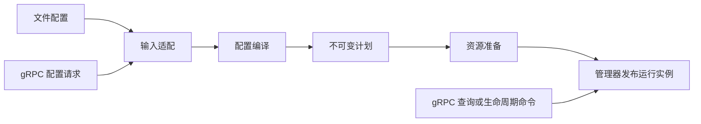

# Chimera_Server 需求、架构演进与维护手册

版本：1.0 · 更新：2026-09-12 · 读者：项目维护者、代码审查者及后续 AI 贡献者

**本文是长期迭代工作的入口手册。当前优先 Xray 服务端 inbound 兼容与架构完善；WireGuard、Xray outbound 属于后期目标，顺序未定；TUN 可以最后做；MCP 可做可不做。**

本文不宣布所有目标已经实现，不授权批量重写、删除既有功能、修改生产网络或发布版本。示意类型、目录和接口只有经代码核验后才能视为现状。

## 阅读导航

| 你现在要解决的问题 | 阅读位置 |
| --- | --- |
| 明确项目目标及范围 | 第 1–3 节 |
| 理解架构与模块职责 | 第 4–8 节 |
| 审核生命周期、状态和控制面 | 第 9–11 节 |
| 规划 WireGuard、outbound、TUN | 第 12 节 |
| 使用 feature 与定位线上问题 | 第 13–14 节 |
| 选择下一轮迭代、执行迁移 | 第 15–17 节 |
| 测试、跨平台、发布与交接 | 第 18–21 节 |
| 判断架构是否完成、记录决策 | 第 22–24 节 |

## 1. 文档职责与事实来源

| 文档或证据 | 职责 |
| --- | --- |
| [AGENTS.md](AGENTS.md) | 贡献流程、操作边界、构建和发布要求 |
| 本手册 | 已确认需求、优先级、迭代选择、架构审核与维护方法 |
| [ARCHITECTURE.md](ARCHITECTURE.md) | 目标设计、模块契约、已记录迁移进展与设计依据 |
| [兼容矩阵](examples/xray-compatible/README.md) | 按组合维护支持状态与验证依据 |
| [配置说明](chimera_server_lib/src/config/README.md) | 用户可见配置的具体语义 |
| 当前源码、测试及运行记录 | 实际实现与可重复验证的证据 |
| 固定 Xray 参考提交及二进制 | 外部兼容行为的比较基线 |

使用顺序：先读 AGENTS 的要求及本文优先级，再读架构相关章节，最后核对实际代码、diff、测试和参考行为。已有任务内只需复查变更部分，不机械重复阅读。

用户最新明确指令优先。本文不能覆盖 AGENTS 的发布授权要求；目标设计不能替代运行证据。文档中的“完成”只适用于当时记录的范围和版本，不自动涵盖后来出现的代码改动。

如果文档和代码不同，分别记录“期望行为”“实际行为”“迁移状态”；不要通过删除设计要求掩盖缺口，也不要为了符合旧文档改回已经验证的正确实现。对过时说明做局部修正并保留有价值的证据。

## 2. 已确认的用户需求

### 2.1 最终产品目标

Chimera_Server 是以 Xray 服务端兼容为目标的 Rust 网络核心。现有 Xray-compatible 客户端应在声明支持的范围内无需改变协议配置即可连接；服务端配置应保留等价含义。

兼容包括配置字段、默认值、认证、传输、安全握手、回落、TCP/UDP 行为、用户策略、管理 API、统计和平台行为。编译成功、能够解析配置、单次网页访问成功都不足以宣称完整兼容。

同时改善内部可维护性：修改一种行为时需要协调的责任中心更少，状态和任务归属更清晰，故障可重现、可隔离，架构能够支持后期扩展。

### 2.2 当前与后期优先级

| 层级 | 内容 | 对当前迭代的含义 |
| --- | --- | --- |
| 当前主要目标 | 服务端 inbound 兼容与架构收口 | 默认优先选择相关可验证切片 |
| 当前必要基础 | 既有目标连接、DNS、routing/policy、转发和管理能力 | 保持正确，允许修复直接阻碍 inbound 的问题 |
| 后期目标 | WireGuard、Xray outbound 能力 | 两者实施顺序未定，不提前扩展功能生态 |
| 更后期目标 | 与 Xray 对应接口及行为兼容的 TUN | 可以放到最后，目前只避免封死包级接入和设备生命周期 |
| 可选能力 | MCP | 不列为必交付，不阻塞 inbound、架构收口或发布 |

“后期考虑”不等于现在创建空模块、引入依赖、开放配置字段或调整默认 feature。既有功能也不因优先级降低而自动获得删除授权。

### 2.3 尚未确定的事项

- WireGuard 与 outbound 的启动顺序、具体兼容版本及验收范围。
- TUN 的首个平台、网络栈、设备后端及移动端接入方式。
- MCP 是否保留、何时移出核心、是否采用独立程序。
- 最终 crate 拆分、公共 API 命名、每一项新 feature 的名称。
- 每个后期协议的完整实现策略与性能目标。

这些应在具体目标启动时决策，不用当前手册替用户作无依据的承诺。

## 3. 独立架构判断与参考方法

Xray 规定外部行为；clash-rs、sing-box、Envoy、shadowsocks-rust、Pingora、Leaf 提供设计思路。参考入口见 [架构参考资料](ARCHITECTURE.md#14-参考资料)。内部实现不必复制任何一个项目。

提出设计时回答四个问题：

1. 当前有哪些具体耦合、重复规则、状态风险或测量到的成本？
2. 保留现状、借鉴参考、本地简化方案分别有什么代价？
3. 新边界保护哪个不变量，减少哪些调用方需要知道的细节？
4. 如何证明外部行为不变或偏差已明确？

不要把 Rust、无锁、Actor、零拷贝、更多 trait 或更多 crate 本身当成结论。也不要为了原创拒绝现有可靠实现。新抽象必须对应真实变化点，通用化至少要有具体使用场景支撑。

## 4. 编写时的项目基线与已有成果

本手册编写时仓库 HEAD 为 `a05e780c05a6b2b5e166202eca571244f0a0550a`，工作树包含正在进行的职责提取，因此该 SHA 不代表本次工作树的全部内容。本地 Xray 参考为 `5ca6f4b7d4dc20a881d4330e498892697627ec0c`。本次仅编写文档，没有重新运行 Rust 构建或互通测试。

维护者可从这些实际入口核验已形成的边界：

| 边界 | 当前入口 | 维护重点 |
| --- | --- | --- |
| 管理与数据面能力 | [runtime.rs](chimera_server_lib/src/runtime.rs)、[data_plane.rs](chimera_server_lib/src/runtime/data_plane.rs) | 不再把完整管理能力传回协议层 |
| Inbound 实例与生命周期 | [inbound.rs](chimera_server_lib/src/inbound.rs)、[lifecycle.rs](chimera_server_lib/src/inbound/lifecycle.rs) | generation、启动清理及发布状态一致 |
| 用户状态 | [inbound/identity.rs](chimera_server_lib/src/inbound/identity.rs) 与协议用户存储 | 动态发布不得无故重建 listener 或 replay 状态 |
| 传输计划 | [transport_plan.rs](chimera_server_lib/src/beginning/transport_plan.rs) | 不重新引入多处递归探测 |
| 任务跟踪 | [session_tasks.rs](chimera_server_lib/src/session_tasks.rs) | 保留任务完成、取消及 drain 语义 |
| 路由内部职责 | [rule.rs](chimera_server_lib/src/routing_state/rule.rs)、[balancer.rs](chimera_server_lib/src/routing_state/balancer.rs) | 规则与负载选择不依赖具体协议拨号 |
| 已有出站编译 | [static_config/compile.rs](chimera_server_lib/src/outbound/static_config/compile.rs) | 复用既有语义，后续再调整职责位置 |

ARCHITECTURE 第 12 节记录了 2026-09-11 的 M2–M6 阶段结果及细节。它是已有工作记录，不是本手册重新测试的声明。不得因为新的目标目录尚未出现，就把已完成的动态用户、任务所有权、readiness 或 DataPlaneRuntime 迁移从头重做。

当前未提交的 beginning、relay、XHTTP、配置 builder、gRPC stats 及多个协议拆分是工作树事实，不等于存在并发 writer。后续先检查具体 diff 和任务归属，再选择不冲突的切片。

## 5. 两条流程与单向依赖

配置生命周期和网络数据路径分别建模；查询、删除及用户修改命令不必都经过完整 Config Compiler。




第二张图表示逻辑关系：普通代理、QUIC 多路复用、回落与后期包级接入可有不同执行形态。不强制一条固定的函数调用链。

依赖要求：控制面调用管理服务；数据面不依赖控制请求类型。编译器可以使用纯协议选项校验；运行模块不依赖外部 JSON/protobuf 配置结构。Routing 不建立协议连接，Outbound 不擅自再次执行整套业务路由。

## 6. 目标责任地图

| Domain | 负责 | 不负责 |
| --- | --- | --- |
| server | 组件装配、整体 readiness、退出协调 | 协议帧解析 |
| config/source | 文件/外部来源加载，显式环境输入 | 活跃连接状态 |
| config/adapter | 格式转换，保留 presence 与来源语义 | 生命周期事务 |
| config/compile | 默认值、合法组合、能力诊断 | socket bind、后台任务和全局日志初始化 |
| config/plan | 描述有限且已验证的启动意图 | 动态授权集合和任务句柄 |
| inbound | 实例注册、generation、生命周期事务 | 独立复制传输和认证逻辑 |
| transport | 接入、传输 framing、连接作用域 | 业务 routing rule |
| security | 安全握手及必要能力状态 | 与 transport 争夺连接最终关闭权 |
| protocol | wire、认证、请求或回落结果 | 全局管理操作 |
| session | 逻辑转发、超时、半关闭、取消和收尾 | 控制面 protobuf |
| routing | 规则、balancer、逻辑出口决策 | TLS/Trojan 等拨号细节 |
| outbound | 实例查找、连接、封装及既有复用资源 | 重复业务路由 |
| identity | 稳定身份、索引、更新版本 | 强行统一所有协议凭据 |
| policy | 策略语义与计算 | listener 启停 |
| runtime | 发布与组装所需共享状态 | 成为所有域的万能入口 |
| traffic | 计量、聚合、查询 | 作为认证身份唯一事实来源 |
| control | gRPC 格式、Status、内部命令映射 | 数据面 wire 和生命周期业务事务 |
| resolver/address/io | 明确的小型基础能力 | 容纳所有难分类逻辑 |

`runtime/policy` 如果保留，只负责发布/存储；策略语义不再另算一份。`outbound/selector` 若只是按选定 tag 找实例，应准确命名，避免和 routing 的选择重复。

`transport/xhttp/session` 负责传输请求关联与重组，顶层 session 负责代理会话执行，两种“session”必须在 API 注释中区分。

### 6.1 目录形态示意

```text
chimera_server_lib/src/
  server/             # 装配、整体生命周期、readiness
  config/             # source、adapter、compile、plan、diagnostics
  inbound/            # manager、instance、lifecycle、实例身份绑定
  transport/          # tcp、udp、quic、websocket、httpupgrade、grpc、xhttp
  security/           # tls、reality；按真实使用方设计共享实现
  protocol/           # vless、vmess、trojan、socks、http、ss、hysteria2、tuic、xudp 等
  session/            # context、dispatch、sniff、relay、UDP 与持久会话
  runtime/            # data-plane capability、一致版本发布
  routing/            # rule、balancer、observation、process、geodata
  outbound/           # 既有连接能力；新协议扩展后置
  identity/           # 仅稳定共享概念；不强制立刻独立建目录
  policy/
  traffic/
  control/grpc/       # MCP 不占必需目录
  resolver/
  address/
  io/
```

这是责任地图，不是本次 mkdir/rename 清单。高度内聚的域可以暂用单个 `.rs`，不为目录形式添加空文件。后期 WireGuard/TUN 不在此提前规定内部文件树。

### 6.2 既有代码的迁移归属

| 现有位置 | 目标 | 需要先验证的边界 |
| --- | --- | --- |
| lib.rs 启动编排 | server | 主 CLI、专用 REALITY 服务和库嵌入调用方 |
| beginning 的监听与 socket | transport / inbound 装配 | bind-ready 与 task publication |
| stream_session、tcp_relay | session | 响应时机、sniffing、计量及半关闭 |
| UDP listener 与 worker | transport/udp 与 session/udp | 源/目标关联、超时及 GlobalID 所有权 |
| gRPC transport、XHTTP | transport 对应域 | 物理连接与逻辑 RPC/请求关联 |
| handler/ws、httpupgrade、proxy_protocol | transport | 包装边界和安全上下文 |
| handler/tls、reality | security 与传输装配 | fallback、Vision、底层能力 |
| handler 中代理协议 | protocol | 认证、codec、Outcome |
| xudp frame/stream 与 registry | protocol/xudp 与 session | framing 与跨连接生命周期分别归属 |
| gRPC 服务文件 | control/grpc | 编解码保留，业务事务移交已有 manager |
| user_domain | policy | 访问规则而非通用用户存储 |
| socket util、prefixed stream | transport 或 io | 只移动真实共享原语 |

消除 `beginning` 和含义过宽的 `handler` 是长期归位方向；目录消失不是功能正确或架构完成的充分证据。

## 7. 配置契约：Input、Plan、Prepared、Instance

### 7.1 各阶段的区别

| 阶段 | 可以包含 | 不应包含 |
| --- | --- | --- |
| Input | 原始选项、别名、是否显式指定 | 默认吞掉未知行为 |
| Plan | 已验证组合、资源请求、初始凭据 | TcpListener、JoinHandle、CancellationToken、动态用户 store |
| Prepared resources | 已加载证书、准备后的平台资源 | 对外冒充完全 Running |
| Instance | 活跃资源、版本与任务所有者 | 与注册表分离且无法核对的状态副本 |

不可变不等于可公开打印。计划和初始配置仍含敏感信息，使用安全摘要而非自动打印全部 Debug。

编译器保持无运行副作用；source 可以做 I/O，资源准备也可以做 I/O。对 geodata、自动设备名等依赖环境的结果，明确输入与解析阶段。不能以“纯编译”为由悄悄改变 `--check` 行为。

### 7.2 文件、检查与管理 API 的一致性

文件和 gRPC 使用各自适配器进入相同语义规则。protobuf 缺省与 JSON 省略值不总能直接等同；不要为省代码把所有 protobuf 请求绕成 JSON。

查询、删除实例和简单管理命令不需要构建完整计划。用户更新复用协议用户校验及发布规则。控制适配器不直接操作 listener 来补齐自身缺少的业务入口。

### 7.3 Plan 设计的收敛条件

先让一个现有协议使用新边界，再用不同形态验证：RAW/TLS/REALITY、XHTTP 或 QUIC。仅为已需要的组合建立类型，不创建任意图形执行语言。旧类型可通过适配迁入，但每个适配器有清理条件。

计划编译通过后必须知道：实际选用的 transport、安全层、协议、监听方式和需要准备的资源。不能到多个运行模块再次猜测同一组合。

## 8. Transport、Security、Protocol 与 Outcome

传输接口不能一律返回 TCP 字节流。根据实际用例保留字节流、消息通道、多路复用接入和请求关联等有限入口。后期包级能力只预留设计空间，当前不引入空实现。

TransportContext 保存源/本地地址、SNI、ALPN 和已证明可用的传输能力。Protocol 产生认证身份与请求语义；SessionContext 持有执行该会话所需的有限能力。不要把它们统一成包含全局 RuntimeState 的万能 Context。

ProtocolOutcome 建议表达互斥结果：TCP、固定目标 UDP、多目标 UDP、会话型 UDP、回落、可跟踪的专用执行结果。避免多个 Option 同时为空或同时有效。不能用一个 `AlreadyHandled` 标记掩盖没有 owner 的任务。

REALITY/Vision、HTTP keep-alive、SOCKS UDP_ASSOCIATE、QUIC stream/datagram 都可保留必要专用接口。统一的是生命周期和能力契约，不是所有协议必须共用一个 relay 循环。

## 9. 生命周期、事务与任务所有权

### 9.1 所有者、跟踪者、观察者

一个资源需要唯一的生命周期决策者，但可以被多个层次跟踪。服务器统计任务与连接局部任务组同时记录同一任务，并不自动违反所有权规则。

| 角色 | 可以做什么 |
| --- | --- |
| 所有者 | 决定结束、转移责任、协调清理 |
| 跟踪者 | 等待完成，向上级提供 drain 依据 |
| 观察者 | 获取状态或统计，不直接决定资源销毁 |

每个任务必须说明：谁创建、谁取消、谁 await、失败由谁处理、父级取消时发生什么。`tokio::spawn`、Arc 和 Drop 都不是完整的答案。

### 9.2 实例事务

维护实例 ID/代次、外部 tag、生命周期状态和运行资源之间的一致性。已登记、已绑定、accept loop 健康、整体 ready 是不同事实，应明确各层判断依据。

必须覆盖：启动中取消、部分 bind 成功、发布前取消、删除中取消、同 tag 重建、旧任务迟到结束。旧代次只能修改自己的实例；清理 guard 不应只更新状态而遗留占用端口的资源。

高层管理器协调事务，资源构建器执行具体准备。不要把证书解析、QUIC 协议和 gRPC wire 都塞回 manager。

### 9.3 关闭语义

区分 listener 停止接入、connection 结束、logical session 结束和 server-wide drain。根据具体 Xray 行为确定顺序与期限，不使用“所有 remove 都 abort”或“所有会话永远 drain”的总规则。

XHTTP 会话可以跨请求；GlobalID XUDP 可以跨连接；QUIC 的连接/设备退出可能影响全部子流。注册表与 task owner 在这些路径中必须协作，不能把物理连接结束作为通用的会话销毁条件。

全局退出完成意味着资源已清理或失败已明确记录，不只是 cancellation token 已触发。避免持有阻塞锁 await；也不能通过后台 spawn 清理后立即声称释放完成。

## 10. 身份、策略、路由与统计

- 用户 ID/email/level、更新版本和统计身份可共享；UUID、password hash、SS key、Hysteria auth 的索引与算法按协议处理。
- 初始用户来自计划，运行时快照属于实例或明确的 store。更新用户不应无故重置 replay、salt、UDP 会话或既有连接。
- 每项更新定义生效边界：新握手、新 HTTP 请求、新 UDP 消息或已存在会话；按固定基线验证。
- DataPlaneRuntime 的第一层目标是 API 无管理操作；第二层是实际持有状态也尽量不牵连完整管理器。按需要推进，不为一次重构引入一组空 trait。
- 业务 routing 选择逻辑出口；outbound 根据该选择连接。域名解析时机应显式，保留原始目标、sniffed 名称及实际连接目标的必要区别。
- 未来 outbound 链由显式依赖表达并检查循环，不通过重新路由隐藏递归。
- 计量点固定，常规/快速路径、失败/回落路径不得重复或漏计；认证事实不能仅寄存在 TrafficContext。
- 有损观测事件不能成为授权或生命周期事实源；慢订阅者不得阻塞转发。

## 11. 控制面与 MCP 决策

管理 gRPC 与 inbound 的 gRPC transport 是不同能力。前者负责外部管理接口，后者承载代理通信；目录和 feature 命名必须区分。

MCP 不属于核心必须保留的能力。没有实际使用需求时可以不做；当前存在的实现仍需按任务范围处理，不能由一份规划自动删除。

若决定保留，优先方向是独立可选 Adapter：

```text
AI/MCP client → MCP Adapter → 管理 gRPC → 内部管理服务
```

Adapter 不读取 RuntimeState，不直接访问用户表，不重新编写生命周期事务。进程内部署如果有明确需要，可以共用内部服务；通常不必通过本机 gRPC 绕回自身。

迁移时做能力映射：活动连接数不等于在线用户数；现有 gRPC 没有等价能力时不能随意替代。需要扩展则使用独立命名空间，保留 Xray API 语义。订阅转轮询须记录频率、背压和失联处理。

写操作超时可能已经执行成功，不得盲目重试。定义操作结果查询或已知的重试规则；管理操作按需要暴露，不自动将所有写接口转换成 AI 工具。MCP 失败不应拖垮核心转发，删除/迁出时间仍由实际任务确定。

## 12. 为未来能力留下边界，不提前实现

当前需要的是确认未来不会被现有模型排斥。不要为尚未启动的目标创建空 crate、空 trait、占位运行时、无使用方的 feature 或长期维护的依赖。

### 12.1 Xray outbound

未来 outbound 的目标仍是固定 Xray 基线下的配置与可观察行为兼容。保留以下分工：

```text
SessionRequest → Routing → RouteDecision → OutboundConnector
                                             │
                                             ├── 解析与目标连接策略
                                             ├── 出站协议握手
                                             └── 出站 transport / security
```

现在可以保护的边界：

- `RouteDecision` 表达选中的出口及必要策略，不包含某个协议的 socket 实现。
- Session 依赖目标连接能力；新增一种出站协议不应要求 inbound 识别它。
- 出站配置最终使用自己的 compiler 和 plan，与入站共享适用的纯值对象和校验能力。
- 入口方向和出口方向的握手、身份验证与生命周期不同；不能因为协议同名就强制共享整个 handler。
- 可共享纯 codec、地址模型及确实对称的 I/O 原语；共享前先明确客户端和服务端的不变量。
- 连接池、复用、探测任务属于明确的 outbound 实例或 Server owner，不应隐藏在一次 session 调用后永久存活。

真正开始时，每次选一个出口协议及明确组合，验证 TCP/UDP、DNS、超时、路由选择、错误传播和统计。不得用“有通用 connector”代替某个 Xray outbound 的互通证据。

### 12.2 WireGuard

WireGuard 不适合直接塞入“接收一个字节流，然后解析代理目标地址”的模型。规划应区分加密隧道、peer 状态、IP packet 处理与代理会话衔接。

```text
UDP endpoint ↔ WireGuard peer/tunnel state ↔ IP packet path
                                                  │
                                     按使用方式接入网络栈或转发能力
```

后续立项前先确定具体角色：作为出站隧道、服务端接入、独立 endpoint，还是其中某一种。用户目前没有要求一次实现所有角色，也没有确定它与完整 outbound 的先后顺序。

应预留的约束：

| 关注点 | 设计要求 |
| --- | --- |
| 状态所有权 | endpoint、peer、握手计时器、重放窗口和会话关联均有明确 owner |
| 地址语义 | 保留 IP packet 的源/目标信息，不把它硬编码成普通代理字节流 |
| 路由 | peer 的地址选择规则与代理业务 routing 分别建模，不能混为一张万能规则表 |
| 网络栈 | 需要时通过明确边界引入；不要求所有 inbound 依赖它 |
| 配置 | peer/key/地址等配置先编译，绑定 socket 和启动任务在资源准备阶段 |
| 生命周期 | 更新 peer、关闭 endpoint、旧会话排空与资源回收的语义单独定义 |
| 可选依赖 | 实现阶段再隔离依赖，不因规划让最小代理服务端构建带上网络栈 |

这些是未来设计约束，不表示当前已具备 WireGuard 支持。

### 12.3 TUN：可放在最后

TUN 当前不进入近期任务、发布阻塞条件或架构完成条件。只保留一个关键认识：设备型接入与端口监听型接入的资源模型不同。

```text
TUN device → IP packet processing / network stack
                         │
                         ▼
                 Logical Session → Routing → Outbound
```

这是候选处理路径，不要求所有 IP packet 必须转换成 TCP/UDP 代理会话。ICMP、分片、MTU 及其他包级行为必须在未来范围评审中明确，不能通过抽象名称暗示已经支持。

未来兼容 Xray TUN 时，按以下步骤推进：

1. 固定当时决定采用的 Xray 源码提交、二进制版本及目标操作系统，核对该版本实际存在的 TUN 配置和实现。
2. 逐字段建立清单：省略值、显式值、校验失败、运行时用途、平台限制和测试证据。本文不预设尚未核验的字段名或默认值。
3. 把配置兼容、设备创建、系统路由/DNS 集成、packet 行为、会话转发分别验证。配置名称相同不等于接口兼容。
4. 根据实际需求引入设备型 ingress plan。由资源准备阶段打开设备，由实例管理生命周期；不伪造一个端口 listener 来适配所有接入。
5. 将设备句柄、权限需求、接口标识及系统资源清理放在平台适配与 owner 内；纯 compiler 不更改系统网络状态。
6. 若创建路由或调整 DNS，记录本实例实际创建/变更的资源，定义失败回滚和重启恢复；不能清理其他程序拥有的资源。
7. 覆盖设备创建失败、路由安装部分失败、正常退出、异常取消、回环路由和跨平台差异，再声明对应范围兼容。

WireGuard 和 TUN 可能复用包处理接口、网络栈适配代码或地址类型，但不能因此共享 peer 状态、设备生命周期或会话注册表。是否引入 `packet/`、`device/` 或独立 crate，应在真实需求出现时决定。

### 12.4 未来能力进入当前设计的门槛

只有出现以下情况之一，才在当前切片增加扩展点：现有实现已经有两个真实使用方；不修正某个边界将明显阻断既定后续能力；或当前任务本身需要该能力。否则记录设计约束即可。

## 13. Feature 管理与构建隔离

### 13.1 三个维度不能混淆

| 维度 | 回答的问题 | 示例 |
| --- | --- | --- |
| Rust module | 谁负责这段行为和状态？ | transport、protocol、session |
| Cargo feature | 这个二进制编译了哪些能力？ | vless、tls、grpc_transport、api |
| Runtime config | 已编译能力如何启用与组合？ | inbound 协议、监听地址、用户及传输选项 |

模块职责清晰是前提；feature 是构建选择工具，不能代替所有权设计，也不能精确证明线上故障来自哪个模块。

### 13.2 当前可用的构建入口

以下名称已核对当前 Cargo manifest；这里只说明配置入口，本次文档维护没有执行这些构建。

| 入口 | 当前意义 |
| --- | --- |
| app 默认 feature | 启用 `full`，转发到 library 的 `full` |
| app `minimal-vless` | 转发 library `vless` |
| app `minimal-vless-tls` | 转发 library `vless`、`tls` |
| library `grpc_transport` | gRPC 入站传输能力 |
| library `api` | 管理 API 相关能力，与 `grpc_transport` 分开 |
| `brutal-ack-batch-trace`、`brutal-pacing-trace` | 现有诊断 feature；不等同于默认 full 功能集合 |

不能据此推断所有依赖都被彻底裁掉。可选依赖、默认依赖 feature、workspace feature unification、构建目标和 dev-dependencies 均须实际检查。

### 13.3 新增或调整 feature 的记录模板

```text
能力名称与使用方：
所属协议/传输/安全/控制面/诊断类别：
为什么需要编译隔离，而不是仅运行时配置：
直接依赖与共享依赖：
library gate 与 app forwarding：
默认/full 行为是否变化：
支持的平台与互斥条件：
运行时激活配置：
未编译时的明确错误：
最小、部署、默认/full、关键组合验证：
```

Feature 尽量 additive。不能设计“关闭鉴权”“关闭重放防护”之类的排障开关；不能因能力未编译而忽略配置、退回明文或换用不等价协议。

只有具有实际使用价值的组合进入持续维护矩阵。无需为理论上所有布尔组合建立指数级 CI，但必须覆盖声明支持的部署组合、重要依赖交互和现有 all-feature gates。

### 13.4 构建隔离不能替代运行时隔离

同一二进制中，某个 inbound 握手拥塞、慢统计订阅或后台探测异常，仍需依靠资源限制、背压、owner 和取消边界处理。编译时裁剪不能解决这些运行时责任。

## 14. 线上故障排查流程

### 14.1 首先保存可比较的基线

记录部署版本、源代码 SHA、实际二进制、平台、编译 feature、构建模式、脱敏配置、客户端版本、负载、时间段及可复现症状。工作区中的源码不一定就是线上二进制对应版本。

禁止输出完整配置、认证包、私钥或 token。可以记录 inbound tag、generation、协议、传输、安全类型、处理阶段、错误类别和经过评估的目标信息。

### 14.2 推荐顺序

1. 用原部署组合复现，先确认故障条件。
2. 在相同二进制上一次改变一个运行时变量；把每次观察写入记录。
3. 根据症状定位 owner 和边界，检查错误、超时、取消、排空、队列及计量证据。
4. 必要时用 minimal-feature 构建减少候选范围；保持版本、平台、负载和其他设置可比较。
5. 找到具体失败路径，建立能区分正常/异常的回归用例。
6. 修复后重新测试最小复现和原部署组合，确认没有把问题移到另一个路径。

Feature 减少后故障消失，只说明条件发生改变。编译优化、线程调度、负载变化和共享依赖也可能影响结果，不能直接将剩余模块判为无责。

### 14.3 症状与首查边界

| 症状 | 首先检查 | 需要的证据 |
| --- | --- | --- |
| 配置检查通过但启动失败 | compiler 与 prepare 的职责、平台资源条件 | 相同输入的诊断、资源准备失败点 |
| AddInbound 与文件配置表现不同 | adapter、默认值、共享 compiler | 等价 literal/plan 或明确 API 差异 |
| 删除后端口仍占用 | listener owner、停止接入、task join | 关闭完成条件、剩余句柄 |
| 同 tag 重建后旧任务影响新实例 | generation 和 registry key | 旧任务发布/注销的代次检查 |
| 握手成功但无流量 | protocol outcome、session dispatch、routing、connector | 各阶段完成或失败证据 |
| XHTTP/gRPC 流中断异常 | 物理连接与逻辑会话的映射 | 取消传播、半关闭、注册表清理 |
| UDP 内存持续增长 | association/registry、TTL、队列与清理 | 活跃数量、过期路径、背压 |
| 统计翻倍或丢失 | relay 包装层、快速路径、更新与 reset | 固定工作负载下的单一计量点 |
| 管理调用导致转发抖动 | 锁范围、同步 I/O、订阅背压 | 等待时间、任务和队列证据 |

这是定位入口，不是故障归因结论。实际部署开关、停服务和流量切换按任务授权执行，文档不自动授权更改线上环境。

## 15. 每轮迭代如何选择任务

### 15.1 任务优先级

优先处理已证实的凭据暴露、静默配置失效、认证/协议错误及生命周期资源故障。之后选择当前部署组合的兼容缺口，再处理阻碍这些工作的小型架构问题。不要让目录迁移阻塞必要的正确性修复。

### 15.2 用户说“继续”或“go”时的决策

```text
确认当前目标和最近一次完成记录
    ↓
读取 AGENTS / ARCHITECTURE / 本手册相关部分
    ↓
检查 git status、相关 diff、已有切片与并发修改
    ↓
核验支持矩阵、实现、固定参考中的真实缺口
    ↓
选择一个责任完整、能够验证的切片
    ↓
说明行为、owner、不变量、回退和检查
    ↓
实施 → 验证 → 同步文档 → 交接结果
```

逐项回答：

1. 是否已有用户指定的待完成目标？不要被最新一个状态问题带偏。
2. 相关文件是否包含未完成改动？是否有已知的其他 writer？脏文件本身不证明并发。
3. 能否在保留这些改动的前提下继续？不重叠工作不必等整个仓库变干净。
4. 当前文件是否混合多个责任，还是只有行数多？
5. 本次移动或修复的完整责任是什么？其最终归属与 owner 是谁？
6. 是否涉及配置、wire、超时、回落、统计或生命周期行为？
7. 是否需要状态机，还是一个显式结果和局部函数已足够？
8. 旧 API/facade 是否需要暂时保留？谁仍在调用？
9. 哪些验证能直接证明本次结果？缺少哪些条件？
10. 本轮结束时，下一位维护者能否理解完成与未完成的边界？

### 15.3 切片大小与完成边界

优先选择一个可独立验证的行为或责任迁移。约 500 行以内可作为代码切片的软目标，不是质量指标；以本轮开始时的 diff 为参照，不把他人的历史未提交改动计入本轮成果。文档、生成代码和机械移动应分别说明，不为达标省略必要的生命周期处理。

一次目录移动尽量不混入协议行为修改。无法分离时解释依赖和风险，保留可审阅证据。不要为了“干净提交”回退未知改动，也不要默认任务授权提交、推送或发布。

## 16. 调整后的迁移路线

原有 Phase 0–10 适合作为责任地图和候选顺序，不能成为每次重新开始的线性清单。[ARCHITECTURE.md 第 12 节](ARCHITECTURE.md#12-渐进迁移路线)已有迁移记录，新的工作应在核验现状后继续。

### 16.1 为什么调整原顺序

- 不再要求先把所有生产大文件拆完，再允许稳定契约。文件规模不是必经门槛。
- 不要求先清空所有工作区改动。只需识别重叠、归属及本轮验证边界。
- Compiler、生命周期和数据面能力收敛若能解决当前问题，可以早于目录搬迁。
- 每次通过一个代表性完整路径验证契约，避免一次设计覆盖所有协议的万能接口。
- `beginning`、`handler` 的消失是迁移里程碑；依赖正确、owner 清晰和兼容证据才是验收依据。

### 16.2 建议阶段与验收

| 阶段 | 工作内容 | 进入条件 | 完成证据 |
| --- | --- | --- | --- |
| A：保护当前成果 | 审核相关未完成切片、接口和验证状态 | 本次任务涉及这些代码 | 相关 diff 可解释，所需检查明确；不要求全仓零脏改动 |
| B：稳定必要契约 | Plan/Prepared、Context、Outcome、owner 边界 | 有真实混合职责或扩展阻碍 | 一个完整现有路径通过，失败路径不退化 |
| C：迁移接入与会话 | beginning 中 listener、transport、session 逐个归位 | 边界已可独立搬迁 | 旧路径调用逐步归零，取消/半关闭/统计保持 |
| D：迁移安全与协议 | handler 中 transport/security 先分离，再按协议迁移 | 组合和特殊路径有证据 | 单协议或单 wrapper 切片验证，facade 有退出条件 |
| E：收口装配和控制面 | server、runtime、inbound、config、control 进一步对齐 | 不破坏已建立的管理/数据面边界 | 共享 compiler、单一事务 owner、无反向 API 依赖 |
| F：收口横向能力 | routing、identity、policy、traffic、resolver、outbound | 实际依赖已明确 | 无万能 common、跨域能力窄、构建组合保持 |
| G：评估 crate 隔离 | 按依赖、安全/API 或明确复用需求决定 | 模块边界稳定且成本可衡量 | 可解释的依赖减少或独立复用收益 |

这些阶段允许按依赖交错推进。B/E 中已经完成的边界不应因目录尚未迁移而重写；后续新增 WireGuard/outbound/TUN 也不要求整个目录路线先全部完成，只要求其依赖边界已稳定且用户已调整开发优先级。

### 16.3 每次路径迁移的操作准则

1. 先确定归属，再确认 public API、内部调用、feature gate 和测试路径。
2. 移动一个内聚模块，按需保留旧路径 re-export；不能把 facade 变成第二份实现。
3. 检查资源 owner、错误转换和初始化顺序是否因移动而变化。
4. 更新相关调用和文档链接，运行适用检查。
5. 记录尚未迁移的调用方；全部归零且没有稳定外部 API 承诺后才删除 facade。

Public facade 的删除可能是破坏性 API 变化，不能仅凭仓库内搜索没有调用就认定安全。必要时保留弃用周期并记录版本要求。

## 17. 代表性路径与失败场景

以下是选择验证切片的模板，不是当前支持声明或同时开发的任务列表。具体协议组合先查支持矩阵。

### 17.1 普通 stream 与安全组合

选择一个已实现组合，从文件/API 输入跟踪到 compiler、资源准备、握手、认证、session、routing、outbound、relay 和关闭。比较配置等价性、错误边界和统计口径。

涉及 REALITY/Vision、回落或快速路径时，单独确认已有 specialized context、原始数据、探测表现和计量资源没有因“统一 stream”而丢失。

### 17.2 HTTP 多请求与多路复用

对 XHTTP、gRPC transport，区分 socket、HTTP connection、request/RPC、transport session 和代理 logical session。检查以下事件分别影响谁：单请求取消、连接断开、用户变更、inbound 删除、全局退出。

不要用一个 TCP echo 成功覆盖整个生命周期声明。协议允许跨物理连接持续的状态，应按规定作用域存活，且具有超时、容量和最终清理条件。

### 17.3 QUIC 与 UDP

对已有 Hysteria2/TUIC 路径，检查 endpoint、connection、stream、UDP association 的 owner。消息队列须有背压/过载行为，单个会话退出不能错误关闭整个 endpoint。

UDP 验证应覆盖目标关联、响应回送、过期、并发和消息边界。XUDP 的 framing 属于 wire，跨连接 registry 属于会话状态；二者可协作，但不应相互掌管生命周期。

### 17.4 管理事务失败矩阵

| 注入位置 | 要证明的结果 |
| --- | --- |
| 编译失败 | 未创建 listener 或发布实例；诊断不泄露凭据 |
| 部分资源准备失败 | 本次已创建资源得到回收，旧实例保持规定状态 |
| 就绪前任务异常 | 不发布虚假 Ready；失败可观测且任务可回收 |
| 发布与取消竞争 | 结果有唯一事实源，不出现可访问但未受管实例 |
| 同 tag 删除/新增竞争 | 旧 generation 不能注销或污染新 generation |
| drain 超时 | 按策略取消并等待必要清理，不能无限悬挂 |
| 用户更新与认证并发 | 按定义的快照/版本语义工作，不混合凭据状态 |
| 统计订阅端阻塞 | 不阻塞数据面，也不无限积压 |

只有修改相应路径时才补充相关测试，不为每次机械移动复制整套故障注入。

## 18. 验证体系与命令

### 18.1 三层兼容证据

| 层次 | 回答的问题 | 不能证明什么 |
| --- | --- | --- |
| Unit / 模块测试 | codec、parser、状态转换和局部边界是否正确 | 不能单独证明真实客户端兼容 |
| Compatibility behavior tests | 可观察行为是否符合固定 Xray 基线 | 模拟输入不能覆盖所有真实实现交互 |
| 真实 interoperability | 指定客户端与 Chimera 在指定组合中是否互通 | 单个成功握手不能证明全部配置/错误/平台行为 |

生命周期、资源上限和性能属于额外验证维度，按变更覆盖到上述合适层次。测试应针对不变量或真实回归，避免只镜像实现细节。

### 18.2 根据变更选择检查

| 变更 | 必要关注点 |
| --- | --- |
| 纯文档 | 路径、链接、命令、事实、diff；无需 Rust 构建 |
| 模块移动/导入调整 | 格式、Clippy、受影响单测与 feature/平台编译；涉及运行路径时检查语义 |
| 配置/default 改动 | 省略/显式/非法值、文件/API/--check 一致性、运行消费、支持矩阵 |
| wire/auth/fallback 改动 | 正常与错误输入、截断、重放、取消、真实版本化客户端及必要基线对照 |
| lifecycle/任务改动 | 启动失败、rollback、drain、取消、join、代次竞争与资源释放 |
| feature/共享依赖改动 | 最小、部署、默认/full、关键组合和适用平台 |
| 性能优化 | 相同安全和协议语义的对照负载，并验证正确性、CPU/内存/延迟等适用指标 |

是否需要互通由受影响的兼容声明和运行路径决定，不仅看提交是否叫 refactor。条件不足时明确“未验证”，不能把编译通过写成行为兼容。

### 18.3 当前通用命令

从仓库根目录执行。代码任务遵循 AGENTS 的检查要求；不要在纯文档任务中无理由运行全量构建。

```sh
cargo fmt --all
cargo clippy --workspace --all-targets --all-features -- -D warnings
cargo test -p chimera_server_lib --lib
```

格式化后检查 diff，避免带入其他文件的格式变化。选择受影响的 integration/package 测试时，以任务实际路径代替无关测试。

最小构建入口：

```sh
cargo check -p chimera_server_app --no-default-features --features minimal-vless
cargo check -p chimera_server_app --no-default-features --features minimal-vless-tls
```

下面是需要替换占位符的命令模板，不能原样执行：

```text
cargo test -p chimera_server_lib --lib -- --list
cargo test -p chimera_server_lib --lib <fully_qualified_test_name> -- --exact
cargo test -p chimera_server_lib --test <integration_target>
cargo test -p <package> <filter> -- --ignored
cargo run -p chimera_server_app -- --config <existing_config_path> --check
```

`--exact` 必须使用完整测试名；零个匹配测试不是成功验证。Ignored 测试需要显式执行，并先核验其二进制、网络和环境前提。

### 18.4 证据记录要求

每条重要证据记录日期、源码 SHA/工作区状态、基线提交、客户端版本、平台、feature、命令、实际执行数量、结果与限制。测试环境缺失和代码测试失败分开记录。

历史记录证明当时的状态，不自动证明当前脏工作树。源码快照与客户端二进制可能不一致，二者必须分别标注。不要把固定 `26.2.6` 之类的历史客户端版本写成永久要求；按已选基线说明使用版本和差异，不能无说明升级。

## 19. 平台、依赖与性能维护

### 19.1 平台边界

涉及 `libc`、Unix fd/signal、socket options、设备句柄、进程调用及路径约定时，先判断跨平台契约。采用可移植封装或明确 `cfg`，不能让未运行的测试阻断另一平台编译。

`#[ignore]` 只跳过执行，不跳过编译。Windows/Linux 等目标的测试辅助代码同样必须满足构建要求。未安装 target、linker 或运行环境时，报告验证限制；交叉编译通过也不等于目标平台运行验证。

TUN、WireGuard 后续可能增加平台依赖，届时另建能力矩阵。当前规划不承诺操作系统支持范围。

### 19.2 依赖和生成代码

- 修改 feature 或依赖先看现有 manifest/lockfile 与依赖图，避免顺手升级。
- `vendor/quinn-proto/` 是本地依赖补丁，变更需说明原因并验证相关传输行为。
- 不手改生成的 protobuf bindings；从源 proto/build 配置处理。
- `build.rs` 使用 vendored protoc，先看真实报错，不预设必须安装系统 protoc。
- `cargo test --locked` 要求现有 lockfile 无需更新，它本身不会固定或更新依赖。

### 19.3 性能判断

先复现成本，再优化。基准需记录客户端/服务端版本、feature、构建模式、CPU、内存、网络、并发、包大小、运行时长和统计方式。安全层、压缩、流控、路由及统计语义应可比较。

同时关注适用的吞吐、延迟、CPU、内存、握手成本和丢包恢复。单次峰值或不同配置下的数字不能证明架构优越。

`bench/chimera_perf/` 是独立 Cargo workspace，根 workspace 检查不覆盖它。只在相关任务中阅读其 README，并使用 `--manifest-path bench/chimera_perf/Cargo.toml` 指定对应检查。

## 20. 发布与部署维护

本节解释当前发布纪律；具体授权和命令以 [AGENTS.md](AGENTS.md) 与实际 workflow 为准。架构讨论、代码完成或文档维护不自动授权发布。

### 20.1 一个发布聚焦一个主要协议目标

发布目标应形成纵向闭环：配置 → 校验/默认值 → 拥有状态 → 运行行为 → 相关测试 → 互通证据 → 支持矩阵。只有 parser/build、运行时未消费的字段不能被包装成协议支持完成。

纯架构整理应保持既有行为，并记录适用验证。不要把多个无关协议缺口或未来 WireGuard/TUN 占位实现混入同一目标。

### 20.2 当前稳定发布流程

当前约定是手动触发 release workflow，选择 SemVer 增量，由流程准备临时 release-candidate 版本与 lockfile 提交，验证该精确提交，再推进稳定分支与版本标签。

```text
明确的手动发布 dispatch
    ↓
准备精确 candidate SHA（含版本 / lockfile）
    ↓
全部发布 gates + 正常 CI 所需跨平台检查
    ↓
成功后原子 fast-forward master 与新稳定 tag
    ↓
发布对应 Release / 产物
    ↓
部署并验证该版本，再开始下一主要协议目标
```

该手动 dispatch 按当前 AGENTS 授权已审定流程中的 candidate push、原子 master/tag 更新和 Release 发布。不能扩大解释为任意 force-push、移动/删除旧 tag 或删除 Release 的授权。

### 20.3 发布门槛

当前 AGENTS 要求的基础命令：

```sh
cargo fmt --all -- --check
cargo build --all-features
cargo clippy --all-targets --all-features -- -D warnings
cargo test
cargo test --locked
```

此外，精确 candidate SHA 的正常 CI 所需平台/feature 检查必须通过，包括配置要求的 Windows tests。Linux 本地通过或 Ubuntu-only release gate 不能代替这些条件。发布检查范围与上述命令含义以实际 package/workspace 和 workflow 为准。

验证失败不应给 `master` 留下版本 bump 或创建稳定标签。不可先发 tag/Release，再补尚未通过的平台验证。

部署发现失败时，修复同一目标并发布后续 patch，再转入下一主要协议目标。部署行为仍须处于实际任务授权范围；本手册不触发 workflow 或更改部署。

## 21. 任务、证据与交接模板

### 21.1 开始一个切片

```text
目标：一个具体行为或责任边界
现状证据：文件/符号/复现/矩阵条目
当前用户优先级：为何本任务现在做
范围：涉及的模块和调用路径
Owner 与不变量：状态由谁管理、什么不能变化
变更方式：保留现状 / 局部提取 / 新契约的选择理由
兼容影响：配置、wire、生命周期、统计及平台
现有改动：重叠 diff、已知 writer、保留方式
验证：目标用例、feature、平台、必要真实客户端
完成条件：可检查的结果
回退方式：如何恢复本切片且保留其他工作
```

例行小修复可简化为数句，不必每次复制完整表单。复杂生命周期迁移则应保留足够证据。

### 21.2 完成与交接

```text
完成了什么，使用者或维护者能观察到什么：
最终归属与 owner：
变更文件与保留的 facade：
运行过的命令及结果：
未运行的验证及原因：
已知兼容差异和限制：
现有工作区中哪些改动不属于本轮：
支持矩阵 / 架构决策 / 配置文档更新位置：
下一轮唯一建议切片与进入条件：
```

完成记录不能只写“重构完成，测试通过”。测试失败如被认为既有，须提供基线证据；无法确认归因时写“尚未确定”。

### 21.3 兼容证据条目

| 字段 | 内容要求 |
| --- | --- |
| 范围 | protocol × transport × security × TCP/UDP，以及相关策略/平台 |
| 基线 | Xray 源码提交、客户端名称和二进制版本 |
| 状态 | 未支持 / parse-build only / runtime implemented / verified interop，必要时明确 partial |
| 行为 | 正常流量与相关失败、回落、取消、统计条件 |
| 证据 | 测试名称、命令、日期、实际结果和限制 |
| 差异 | 明确缺口、安全加固或其他 intentional deviation |

条目维护在支持矩阵及相邻配置文档，本手册不复制不断变化的完整功能清单。

### 21.4 避免文档成为新的维护负担

AGENTS 放稳定工作规则；ARCHITECTURE 放设计与迁移状态；本手册放操作方法和需求优先级；支持矩阵放兼容证据。一次变更只同步受影响的事实，不把完整日志复制到每份文档。

长期证据可按日期/任务整理成独立记录并从架构状态链接。避免不断延长单行历史段落；迁移既有记录时保留原始证据，不用一句“已完成”替代。

## 22. 架构质量与完成判定

### 22.1 可检查的不变量

- 配置编译不绑定端口、不启动 task、不发布动态用户状态；外部资源读取有单独的 source/prepare 边界。
- 文件输入、`--check`、startup 和适用管理创建输入共享同一套语义编译规则。
- 一个实例的生命周期有唯一事实源，代次、资源准备、发布与回滚关系明确。
- listener、connection、session 和后台任务都有 owner，取消与完成可观测。
- transport 不执行代理业务路由；protocol 不操作全局管理状态。
- session 不依赖管理 gRPC protobuf；control 不实现第二套生命周期事务。
- routing 不建立具体协议连接；outbound 不重新执行路由规则来隐藏连接递归。
- 数据面只持有需要的查询/执行能力；窄接口后面不能长期藏着任意管理入口。
- 统计、日志和订阅不会成为授权事实源或阻塞转发的无界通道。
- 当前声明的兼容组合、reduced-feature 构建和适用平台验证不倒退。

### 22.2 结构性里程碑

`beginning/` 和万能 `handler/` 逐步消失、server/control/config 归位，是有价值的可视进展。但只有迁移后的依赖与 owner 满足上述不变量，才代表架构得到改善。

存在一个 950 行 codec 或 1100 行内聚加密实现，不阻止完成；到处是小文件但共享一个万能 RuntimeState，也不能算完成。新功能出现后仍应允许局部修订边界。

### 22.3 如何审核而不制造形式指标

用真实调用链、类型持有关系、任务创建/回收路径和测试证据审核。文本搜索可以找到可疑反向依赖、`spawn` 或旧路径，但不能单独证明边界正确，也不能因为搜到 `spawn` 就判定无 owner。

衡量维护收益时，可观察同类改动触及的责任中心数、共享状态数量、失败路径可测试性、回归定位时间和构建依赖变化。不规定必须增加多少 trait、减少多少行或获得未经测量的性能百分比。

架构主要目标可以在 TUN 未实现、MCP 未保留时完成。这两项不是当前主线验收门槛。

## 23. 设计决策与独立审核

重大决策建议使用简短 ADR，至少包括：

```text
标题 / 日期 / 关联目标：
决策状态：候选、接受、替代或废弃
实现状态：未开始、部分实现、已实现
验证状态：已完成的证据与仍未验证的范围
问题与现有成本：
受影响的边界、状态 owner、不变量：
备选：保留现状 / 参考方案 / 更简单的本地方案
选择与理由：
兼容、迁移、运行和维护代价：
本次切片与不做的部分：
证据和何时重新评估：
```

不要把“设计已接受”“代码已实现”“互通已验证”合并成一个完成标签。

本手册的主要独立判断如下：

| 判断 | 理由 | 需要持续检验的限制 |
| --- | --- | --- |
| 先职责与 owner，再目录与 crate | 减少无行为价值的大范围移动 | 不把“先契约”变成长期只设计不迁移 |
| compiler / prepare / runtime 分离 | 便于复用校验、控制副作用和回滚 | 外部资源读取必须有实际落点，不能只是转移复杂度 |
| 接入结果允许多种形态 | 避免把 UDP、QUIC、XHTTP 压成同一种 stream | 不发展成任意执行图或万能 outcome |
| session 生命周期不强制依附连接树 | 支持跨连接状态和复用 | 脱离连接的状态仍须有唯一 owner 和有限清理 |
| 内部管理服务承载事务 | 外部 API 能复用同一规则 | 服务层不能变成新的全局万能对象 |
| MCP 可选，优先适配管理 gRPC | 减少核心耦合和重复实现 | 先核对能力等价性、超时和失败语义 |
| WireGuard/TUN 暂存扩展约束 | 保护未来 packet/device 方向 | 不提前引入依赖、空模块或虚假支持声明 |
| feature 用于能力裁剪和辅助定位 | 有助于构建成本与故障范围控制 | feature unification 和负载变化会干扰归因 |

这些是架构建议和已确认需求的落实方式，后续可以用具体证据修订。参考项目架构只能提供选项，不能代替本项目的兼容和所有权验证。

## 24. 后续使用方式与待定事项

### 24.1 开始下一轮之前

首先看本轮真实代码、相关未提交切片及历史验证，再选一个最有价值的目标。本次文档整理没有重新审计全部协议，因此不把历史“大文件热点”直接排序成当前必做清单。

近期推荐的决策方向是：核验当前拆分成果是否已有完整验证；在实际发现的混合职责中选一个完整接入路径，完善必要契约和 owner；随后再做对应目录迁移。发现更高优先级的兼容或资源故障时先修复它。

### 24.2 保留为后续决策的问题

| 问题 | 当前状态 | 何时需要决定 |
| --- | --- | --- |
| WireGuard 与广泛 outbound 的顺序 | 尚未确定 | inbound 主线达到约定阶段、用户启动后续目标时 |
| WireGuard 的具体角色 | 尚未确定 | WireGuard 立项时 |
| TUN 的目标平台与基线 | 后置，可最后做 | TUN 立项前核对参考实现 |
| MCP 是否保留、迁出或删除 | 可选；倾向保留时通过管理 gRPC 适配 | 有实际使用需求或明确清理任务时 |
| 具体 crate 划分 | 尚未冻结 | 模块边界稳定且隔离收益明确时 |
| 新 feature 的名称与默认集合 | 不预设未来能力 gate | 实现相应能力并检查依赖图时 |
| 固定 Xray 基线是否升级 | 本文不升级 | 独立比较变更、更新证据并明确采用时 |

这些问题不妨碍当前 inbound 维护，不需要为了完善文档提前作出全部技术承诺。

### 24.3 维护入口

- [AGENTS.md](AGENTS.md)：贡献与验证规则，后续 AI 的入口。
- [ARCHITECTURE.md](ARCHITECTURE.md)：内部设计规范、既有迁移状态与参考体系。
- [Xray 兼容矩阵](examples/xray-compatible/README.md)：具体支持范围与证据。
- [配置说明](chimera_server_lib/src/config/README.md)：用户可见配置语义。
- [Library manifest](chimera_server_lib/Cargo.toml)、[App manifest](chimera_server_app/Cargo.toml)：实际 feature 和依赖声明。
- [.github/workflows](.github/workflows/)：实际 CI 与发布执行入口，使用前检查当前内容。

本手册本次建立的是完整维护方法与演进约束，没有执行代码迁移、新增协议、删除 MCP、修改默认 feature 或运行发布。后续维护应把设计意图、实现状态和验证证据持续分开记录。
