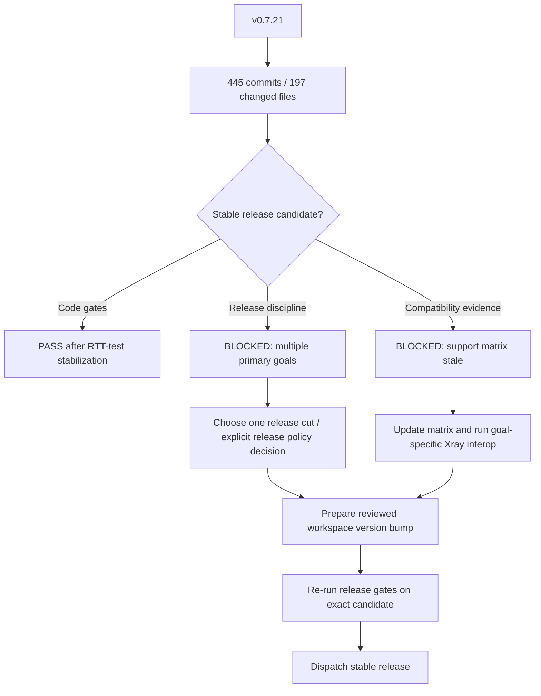

# v0.8.0 release-prep audit

## Summary

Current `master` is **not ready to tag as a stable release under the repository's existing release discipline**, even though the code-level release gates now pass.

The latest reachable stable tag is `v0.7.21`. The audited code baseline after release-gate stabilization is `303dc72` (`v0.7.21-445-g303dc72`): 445 commits after the tag, touching 197 files with approximately 94,914 additions and 4,974 deletions. The accumulated scope includes multiple independent primary areas, including Hysteria2, XUDP/UDP behavior, routing/observatory, policy/stats, socket options, outbound compatibility, performance work, inbound lifecycle, dynamic user stores, and session-task ownership. That does not fit the repository rule that one stable release advances one primary protocol goal.

The current workspace source version is still `0.7.21`. No commit that changes the root workspace version after `v0.7.21` prepares a later release version, so the release workflow's version-consistency check would reject a new version until a reviewed version bump is committed.

The Xray compatibility matrix is also stale. `examples/xray-compatible/README.md` still records baseline `acb06e83`, while the fixed local Xray reference is `5ca6f4b7d4dc20a881d4330e498892697627ec0c`. The same matrix still says Shadowsocks inbound is not implemented even though the current runtime contains Shadowsocks TCP/UDP paths and dynamic-user behavior. Compatibility claims therefore need to be re-audited before a stable tag.

## Release decision

**Current recommendation: NO-GO for a stable tag from current HEAD.**

This is a release-scope and compatibility-evidence blocker, not a current compile/test blocker. Do not bump the workspace version or dispatch `.github/workflows/release.yml` until a single release goal and its compatibility evidence are selected and reviewed.



## What changed since v0.7.21

The commit subject distribution alone shows that this is not a patch-sized release batch: 232 `fix`, 62 `refactor`, 61 `bench`, 40 `perf`, 21 `test`, and 17 `feat` commits, plus documentation/style/port/chore work. The source tree changes span protocol handlers, transports, routing, policy, observability, UDP/XUDP, REALITY, vendored QUIC code, control interfaces, and performance tooling.

Recent lifecycle work materially improves task ownership and shutdown correctness, including server-level connection ownership, XHTTP H3/TUIC/Hysteria2 tracking, MultiDirectional/SessionBased UDP cleanup, SOCKS UDP cleanup, GlobalID XUDP replacement/termination/TTL expiry cleanup, and ownership of Dokodemo/Shadowsocks UDP subtasks. These changes are valuable stabilization work but are not, by themselves, a single protocol compatibility release goal.

## Release-gate verification

The repository-required release gate was executed on the release-prep working tree using the exact commands required by `AGENTS.md`:

```sh
cargo fmt --all -- --check
cargo build --all-features
cargo clippy --all-targets --all-features -- -D warnings
cargo test
cargo test --locked
```

The first run exposed a scheduling-sensitive test failure in `routing_observer::tests::least_ping_uses_real_socks_observatory_rtt`: under full workspace load the nominal 5 ms probe was measured at 643 ms while the nominal 120 ms probe was measured at 123 ms. The production observatory implementation was not changed. The test was stabilized by making the SOCKS probes sequential and widening the synthetic fast/slow response gap to 5 ms versus 750 ms. The focused test then passed 20 consecutive runs.

After that test-only stabilization, all five release-gate commands passed on the same working tree, including `cargo test --locked`. The full library suite reported 1,322 passing library tests. Standard `cargo test` still intentionally skips tests marked `#[ignore]`, including real Xray-client interoperability matrices and performance probes; those ignored tests must be run explicitly when they are evidence for the selected release goal.

## Compatibility evidence gaps

The fixed local references are:

- xray-core: `5ca6f4b7d4dc20a881d4330e498892697627ec0c`
- clash-rs: `c6f25ab847a15bf7628d34108eab6a171325dadb`

`examples/xray-compatible/README.md` does not currently reflect the Xray baseline above and contains implementation-status entries that are known to be stale. It must not be used unchanged as release evidence.

Several real interoperability tests are intentionally ignored by ordinary `cargo test`, including VLESS/REALITY/Vision, Shadowsocks legacy and 2022, Hysteria2, VLESS gRPC, HTTPUpgrade, and the gRPC Xray compatibility matrix. This is correct for day-to-day test cost, but a compatibility release must explicitly execute the subset corresponding to its chosen primary goal and record the command, fixed client/reference version, and result.

## CI and release workflow observations

`.github/workflows/ci.yml` currently tests the all-features workspace on Ubuntu and Windows and builds release targets for Linux GNU, Linux musl, and Windows. The ordinary CI lint job only runs rustfmt; its clippy step is commented out. The dedicated release workflow compensates by running the required all-target/all-feature clippy gate before tagging.

`.github/workflows/release.yml` accepts only stable `X.Y.Z` versions and requires a non-empty description of a single primary protocol goal. It also checks that the source workspace version already equals the requested version; it does not bump versions automatically. The current workspace version `0.7.21` therefore needs a separate reviewed preparation commit only after the release scope is approved.

Although the release workflow accepts a historical `source_ref`, all inspected root-manifest states after `v0.7.21` remain version `0.7.21`. A historical release cut is therefore not immediately dispatchable as a new version without deliberately preparing a release branch/history strategy; that should not be improvised during tagging.

## Risks and rollout

The largest release risk is scope, not one known failing subsystem. Shipping 445 mixed-purpose commits as if they represented one protocol goal would make regressions difficult to attribute and would contradict the repository's own rollout rule of publishing and validating one completed goal before starting the next.

A second risk is overclaiming compatibility. Current unit/integration coverage is strong, but the support matrix has drifted and many real-client checks are opt-in. A stable release should state only the combinations that have current evidence against the fixed Xray baseline.

Recent session-ownership work deliberately preserves protocol-specific listener-stop semantics instead of imposing one global cancellation policy. `ARCHITECTURE.md` still lists unified server shutdown drain/cancel behavior, explicit failure state, finer draining, and runtime health/readiness as unfinished. Those are not automatic blockers for every release, but release notes must not imply M2/M3/M4 are complete.

## Breaking changes

No new breaking change is asserted by this audit. The accumulated `v0.7.21..HEAD` range is too broad to make a reliable repository-wide breaking-change statement without a release-goal-specific diff review. Before tagging, review the selected release scope for config/default changes, unsupported-option behavior, feature defaults, management API semantics, dynamic-user semantics, and listener/session shutdown behavior.

## Required steps before stable release

1. Freeze feature work on the intended release candidate.
2. Select one primary release goal that complies with `AGENTS.md`, or explicitly revise the repository's release policy in a separate reviewed decision before attempting a multi-goal `v0.8.0` consolidation release.
3. Re-audit and update `examples/xray-compatible/README.md` against xray-core `5ca6f4b7d4dc20a881d4330e498892697627ec0c`, including current Shadowsocks/Hysteria2/gRPC/HTTPUpgrade/XHTTP statuses relevant to the chosen goal.
4. Explicitly run the real-client interoperability tests required by that goal and record versioned evidence.
5. Review user-visible config/default/API behavior in the chosen release diff and prepare release notes/upgrade notes for any changes.
6. Commit the workspace version bump only after the release goal is approved.
7. Re-run all five required release-gate commands on the exact version-bumped candidate.
8. Confirm applicable CI target builds, then dispatch `.github/workflows/release.yml` from `master` with the approved release goal.
9. Deploy and validate the released artifact before resuming the next primary protocol goal.

## Current audit status

- Code release gate: **PASS** after test-only observatory stabilization.
- Workspace version prepared for new release: **NO** (`0.7.21`).
- Single primary release goal selected: **NO**.
- Xray support matrix current: **NO**.
- Goal-specific real Xray-client interoperability evidence refreshed: **NO**.
- Stable release recommendation: **NO-GO until the scope and compatibility blockers above are closed**.
