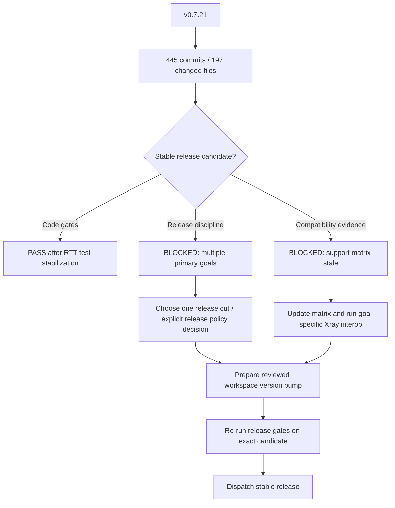

# v0.8.0 release-prep audit

## Summary

Current `master` is **not ready to tag as a stable release under the repository's existing release discipline**, even though the code-level release gates now pass.

The latest reachable stable tag is `v0.7.21`. The audited code baseline after release-gate stabilization is `303dc72` (`v0.7.21-445-g303dc72`): 445 commits after the tag, touching 197 files with approximately 94,914 additions and 4,974 deletions. The accumulated scope includes multiple independent primary areas, including Hysteria2, XUDP/UDP behavior, routing/observatory, policy/stats, socket options, outbound compatibility, performance work, inbound lifecycle, dynamic user stores, and session-task ownership. That does not fit the repository rule that one stable release advances one primary protocol goal.

The current workspace source version is still `0.7.21`. No commit that changes the root workspace version after `v0.7.21` prepares a later release version, so the release workflow's version-consistency check would reject a new version until a reviewed version bump is committed.

At the start of this audit, the Xray compatibility matrix was stale: it still recorded baseline `acb06e83` and said Shadowsocks inbound was not implemented. The follow-up release-prep pass has now updated `examples/xray-compatible/README.md` to the fixed local Xray reference `5ca6f4b7d4dc20a881d4330e498892697627ec0c`, added materialized Shadowsocks legacy/2022 EIH TCP+UDP examples, and separated config validation from real-client release evidence.

## Release decision

**Current recommendation: NO-GO for a stable tag from current HEAD.**

This is a release-scope and compatibility-evidence blocker, not a current compile/test blocker. Do not bump the workspace version or dispatch `.github/workflows/release.yml` until a single release goal and its compatibility evidence are selected and reviewed.



## What changed since v0.7.21

The commit subject distribution alone shows that this is not a patch-sized release batch: 232 `fix`, 62 `refactor`, 61 `bench`, 40 `perf`, 21 `test`, and 17 `feat` commits, plus documentation/style/port/chore work. The source tree changes span protocol handlers, transports, routing, policy, observability, UDP/XUDP, REALITY, vendored QUIC code, control interfaces, and performance tooling.

Recent lifecycle work materially improves task ownership and shutdown correctness, including server-level connection ownership, XHTTP H3/TUIC/Hysteria2 tracking, MultiDirectional/SessionBased UDP cleanup, SOCKS UDP cleanup, GlobalID XUDP replacement/termination/TTL expiry cleanup, and ownership of Dokodemo/Shadowsocks UDP subtasks. These changes are valuable stabilization work but are not, by themselves, a single protocol compatibility release goal.

## Release-gate verification

The repository-required release gate was executed on the release-prep working tree using the exact commands required by `AGENTS.md`:

```sh
cargo fmt --all -- --check
cargo build --all-features
cargo clippy --all-targets --all-features -- -D warnings
cargo test
cargo test --locked
```

The first run exposed a scheduling-sensitive test failure in `routing_observer::tests::least_ping_uses_real_socks_observatory_rtt`: under full workspace load the nominal 5 ms probe was measured at 643 ms while the nominal 120 ms probe was measured at 123 ms. The production observatory implementation was not changed. The test was stabilized by making the SOCKS probes sequential and widening the synthetic fast/slow response gap to 5 ms versus 750 ms. The focused test then passed 20 consecutive runs.

After that test-only stabilization, all five release-gate commands passed on the same working tree, including `cargo test --locked`. The full library suite reported 1,322 passing library tests. Standard `cargo test` still intentionally skips tests marked `#[ignore]`, including real Xray-client interoperability matrices and performance probes; those ignored tests must be run explicitly when they are evidence for the selected release goal.

## Compatibility evidence gaps

The fixed local references are:

- xray-core: `5ca6f4b7d4dc20a881d4330e498892697627ec0c`
- clash-rs: `c6f25ab847a15bf7628d34108eab6a171325dadb`

`examples/xray-compatible/README.md` has now been re-audited against the fixed Xray reference and records evidence levels explicitly. Two Shadowsocks examples were materialized and validated through the public config path: legacy AEAD TCP+UDP and Shadowsocks 2022 EIH TCP+UDP.

Several real interoperability tests remain intentionally ignored by ordinary `cargo test`, including VLESS/REALITY/Vision, Shadowsocks legacy and 2022, Hysteria2, VLESS gRPC, HTTPUpgrade, and the gRPC Xray compatibility matrix. This is correct for day-to-day test cost, but a compatibility release must explicitly execute the subset corresponding to its chosen primary goal and record the command, fixed client/reference version, and result.

### Follow-up protocol verification and release-goal selection

The repository-local `./xray` used for the refreshed checks reports `Xray 26.2.6`, commit `12ee51e`, built with Go 1.25.7 for linux/amd64.

The strongest refreshed candidate primary goal is **Shadowsocks inbound Xray compatibility**. Four ignored real-client tests were executed explicitly and all passed: legacy AEAD TCP/UDP, multiple legacy users with different methods, Shadowsocks 2022 TCP/AES UDP, and 2022 EIH multi-user TCP/UDP. Focused runtime/gRPC tests already cover dynamic UserManager mutation semantics and no-restart updates. The materialized example matrix now contains both legacy TCP+UDP and 2022 EIH TCP+UDP shapes.

The initially observed Hysteria2 4096-byte UDP timeout was subsequently isolated to the repository-local Xray 26.2.6 / `12ee51e` client fixture rather than Chimera. That Xray revision allocates exactly `MaxUDPSize` (4096 bytes) for the complete serialized Hysteria `UDPMessage`; payload plus protocol header can therefore overflow the client buffer, and `UDPWriter.sendMsg` silently drops the message before QUIC fragmentation. Xray commit `1d62941b`, present before `v26.5.3`, moves the writer to the regular 8192-byte buffer. The positive Hysteria2 TCP+UDP test now selects 4000 bytes for pre-v26.5.3 clients and retains the original 4096-byte check for newer clients. It passed 3/3 repeated runs with the bundled 26.2.6 fixture and 3/3 with a client built from fixed reference `5ca6f4b7d4dc20a881d4330e498892697627ec0c` (v26.7.28 source); the fixed-reference runs exercised the full 4096-byte payload. The three narrower Hysteria2 TCP/auth checks also pass. The previously recorded Hysteria2 UDP failure is therefore no longer a current-HEAD server regression or release blocker.

## CI and release workflow observations

`.github/workflows/ci.yml` currently tests the all-features workspace on Ubuntu and Windows and builds release targets for Linux GNU, Linux musl, and Windows. The ordinary CI lint job only runs rustfmt; its clippy step is commented out. The dedicated release workflow compensates by running the required all-target/all-feature clippy gate before tagging.

`.github/workflows/release.yml` accepts only stable `X.Y.Z` versions and requires a non-empty description of a single primary protocol goal. It also checks that the source workspace version already equals the requested version; it does not bump versions automatically. The current workspace version `0.7.21` therefore needs a separate reviewed preparation commit only after the release scope is approved.

Although the release workflow accepts a historical `source_ref`, all inspected root-manifest states after `v0.7.21` remain version `0.7.21`. A historical release cut is therefore not immediately dispatchable as a new version without deliberately preparing a release branch/history strategy; that should not be improvised during tagging.

## Risks and rollout

The largest release risk is scope, not one known failing subsystem. Shipping 445 mixed-purpose commits as if they represented one protocol goal would make regressions difficult to attribute and would contradict the repository's own rollout rule of publishing and validating one completed goal before starting the next.

A second risk is overclaiming compatibility. Current unit/integration coverage is strong, but the support matrix has drifted and many real-client checks are opt-in. A stable release should state only the combinations that have current evidence against the fixed Xray baseline.

Recent session-ownership work deliberately preserves protocol-specific listener-stop semantics instead of imposing one global cancellation policy. `ARCHITECTURE.md` still lists unified server shutdown drain/cancel behavior, explicit failure state, finer draining, and runtime health/readiness as unfinished. Those are not automatic blockers for every release, but release notes must not imply M2/M3/M4 are complete.

## Breaking changes

No new breaking change is asserted by this audit. The accumulated `v0.7.21..HEAD` range is too broad to make a reliable repository-wide breaking-change statement without a release-goal-specific diff review. Before tagging, review the selected release scope for config/default changes, unsupported-option behavior, feature defaults, management API semantics, dynamic-user semantics, and listener/session shutdown behavior.

## Required steps before stable release

1. Freeze feature work on the intended release candidate.
2. Use **Shadowsocks inbound Xray compatibility** as the current candidate primary release goal, or explicitly revise the repository's release policy in a separate reviewed decision before attempting a multi-goal `v0.8.0` consolidation release.
3. Keep `examples/xray-compatible/README.md` synchronized with the fixed xray-core reference `5ca6f4b7d4dc20a881d4330e498892697627ec0c` and do not promote evidence levels without explicit tests.
4. Re-run the four recorded Shadowsocks real-client interoperability commands on the exact version-bumped release candidate. For Hysteria evidence, keep the bundled pre-v26.5.3 client limitation separate from the full 4096-byte fixed-reference verification.
5. Review user-visible config/default/API behavior in the chosen release diff and prepare release notes/upgrade notes for any changes.
6. Commit the workspace version bump only after the release goal is approved.
7. Re-run all five required release-gate commands on the exact version-bumped candidate.
8. Confirm applicable CI target builds, then dispatch `.github/workflows/release.yml` from `master` with the approved release goal.
9. Deploy and validate the released artifact before resuming the next primary protocol goal.

## Current audit status

- Code release gate: **PASS** after test-only observatory stabilization.
- Workspace version prepared for new release: **NO** (`0.7.21`).
- Single primary release goal selected: **YES, candidate = Shadowsocks inbound Xray compatibility**.
- Xray support matrix current: **YES for this release-prep evidence pass**.
- Goal-specific real Xray-client interoperability evidence refreshed: **YES, Shadowsocks 4/4 PASS with Xray 26.2.6 / `12ee51e`**.
- Known Hysteria2 evidence caveat: **the bundled Xray 26.2.6 fixture silently drops Hysteria UDP messages whose payload plus header exceeds its 4096-byte client serialization buffer; fixed-reference v26.7.28 source passes the full 4096-byte payload 3/3**.
- Stable release recommendation: **NO-GO from current HEAD because the multi-goal scope problem remains; prepare a clean single-goal release source or explicitly revise the release policy before tagging**.
